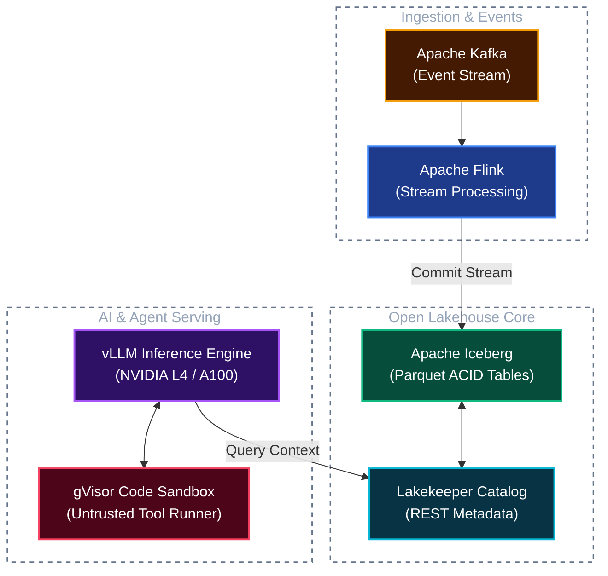

# Mermaid Drawing Skill: Dual-Mode (Light & Dark) Visual Design System

## Overview
Mermaid diagrams frequently break when users switch between **Light Mode** (white canvas) and **Dark Mode** (dark canvas). Common failure modes include:
* Invisible text (black text on dark backgrounds or white text on light backgrounds).
* Mismatched default node borders that vanish against dark canvases.
* Subgraph container boxes rendering with jarring opaque backgrounds.
* Link lines/arrows disappearing because their strokes lack contrast against dark or light themes.

This skill equips the agent with a **Universal Dual-Mode Design System** using explicit `classDef` styling, tuned high-contrast color palettes, and container transparency rules.

---

## 1. The 4 Golden Rules for Dual-Mode Readability

### Rule 1: Never Set `fill` Without Explicit `color`
Whenever you define a custom `fill`, you **must** explicitly define `color` (font color) and `stroke` (border color). If you omit `color`, the renderer injects the theme default, causing invisible text when mode switches.

### Rule 2: The "Illuminated Dark-Card" Pattern (Universal Standard)
The most reliable aesthetic across both light and dark modes is the **Illuminated Dark-Card**:
* **Fill:** Deep, muted slate or rich dark jewel tones (`#1e293b`, `#1e1b4b`, `#064e3b`, `#451a03`).
* **Text (`color`):** Pure white or crisp light gray (`#ffffff` or `#f8fafc`).
* **Stroke (`stroke`):** Vibrant, high-visibility 1.5px–2px accent borders (`#38bdf8`, `#818cf8`, `#34d399`, `#fbbf24`).
* *Why it works:* On a white canvas (Light Mode), it reads as a sleek, modern, readable dark card with colored accents. On a dark canvas (Dark Mode), it blends seamlessly while the vibrant border and crisp white text make it pop.

### Rule 3: Subgraphs Must Be Transparent or Subtle Dashed Borders
Never leave subgraphs with default solid white/gray fills. Always style subgraphs explicitly:
```mermaid
style SubgraphId fill:none,stroke:#64748b,stroke-width:1.5px,stroke-dasharray: 5 5,color:#94a3b8
```
* Use `fill:none` or semi-transparent fills so the underlying canvas (light or dark) shows through naturally.
* Use dashed borders (`stroke-dasharray: 5 5`) in midtone slate (`#64748b` or `#94a3b8`) for clean grouping.

### Rule 4: Link Lines Must Use Midtone Contrasting Strokes
Default black arrows vanish in dark mode; default light arrows vanish in light mode.
Use midtone link strokes (`#64748b`, `#0284c7`, `#8b5cf6`, or `#10b981`) with `stroke-width:2px`.

---

## 2. Standardized Dual-Mode `classDef` Palette

Copy and paste these pre-tested, high-contrast classes into diagrams:

```mermaid
%% Dual-Mode Universal Palette %%
classDef default fill:#1e293b,stroke:#64748b,stroke-width:1.5px,color:#f8fafc;
classDef primary fill:#1e3a8a,stroke:#3b82f6,stroke-width:2px,color:#ffffff;
classDef success fill:#064e3b,stroke:#10b981,stroke-width:2px,color:#ffffff;
classDef warning fill:#451a03,stroke:#f59e0b,stroke-width:2px,color:#ffffff;
classDef danger  fill:#4c0519,stroke:#f43f5e,stroke-width:2px,color:#ffffff;
classDef purple  fill:#2e1065,stroke:#a855f7,stroke-width:2px,color:#ffffff;
classDef cyan    fill:#083344,stroke:#06b6d4,stroke-width:2px,color:#ffffff;
classDef gray    fill:#0f172a,stroke:#475569,stroke-width:1.5px,color:#e2e8f0;
```

### Semantic Role Mapping

| Class Name | Fill | Stroke (Border) | Text Color | Recommended Usage |
| :--- | :--- | :--- | :--- | :--- |
| **`primary`** | `#1e3a8a` (Deep Blue) | `#3b82f6` (Vibrant Blue) | `#ffffff` | Core compute engines, APIs, primary orchestrators (Spark, Trino) |
| **`success`** | `#064e3b` (Deep Emerald) | `#10b981` (Vibrant Green) | `#ffffff` | Storage sinks, verified tables, Iceberg datasets, healthy targets |
| **`warning`** | `#451a03` (Deep Amber) | `#f59e0b` (Vibrant Amber) | `#ffffff` | Ingestion queues, caches, streaming buffers (Kafka, Redis) |
| **`danger`** | `#4c0519` (Deep Rose) | `#f43f5e` (Vibrant Rose) | `#ffffff` | Dead-letter queues, sandbox isolation, alert triggers, PII filters |
| **`purple`** | `#2e1065` (Deep Violet) | `#a855f7` (Vibrant Purple) | `#ffffff` | AI/LLM models, embeddings, GPU workloads (vLLM, KServe) |
| **`cyan`** | `#083344` (Deep Cyan) | `#06b6d4` (Vibrant Cyan) | `#ffffff` | Metadata catalogs, REST gateways, MCP gateways (Lakekeeper) |
| **`gray`** | `#0f172a` (Dark Slate) | `#475569` (Slate) | `#e2e8f0` | External clients, generic tools, supporting background utilities |

---

## 3. Step-by-Step Procedure for AI Agents

When asked to generate a Mermaid diagram:

1. **Choose the Right Diagram Type:**
   * `flowchart TB` or `flowchart LR` for system architectures and data flows.
   * `sequenceDiagram` for API calls, tool loops, and protocol handshakes.
2. **Apply Subgraph Transparency:**
   * Assign unique IDs to every subgraph (e.g., `subgraph StorageLayer["Storage Substrate"]`).
   * Add a `style` directive for each subgraph:
     `style StorageLayer fill:none,stroke:#64748b,stroke-width:1.5px,stroke-dasharray: 5 5,color:#94a3b8`
3. **Attach Node Classes:**
   * Define classes at the bottom of the diagram using the standardized palette.
   * Apply classes to nodes using `class NodeId className;` or `NodeId:::className`.
4. **Style Links and Annotations:**
   * For critical paths, style arrows with `linkStyle default stroke:#64748b,stroke-width:2px;`.
   * For specific callouts, use colored links: `linkStyle 0 stroke:#3b82f6,stroke-width:2.5px;`.

---

## 4. Complete Reference Template



---

## 5. Supplementary Resources

* **[Palettes Reference](file:///c:/Users/ToanBX/dev/personal/data_platform/.agents/skills/mermaid-drawing/references/palettes.md):** Alternative color themes (Pastel High-Contrast, Cyberpunk, Monochrome Slate).
* **[Sequence Diagram Guide](file:///c:/Users/ToanBX/dev/personal/data_platform/.agents/skills/mermaid-drawing/examples/sequence_diagram_dual_mode.md):** How to color actor boxes, activations, and note blocks in sequence diagrams.
