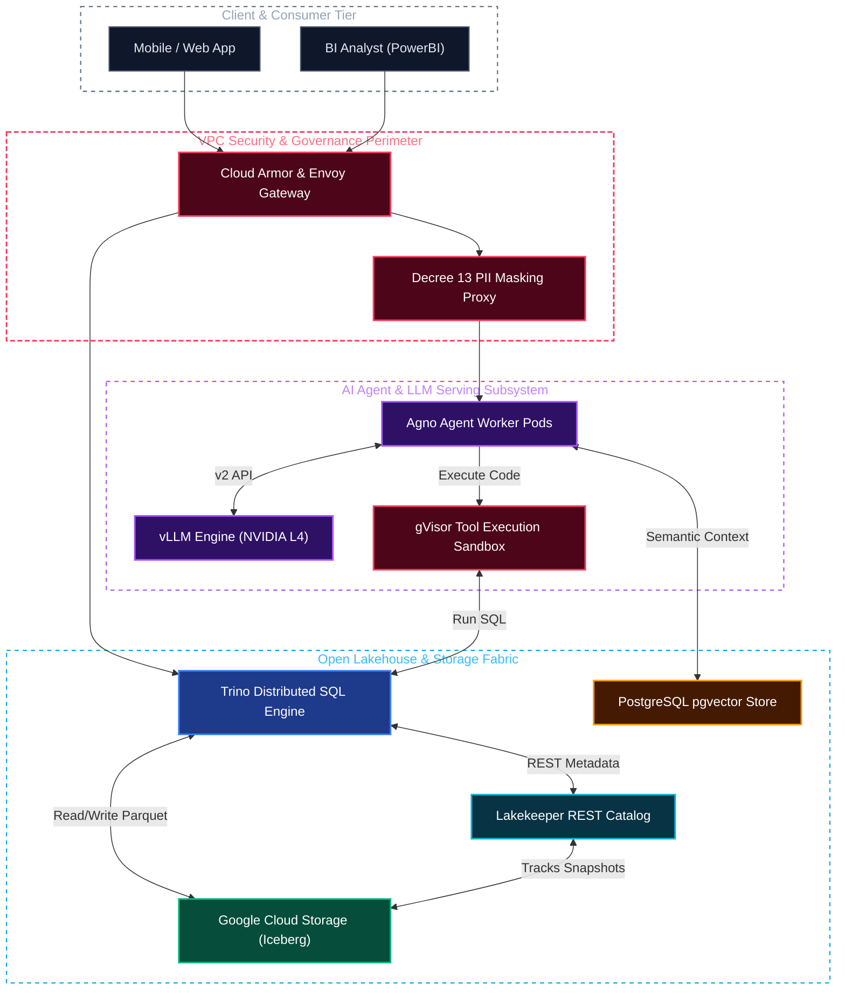

# Dual-Mode System Architecture Diagram Example

This example illustrates an end-to-end production architecture diagram that is crystal clear, vibrant, and effortlessly legible in both Light and Dark modes.

---

## 1. Architectural Diagram

---

## 2. Why This Renders Flawlessly in Light & Dark Mode:
1. **Zero Text Bleed:** Every node class explicitly locks `color:#ffffff` or `#e2e8f0`, guaranteeing that regardless of whether the browser background is `#FFFFFF` or `#0D1117`, text is sharp and legible.
2. **Distinctive Card Depth:** The deep jewel backgrounds (`#1e3a8a`, `#064e3b`, `#2e1065`) create crisp, modern cards on white canvases and blend into dark canvases without looking washed out.
3. **Luminous Outlines:** Neon-tinted 2px borders (`#3b82f6`, `#10b981`, `#a855f7`, `#f43f5e`) delineate node perimeters against pitch-black dark mode backgrounds.
4. **Transparent Boundaries:** Subgraphs use `fill:none` and themed dashed borders (`stroke-dasharray: 5 5`), avoiding ugly solid white or solid gray boxes.
