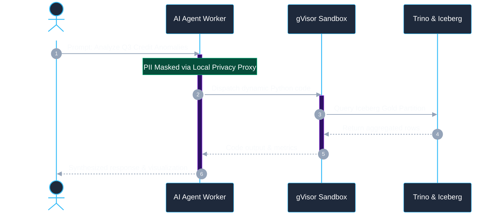

# Dual-Mode Sequence Diagram Example

In Mermaid `sequenceDiagram`, participant boxes and notes can also be styled for light and dark mode using directives or CSS class overrides.

---

## 1. Sequence Diagram Example with Theming

---

## 2. Key Takeaways for Sequence Diagrams
1. Always inject the `%%{init: ...}%%` block at the top of sequence diagrams when color is desired.
2. Set `actorBkg: '#1e293b'` and `actorTextColor: '#ffffff'` to prevent black-on-dark or white-on-white text collisions.
3. Use a vibrant `actorBorder` (such as `#38bdf8` or `#818cf8`) so participants stand out prominently on dark and light canvas themes.
