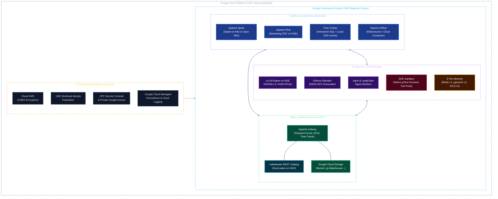

# Solution Architecture: Unified Kubernetes AI & Data Platform on Google Cloud (GCP)
## Document 00: Architecture Overview & Workload Requirements

---

## 1. Executive Summary

Modern enterprise data platforms are shifting from human-centric batch reporting to **autonomous, machine-speed intelligence (AI agents, dynamic tool execution, and continuous LLM inference)**.

This solution architecture adapts the unified data platform design to **Google Cloud Platform (GCP)**, utilizing **Google Kubernetes Engine (GKE)** as the core compute substrate while maintaining an open, vendor-neutral Lakehouse architecture.

By hosting the platform on GKE and Google Cloud:
* Compute is orchestrated via **GKE Standard Regional Clusters**, leveraging native features like **GKE Dataplane V2 (Cilium eBPF)**, **GKE Sandbox (gVisor)**, and **Workload Identity Federation**.
* The analytical storage layer standardizes on **Apache Iceberg** backed by **Google Cloud Storage (GCS)** and governed by the high-performance, Rust-based **Lakekeeper REST Catalog**.
* AI workloads (LLM inference with **vLLM**, model orchestration with **KServe**, and agent runtimes with **Agno / LangChain**) run alongside traditional analytical engines (**Trino, Spark, Flink**) with zero data duplication.

---

## 2. Core Architectural Tenets on GCP

1. **Open Lakehouse on Cloud Storage (No BigQuery Vendor Lock-In):**
   * Data is stored in open columnar **Apache Parquet** formatted with **Apache Iceberg** in **Google Cloud Storage (GCS)** buckets.
   * Metadata is centrally managed via **Lakekeeper** (Iceberg REST Catalog), with optional BigLake federation for querying from BigQuery if needed.
2. **Native GKE Security & Sandboxing for AI Agents:**
   * AI agents dynamically generate and execute untrusted code/tools inside **GKE Sandbox** (managed gVisor kernel isolation), preventing container breakouts.
   * Zero static service account keys: All pods authenticate via **GKE Workload Identity Federation**.
3. **Optimized GPU & Compute Sizing (FinOps on Cloud):**
   * GPU serving leverages cost-efficient **NVIDIA L4 (G2 instances)** and **A100 (A2 instances)** with **GCS FUSE CSI driver** for streaming model weights.
   * Batch Spark workloads leverage **GKE Spot VMs** to cut compute costs by up to 80%.
4. **Data Sovereignty & Compliance (Vietnam Decree 13 PDPD):**
   * Infrastructure is pinned to sovereign cloud zones (e.g., `asia-southeast1` Singapore / hybrid private interconnect).
   * Customer PII is protected via **VPC Service Controls (VPC-SC)**, **Cloud KMS CMEK**, and an inline privacy guardrails proxy.

---

## 3. Workload Comparison: Traditional Lakehouse vs. AI Agents on GKE

| Dimension | Traditional Lakehouse on GKE | AI Agent & GenAI Workload on GKE |
| :--- | :--- | :--- |
| **GKE Compute Shape** | High-memory CPU instances (`c3-highmem`, `n2-highmem`), Local SSDs | GPU-accelerated instances (`g2-standard`, `a2-highgpu`) + GKE Sandbox nodes |
| **Storage Access** | High throughput sequential reads/writes to GCS via `GCSFileIO` | Low-latency point reads (pgvector), sub-second token streaming, GCS FUSE |
| **Scaling Policy** | Batch-driven: Scheduled or queue-based pod scaling on Spot VMs | Traffic-driven: KEDA autoscaling based on vLLM concurrency and queue depth |
| **Execution Sandbox** | Trusted ETL containers running pre-compiled Spark/Flink code | Untrusted, dynamically generated Python/SQL code running in GKE Sandbox |
| **State Persistence** | Stateless compute engines; state flushed to GCS Iceberg tables | Multi-tier state: In-memory session context, vector database, and audit Iceberg logs |

---

## 4. Key Non-Functional Requirements (NFRs) on GCP

* **Availability:** 99.95% multi-zone regional SLA provided by GKE Regional clusters and GCS multi-region/dual-region storage.
* **Latency:**
  * P95 Time-To-First-Token (TTFT) for LLM serving: $< 250\text{ ms}$ on NVIDIA L4/A100.
  * P95 Vector Retrieval Latency: $< 40\text{ ms}$ via PostgreSQL `pgvector` with Hyperdisk.
  * P90 Interactive SQL Query Latency: $< 2.5\text{ seconds}$ on Trino with GKE Local NVMe SSD cache.
* **Cost Efficiency (FinOps):**
  * Use GKE Spot node pools for non-critical Spark batch jobs and ephemeral agent execution sandboxes.
  * Use GCS Lifecycle policies to automatically transition older Iceberg Parquet files from Standard to Nearline/Coldline storage.
* **Compliance & Data Privacy:**
  * End-to-end customer PII anonymization adhering to Vietnam Personal Data Protection Decree (Decree 13/2023/ND-CP).
  * Storage and disks encrypted with Customer-Managed Encryption Keys (Cloud KMS CMEK).

---

## 5. Architectural Documentation Index (GCP Edition)

* [Document 01: Infrastructure, GKE & Cloud Storage Fabric](file:///c:/Users/ToanBX/dev/personal/data_platform/docs/architectures/01_infrastructure_and_storage.md)
* [Document 02: Open Lakehouse, Distributed Compute & Pipeline Engineering on GCP](file:///c:/Users/ToanBX/dev/personal/data_platform/docs/architectures/02_lakehouse_and_compute.md)
* [Document 03: AI Agent Runtimes, LLM Serving & Memory Architecture on GKE](file:///c:/Users/ToanBX/dev/personal/data_platform/docs/architectures/03_ai_agent_and_llm_runtime.md)
* [Document 04: Governance, Security, Privacy & Full-Stack Observability on GCP](file:///c:/Users/ToanBX/dev/personal/data_platform/docs/architectures/04_governance_security_and_observability.md)
* [Document 05: High Availability, Disaster Recovery & FinOps on GCP](file:///c:/Users/ToanBX/dev/personal/data_platform/docs/architectures/05_ha_dr_and_finops.md)
