# Solution Architecture: Unified Kubernetes AI & Data Platform on Google Cloud (GCP)
## Document 00: Architecture Overview & Workload Requirements

---

## 1. Executive Summary

Modern enterprise data platforms are shifting from human-centric batch reporting to **autonomous, machine-speed intelligence (real-time stream analytics, event-driven AI agents, dynamic tool execution, and continuous LLM inference)**.

This solution architecture adapts the unified data platform design to **Google Cloud Platform (GCP)**, utilizing **Google Kubernetes Engine (GKE)** as the core compute substrate while maintaining an open, vendor-neutral Lakehouse architecture.

By hosting the platform on GKE and Google Cloud:
* **Decoupled Modern Lakehouse:** The analytical storage layer standardizes on **Apache Iceberg** backed by **Google Cloud Storage (GCS)** and governed by the high-performance, Rust-based **Lakekeeper REST Catalog**.
* **Unified Dual-Speed Real-Time Fabric:** Streaming ingestion (**Debezium CDC**, **Strimzi Kafka**) and stateful stream processing (**Apache Flink**) feed both a **Speed Layer** ($< 500\text{ms}$ writes to Redis L1 and `pgvector` L2 for real-time AI agents) and a **Near-Real-Time Lakehouse Layer** ($60\text{s} - 120\text{s}$ micro-batch commits to Iceberg Bronze).
* **AI & Agentic Workloads:** LLM inference with **vLLM**, model orchestration with **KServe**, and agent runtimes (**Agno / LangChain**) execute in **GKE Sandbox (gVisor)** with direct access to real-time streaming state and historical analytical data with zero duplication.
* **Declarative Infrastructure & Security:** The entire platform operates via Kubernetes Operators, **GKE Dataplane V2 (Cilium eBPF)**, **GKE Workload Identity Federation**, Cloud KMS CMEK, and complies with the Vietnam Personal Data Protection Decree (Decree 13/2023/ND-CP).

```mermaid
flowchart TB
    subgraph GCPInfrastructure["Google Cloud Platform (GCP: asia-southeast1)"]
        subgraph GKECluster["Google Kubernetes Engine (GKE Regional Cluster)"]
            
            subgraph StreamingIngestionTier["Real-Time Ingestion & Event Streaming Tier"]
                Debezium["Debezium CDC Connectors\n(Strimzi KafkaConnect on GKE)"]:::warning
                SchemaReg["Karapace / Apicurio\n(Schema Registry - Avro/Protobuf)"]:::cyan
                Kafka["Strimzi Apache Kafka Cluster\n(Hyperdisk Balanced + GCS Tiered Storage)"]:::warning
                
                Debezium --> Kafka
                SchemaReg <--> Kafka
            end

            subgraph StreamComputeTier["Stateful Stream Compute Engine"]
                Flink["Apache Flink Operator\n- RocksDB Incremental State on NVMe\n- Unaligned Checkpoints to GCS\n- Stateful CEP & Window Joins"]:::primary
                Kafka --> Flink
            end

            subgraph SpeedAndRealtime["Speed Layer (Real-Time: < 500ms)"]
                RedisL1["Redis / Dragonfly Cluster\n(L1 Real-Time Feature Store)"]:::warning
                pgvectorL2["PostgreSQL pgvector L2\n(Sub-second Streaming Embeddings)"]:::warning
                EventBus["Kafka Priority Event Bus\n(CloudEvents / Anomalies)"]:::purple
                
                Flink -->|"Key-Value Upserts"| RedisL1
                Flink -->|"Streaming Document Vectors"| pgvectorL2
                Flink -->|"Anomalies / Signals"| EventBus
            end

            subgraph TraditionalCompute["Analytical Compute & Batch Lakehouse"]
                Trino["Trino Query Cluster\n(Interactive SQL + Local NVMe Cache)"]:::primary
                Spark["Apache Spark (Spark-on-K8s)\n(Batch Gold Aggregations on Spot VMs)"]:::primary
                Airflow["Apache Airflow\n(KubernetesExecutor Orchestrator)"]:::primary
                Compactor["LakeOps Compactor Daemon\n(Streaming Small-File Bin-Packing)"]:::cyan
            end

            subgraph StorageAndCatalog["Open Lakehouse Core on GCP"]
                Iceberg["Apache Iceberg Tables\n(Parquet, v2 Position Deletes, Time-Travel)"]:::success
                Lakekeeper["Lakekeeper REST Catalog\n(Rust-native on GKE - Vends Scoped Tokens)"]:::cyan
                GCS["Google Cloud Storage Buckets\n(gs://lakehouse-data/ - Multi-Region)"]:::success
                
                Iceberg --- Lakekeeper
                Iceberg --- GCS
            end

            subgraph AIAgentWorkloads["AI Agent & LLM Serving Workloads"]
                vLLM["vLLM Engine on GKE\n(NVIDIA L4 / A100 GPUs)"]:::purple
                KServe["KServe Operator\n(KEDA Concurrency Autoscaler)"]:::purple
                AgnoWorkers["Agno & LangChain Workers\n(Reactive & User-Facing)"]:::purple
                GKESandbox["GKE Sandbox\n(Native gVisor Dynamic Tool Pods)"]:::danger
            end

        end

        subgraph GCPManagedPillars["GCP Native Foundation & Security"]
            CMEK["Cloud KMS\n(CMEK Encryption)"]:::gray
            WorkloadID["GKE Workload Identity\nFederation"]:::gray
            VPCSC["VPC Service Controls\n& Private Google Access"]:::gray
            CloudMonitor["Cloud Managed Prometheus\n& OpenTelemetry Tracing"]:::gray
        end
    end

    %% Cross-Tier Flows
    Flink -->|"NRT Micro-batch Commits (60s)"| Iceberg
    Compactor -.->|"Continuous Compaction"| Iceberg
    EventBus -->|"KEDA Trigger"| AgnoWorkers
    AgnoWorkers <--> SpeedAndRealtime
    AgnoWorkers <--> StorageAndCatalog
    TraditionalCompute <--> StorageAndCatalog
    AIAgentWorkloads <--> vLLM
    AIAgentWorkloads <--> GKESandbox
    GCPManagedPillars -.-> GKECluster

    %% Subgraph Styling (Transparent & Dual-Mode Friendly)
    style GCPInfrastructure fill:none,stroke:#475569,stroke-width:1.5px,stroke-dasharray: 5 5,color:#94a3b8
    style GKECluster fill:none,stroke:#0ea5e9,stroke-width:1.5px,stroke-dasharray: 5 5,color:#38bdf8
    style StreamingIngestionTier fill:none,stroke:#f59e0b,stroke-width:1.5px,stroke-dasharray: 4 4,color:#fcd34d
    style StreamComputeTier fill:none,stroke:#3b82f6,stroke-width:1.5px,stroke-dasharray: 4 4,color:#93c5fd
    style SpeedAndRealtime fill:none,stroke:#a855f7,stroke-width:1.5px,stroke-dasharray: 4 4,color:#d8b4fe
    style TraditionalCompute fill:none,stroke:#3b82f6,stroke-width:1.5px,stroke-dasharray: 4 4,color:#93c5fd
    style StorageAndCatalog fill:none,stroke:#10b981,stroke-width:1.5px,stroke-dasharray: 4 4,color:#6ee7b7
    style AIAgentWorkloads fill:none,stroke:#8b5cf6,stroke-width:1.5px,stroke-dasharray: 4 4,color:#c4b5fd
    style GCPManagedPillars fill:none,stroke:#64748b,stroke-width:1.5px,stroke-dasharray: 4 4,color:#94a3b8

    %% Link Styling
    linkStyle default stroke:#64748b,stroke-width:2px;

    %% Universal Dual-Mode High-Contrast Palette
    classDef primary fill:#1e3a8a,stroke:#3b82f6,stroke-width:2px,color:#ffffff;
    classDef success fill:#064e3b,stroke:#10b981,stroke-width:2px,color:#ffffff;
    classDef warning fill:#451a03,stroke:#f59e0b,stroke-width:2px,color:#ffffff;
    classDef danger  fill:#4c0519,stroke:#f43f5e,stroke-width:2px,color:#ffffff;
    classDef purple  fill:#2e1065,stroke:#a855f7,stroke-width:2px,color:#ffffff;
    classDef cyan    fill:#083344,stroke:#06b6d4,stroke-width:2px,color:#ffffff;
    classDef gray    fill:#0f172a,stroke:#475569,stroke-width:1.5px,color:#e2e8f0;
```

---

## 2. Core Architectural Tenets on GCP

1. **Open Lakehouse on Cloud Storage (No BigQuery Vendor Lock-In):**
   * Data is stored in open columnar **Apache Parquet** formatted with **Apache Iceberg** in **Google Cloud Storage (GCS)** buckets.
   * Metadata is centrally managed via **Lakekeeper** (Iceberg REST Catalog), with optional BigLake federation for querying from BigQuery if needed.
2. **Unified Dual-Speed Architecture (Real-Time + Batch Cohesion):**
   * Stream processing (**Apache Flink**) splits real-time pipelines into a **Speed Layer** ($< 500\text{ms}$ writes to Redis and `pgvector`) and a **Near-Real-Time Layer** ($60\text{s} - 120\text{s}$ commits to Iceberg Bronze).
   * Eliminates the traditional Lambda architecture dissonance: both streaming and batch share the same Iceberg catalog and governance plane.
3. **Native GKE Security & Sandboxing for AI Agents:**
   * AI agents dynamically generate and execute untrusted code/tools inside **GKE Sandbox** (managed gVisor kernel isolation), preventing container breakouts.
   * Zero static service account keys: All pods authenticate via **GKE Workload Identity Federation**.
4. **Optimized GPU & Compute Sizing (FinOps on Cloud):**
   * GPU serving leverages cost-efficient **NVIDIA L4 (G2 instances)** and **A100 (A2 instances)** with **GCS FUSE CSI driver** for streaming model weights.
   * Batch Spark workloads leverage **GKE Spot VMs** to cut compute costs by up to 80%.
5. **Data Sovereignty & Compliance (Vietnam Decree 13 PDPD):**
   * Infrastructure is pinned to sovereign cloud zones (e.g., `asia-southeast1` Singapore / hybrid private interconnect).
   * Customer PII is protected via **VPC Service Controls (VPC-SC)**, **Cloud KMS CMEK**, and an inline privacy guardrails proxy.

---

## 3. Workload Comparison: Batch Lakehouse vs. Real-Time Streaming vs. AI Agents

| Dimension | Traditional Batch Lakehouse | Real-Time & Stream Processing | AI Agent & GenAI Workload |
| :--- | :--- | :--- | :--- |
| **Primary Engines** | Apache Spark (Spark-on-K8s), Trino | Apache Flink, Debezium, Strimzi Kafka | vLLM, KServe, Agno, LangChain |
| **GKE Compute Shape** | `c3-standard-44` (CPU/High-Mem) on Spot VMs | `c3-standard-44` + Local NVMe (Flink) & `n2-standard-16` (Kafka) | GPU instances (`g2-standard`, `a2-highgpu`) + GKE Sandbox |
| **Latency SLA** | Minutes to Hours ($> 15\text{ mins}$) | Sub-second to Seconds ($< 500\text{ms} - 60\text{s}$) | Sub-second tokens ($< 250\text{ms}$ TTFT), $< 40\text{ms}$ retrieval |
| **Storage Targets** | Iceberg Gold/Silver Parquet on GCS | Kafka Hyperdisk, Redis L1, Iceberg Bronze | Redis L1, `pgvector` L2, GCS Iceberg L3 |
| **State Persistence** | Stateless compute; flushed to GCS tables | RocksDB state on NVMe + GCS checkpoints | In-memory session, vector DB, episodic logs |
| **Scaling Trigger** | Scheduled batch DAGs (Airflow) | Continuous event volume / Kafka partition lag | Traffic concurrency, Kafka priority alert queue |
| **Execution Trust** | Trusted, pre-compiled analytical code | Trusted continuous streaming DAGs | **Untrusted** agent-generated dynamic code (gVisor) |

---

## 4. Key Non-Functional Requirements (NFRs) & Latency Taxonomy

### A. 4-Tier Latency Taxonomy & SLAs

| Tier | Latency SLA | Target Sinks | Processing Subsystem | Example Workloads |
| :--- | :--- | :--- | :--- | :--- |
| **Tier 0: Hard Real-Time** | $< 50\text{ ms}$ | Kafka $\rightarrow$ Redis L1 / In-Memory | Flink Stateful CEP | Payment fraud cut-off, token-bucket rate limiter, inline PII masking. |
| **Tier 1: Soft Real-Time** | $< 500\text{ ms}$ | `pgvector` L2 / Priority Event Bus | Flink $\rightarrow$ Streaming Embeddings | Reactive AI agent triggers, dynamic customer memory sync, live telemetry. |
| **Tier 2: Near-Real-Time (NRT)** | $10\text{s} - 60\text{s}$ | Iceberg Bronze Tables on GCS | Flink Iceberg Sink (Checkpoint Commit) | Operational dashboards, live transaction monitoring, Bronze data ingestion. |
| **Tier 3: Batch Analytical** | $> 15\text{ mins}$ | Iceberg Silver & Gold on GCS | Spark-on-K8s on Spot VMs | Dimensional models, ML model retraining, regulatory reporting. |

### B. Core System Metrics & Reliability SLAs

* **Availability:** 99.95% multi-zone regional SLA provided by GKE Regional clusters and GCS multi-region storage.
* **Latency Benchmarks:**
  * Kafka broker P99 write latency: $< 5\text{ ms}$ on Hyperdisk Balanced.
  * Flink end-to-end event latency: $< 200\text{ ms}$ from Kafka ingestion to Redis/pgvector sink.
  * P95 Vector Retrieval Latency: $< 40\text{ ms}$ via PostgreSQL `pgvector` with Hyperdisk.
  * P95 Time-To-First-Token (TTFT) for LLM serving: $< 250\text{ ms}$ on NVIDIA L4/A100.
  * P90 Interactive SQL Query Latency: $< 2.5\text{ seconds}$ on Trino with GKE Local NVMe SSD cache.
* **Cost Efficiency (FinOps):**
  * GKE Spot node pools for Spark batch jobs, cutting compute costs by up to 80%.
  * Kafka Tiered Storage to GCS offloading historical segments, keeping local Hyperdisk volumes small.
  * GCS Lifecycle policies automatically transitioning older Iceberg Parquet files to Nearline/Coldline.
* **Compliance & Data Privacy:**
  * End-to-end customer PII anonymization adhering to Vietnam Personal Data Protection Decree (Decree 13/2023/ND-CP).
  * Storage and disks encrypted with Customer-Managed Encryption Keys (Cloud KMS CMEK).

---

## 5. Architectural Documentation Index (GCP Edition)

* [Document 01: Infrastructure, GKE & Cloud Storage Fabric](file:///c:/Users/ToanBX/dev/personal/data_platform_gcp/docs/architectures/01_infrastructure_and_storage.md)
* [Document 02: Open Lakehouse, Distributed Compute & Pipeline Engineering on GCP](file:///c:/Users/ToanBX/dev/personal/data_platform_gcp/docs/architectures/02_lakehouse_and_compute.md)
* [Document 03: Enterprise Hybrid RAG, Knowledge Pipelines & Semantic Retrieval on GCP](file:///c:/Users/ToanBX/dev/personal/data_platform_gcp/docs/architectures/03_rag_system_architecture.md)
* [Document 04: AI Agent Runtimes, LLM Serving & Memory Architecture on GKE](file:///c:/Users/ToanBX/dev/personal/data_platform_gcp/docs/architectures/04_ai_agent_and_llm_runtime.md)
* [Document 05: Governance, Security, Privacy & Full-Stack Observability on GCP](file:///c:/Users/ToanBX/dev/personal/data_platform_gcp/docs/architectures/05_governance_security_and_observability.md)
* [Document 06: High Availability, Disaster Recovery & FinOps on GCP](file:///c:/Users/ToanBX/dev/personal/data_platform_gcp/docs/architectures/06_ha_dr_and_finops.md)
* [Master Architecture Blueprint & Index](file:///c:/Users/ToanBX/dev/personal/data_platform_gcp/docs/architectures/README.md)
