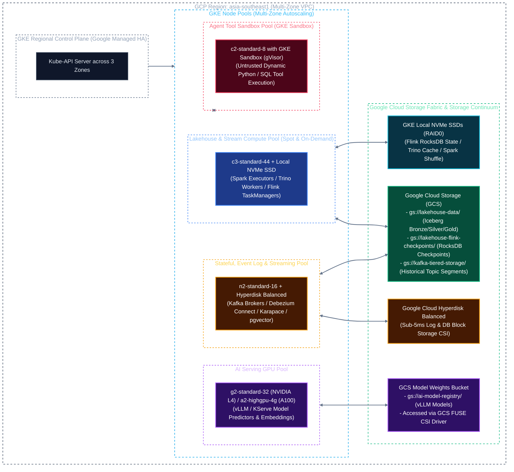
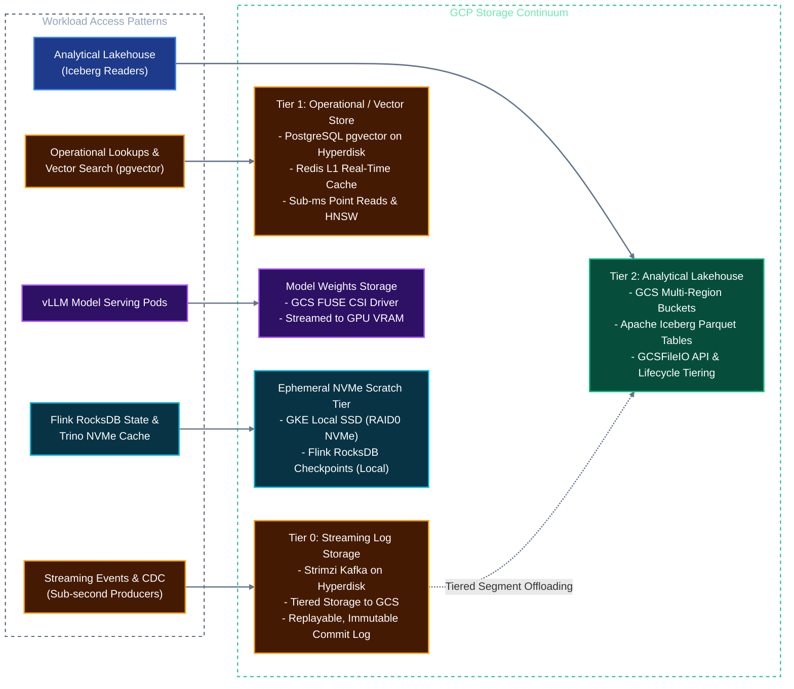
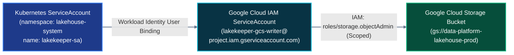

# Solution Architecture: Unified Kubernetes AI & Data Platform on Google Cloud (GCP)
## Document 01: Infrastructure, GKE & Cloud Storage Fabric

---

## 1. GKE Regional Cluster Topology

The platform deploys on **Google Kubernetes Engine (GKE) Standard** as a **Regional Cluster** in `asia-southeast1` (Singapore) spanning three availability zones (`asia-southeast1-a`, `asia-southeast1-b`, `asia-southeast1-c`).



---

## 2. GKE Node Pool Segregation & Machine Configurations

Workloads are strictly isolated across dedicated GKE Node Pools using Kubernetes Labels, Taints, and Tolerations:

| Node Pool Name | Target Workloads | Machine Type | Taints / Flags | Storage Attached |
| :--- | :--- | :--- | :--- | :--- |
| **`pool-lakehouse-compute`** | Spark Executors, Trino Workers, Flink TaskManagers | `c3-standard-44` (44 vCPU, 176 GB RAM) | `workload=lakehouse:NoSchedule`<br>*(Mixed On-Demand & Spot)* | 2x 375GB Local NVMe SSDs (RAID0 for Spark shuffle, Trino cache, & Flink RocksDB state) |
| **`pool-stateful-storage`** | Kafka Brokers, Debezium Connect, Karapace, CloudNativePG, Lakekeeper DB | `n2-standard-16` (16 vCPU, 64 GB RAM) | `workload=stateful:NoSchedule` | Google Cloud Hyperdisk Balanced (up to 20,000 IOPS, 500 MB/s per broker) |
| **`pool-ai-gpu`** | vLLM Engine, KServe Model Predictors, Embeddings | `g2-standard-32` (1x L4 24GB) or `a2-highgpu-4g` (4x A100 80GB) | `nvidia.com/gpu=present:NoSchedule`<br>`--enable-gcsfuse-csi-driver` | GCS FUSE CSI Driver (read-only model weights cache) + Boot Disk |
| **`pool-agent-sandbox`** | Ephemeral Python/SQL tool execution spawned by agents | `e2-standard-8` (8 vCPU, 32 GB RAM) | `workload=sandbox:NoSchedule`<br>`--sandbox type=gvisor` | Ephemeral `emptyDir` (RAM backed) |

### Terraform GKE Node Pool Snippet (GPU Pool with GCS FUSE CSI)
```hcl
resource "google_container_node_pool" "gpu_ai_serving" {
  name       = "pool-ai-gpu"
  cluster    = google_container_cluster.primary.id
  location   = "asia-southeast1"
  node_count = 1

  autoscaling {
    min_node_count = 1
    max_node_count = 6
  }

  node_config {
    machine_type = "a2-highgpu-4g" # 4x NVIDIA A100 80GB
    guest_accelerator {
      type  = "nvidia-tesla-a100"
      count = 4
      gpu_driver_installation_config {
        gpu_driver_version = "DEFAULT"
      }
    }

    taint {
      key    = "nvidia.com/gpu"
      value  = "present"
      effect = "NO_SCHEDULE"
    }

    labels = {
      workload = "ai-serving"
    }

    workload_metadata_config {
      mode = "GKE_METADATA" # Workload Identity
    }

    service_account = google_service_account.gke_ai_sa.email
    oauth_scopes    = ["https://www.googleapis.com/auth/cloud-platform"]
  }
}
```

---

## 3. Storage Fabric & The Enterprise Storage Continuum

Data storage is architected as a **tiered continuum** ranging from sub-millisecond append-only event logs to petabyte-scale analytical tables:



### 1. Tier 0: Streaming Log Storage (Strimzi Kafka on Hyperdisk Balanced + GCS Tiered Storage)
* **Is a Message Bus Considered Storage?** Yes. Kafka is an immutable, distributed commit-log storage system. Messages are flushed to disk in sequential segments and replicated across availability zones.
* **Durability & Replication:** Managed by the Strimzi Kafka Operator on GKE. Brokers mount `hyperdisk-balanced` with `min.insync.replicas: 2` and `acks: all`, ensuring zero data loss during zone outages.
* **Tiered Storage Offloading:** Older topic segments ($> 24\text{ hours}$) are automatically uploaded to `gs://kafka-tiered-storage/`, allowing topics to retain replayable changelogs indefinitely at GCS object-storage prices while keeping local Hyperdisk volumes small and high-performance.

### 2. Tier 1: Low-Latency Operational & Vector Storage (PostgreSQL `pgvector` & Redis)
* **Storage Primitives:** Backed by Hyperdisk Balanced with dynamically configured IOPS (up to 20,000 IOPS) and Throughput (500 MB/s).
* **Redis Cluster:** In-memory key-value state for Tier 0 hard real-time feature retrieval ($< 5\text{ms}$) and working agent memory.

### 3. Tier 2: Analytical Lakehouse Storage (Google Cloud Storage for Apache Iceberg)
* **Bucket Layout:** `gs://data-platform-lakehouse-prod/`
* **File Format:** Columnar Apache Parquet with Zstandard (ZSTD) compression.
* **Lifecycle Policies:** GCS Object Lifecycle Management rules automatically transition cold snapshots and uncompacted bronze files older than 90 days from `STANDARD` to `NEARLINE` storage, cutting analytical storage costs by 50%.

### 4. Ephemeral Acceleration: GKE Local NVMe SSDs
* **Flink Stateful Streaming:** Flink TaskManagers mount local NVMe SSDs (`/mnt/disks/local-nvme/rocksdb`) to host active RocksDB state. This delivers sub-millisecond state read/writes while state checkpoints are saved asynchronously to `gs://lakehouse-flink-checkpoints/`.
* **Trino SSD Caching & Spark Shuffle:** Mounts local NVMe in RAID0 for intermediate data processing.

---

## 4. Networking: GKE Dataplane V2 (Cilium eBPF) & VPC Architecture

* **GKE Dataplane V2:** Fully leverages Cilium eBPF natively integrated and managed by Google Cloud:
  * Replaces `kube-proxy` for line-rate packet processing with sub-millisecond latency for Kafka producers and Flink stream pipelines.
  * Native Kubernetes NetworkPolicy enforcement for agent sandbox isolation and cross-pool firewalls.
* **Private Google Access & Private Service Connect (PSC):** Ensures traffic from GKE pods to GCS, Cloud KMS, and Cloud Logging never traverses the public internet.
* **VPC Native IP Allocation:** Pod IPs are natively routable within the Google Cloud Virtual Private Cloud (VPC), avoiding double-NAT overhead.

---

## 5. Identity & Security: GKE Workload Identity Federation

Static long-lived JSON service account keys are strictly forbidden. The platform standardizes on **GKE Workload Identity Federation**:



### Binding Kubernetes Service Account to Google Cloud IAM:
```bash
gcloud iam service-accounts add-iam-policy-binding \
  lakekeeper-gcs-writer@${PROJECT_ID}.iam.gserviceaccount.com \
  --role roles/iam.workloadIdentityUser \
  --member "serviceAccount:${PROJECT_ID}.svc.id.goog[lakehouse-system/lakekeeper-sa]"
```
All Spark, Trino, Flink, and vLLM pods automatically inherit temporary OAuth2 tokens issued by Google's metadata server.
