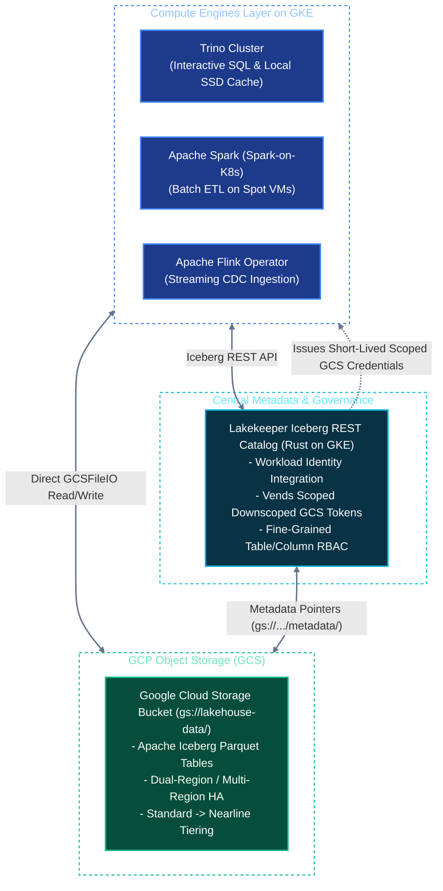

# Solution Architecture: Unified Kubernetes AI & Data Platform on Google Cloud (GCP)
## Document 02: Open Lakehouse, Distributed Compute & Pipeline Engineering on GCP

---

## 1. The Open Lakehouse Architecture on Google Cloud

The analytical layer on GCP maintains an **Open Lakehouse architecture** using **Apache Iceberg** and **Google Cloud Storage (GCS)**, governed centrally by **Lakekeeper (Iceberg REST Catalog)**. This avoids closed proprietary warehouses while offering seamless integration with open-source engines and optional federation to BigQuery via BigLake.



---

## 2. Table Format & Catalog: Apache Iceberg with Lakekeeper on GCS

### A. Native GCS Integration (`GCSFileIO`)
Compute engines access Iceberg tables using `GCSFileIO` (`org.apache.iceberg.gcp.gcs.GCSFileIO`):
* Directly authenticates via **GKE Workload Identity Federation** without embedding service account keys.
* Supports high-throughput multi-channel uploads and parallel block downloads.

### B. Lakekeeper on GKE with Vended GCS Tokens
Lakekeeper operates as a high-concurrency, lightweight Rust service deployed on GKE:
1. **Catalog Interface:** Implements the official Apache Iceberg REST Catalog specification.
2. **Downscoped Credential Dispensing:** When a query engine requests access to `gold.customer_transactions`, Lakekeeper evaluates authorization (via OpenFGA or OIDC) and dispenses a **GCP Downscoped OAuth2 Token** or short-lived signed credential restricted *only* to that table’s GCS bucket path (`gs://lakehouse-data/gold/customer_transactions/*`).
3. **BigLake Compatibility:** Because Lakekeeper implements the standard Iceberg REST specification, external engines like BigQuery can query Iceberg tables as external BigLake tables without moving data.

---

## 3. Distributed Compute Engines on GKE

### A. Interactive SQL: Trino on GKE with Local NVMe Cache
Trino provides interactive SQL query performance matching cloud data warehouses:
* **Node Pool:** Deployed on GKE `c3-standard-44` instances with attached Local NVMe SSDs.
* **Local Caching (Alluxio / Trino Caching):** Trino worker pods mount local NVMe SSDs to cache Parquet file blocks read from GCS. Subsequent analytical queries hit local NVMe SSDs with zero GCS network latency.
* **Autoscaling via KEDA:** Scales Trino worker pods between 4 and 24 replicas based on active query concurrency.

### B. Scalable Batch ETL: Apache Spark on GKE with Spot VMs
Spark batch transformations run container-natively using the **Spark-on-K8s Operator**:
* **GKE Spot VMs for Executors:** Spark executor pods run on `c3-standard-44` Spot node pools. If a Spot instance is reclaimed, Spark's dynamic allocation and driver automatically spin up replacement pods, cutting batch ETL compute costs by up to **80%**.
* **Shuffle Handling:** Local NVMe SSDs provide ultra-fast shuffle storage.
* **Spark Submit Configuration on GKE:**
```bash
spark-submit \
  --master k8s://https://kubernetes.default.svc \
  --deploy-mode cluster \
  --name spark-iceberg-etl \
  --conf spark.kubernetes.container.image=internal-registry.corp/spark-iceberg:3.5.1 \
  --conf spark.kubernetes.authenticate.driver.serviceAccountName=spark-sa \
  --conf spark.sql.extensions=org.apache.iceberg.spark.extensions.IcebergSparkSessionExtensions \
  --conf spark.sql.catalog.lakehouse=org.apache.iceberg.spark.SparkCatalog \
  --conf spark.sql.catalog.lakehouse.type=rest \
  --conf spark.sql.catalog.lakehouse.uri=http://lakekeeper.lakehouse-system.svc:8080/v1 \
  --conf spark.sql.catalog.lakehouse.io-impl=org.apache.iceberg.gcp.gcs.GCSFileIO \
  --conf spark.kubernetes.node.selector.cloud.google.com/gke-spot=true \
  --conf spark.dynamicAllocation.enabled=true \
  --conf spark.dynamicAllocation.maxExecutors=60 \
  gs://lakehouse-jobs/jobs/credit_risk_feature_pipeline.py
```

### C. Real-Time Streaming & CDC: Apache Flink on GKE
* **Flink Kubernetes Operator:** Deploys reactive streaming jobs consuming real-time CDC events from Kafka.
* **State Checkpointing:** Incremental **RocksDB StateBackend** saves checkpoints directly to `gs://data-platform-flink-checkpoints/` using Google Cloud Storage.

---

## 4. Ingestion & Event Streaming: Strimzi Kafka on GKE

Real-time streaming is managed by **Strimzi Kafka Operator** on GKE:
* **Storage:** Kafka broker pods use Google Cloud **Hyperdisk Balanced** (`hyperdisk-balanced` StorageClass) with dynamic IOPS allocation, delivering consistent write latencies under 5ms.
* **Tiered Storage (Kafka to GCS):** Uses Kafka tiered storage to offload historical topic segments directly to cold GCS buckets, keeping local Hyperdisk volumes small and cost-effective.

---

## 5. Workflow Orchestration: Apache Airflow

Orchestration is deployed via the official **Apache Airflow Helm Chart** on GKE:
* **KubernetesExecutor:** Every Airflow task runs in its own dedicated, isolated GKE pod.
* **Workload Identity:** Airflow tasks communicate securely with GCS, BigQuery, and KServe without managing service account keys.
* **Git-Sync:** Continually syncs DAGs from an enterprise Git repository.

---

## 6. Automated Lakehouse Maintenance (LakeOps Janitor on GKE)

A Kubernetes CronJob executes scheduled Iceberg maintenance against GCS:

```sql
-- 1. Compact Small Files into 256MB Parquet Files on GCS
CALL lakehouse.system.rewrite_data_files(
  table => 'gold.customer_credit_profile',
  strategy => 'binpack',
  options => map('target-file-size-bytes', '268435456')
);

-- 2. Expire Snapshots older than 14 days
CALL lakehouse.system.expire_snapshots(
  table => 'gold.customer_credit_profile',
  older_than => TIMESTAMP '2026-09-01 00:00:00.000',
  retain_last => 50
);

-- 3. Prune Orphaned GCS Objects
CALL lakehouse.system.remove_orphan_files(
  table => 'gold.customer_credit_profile',
  older_than => TIMESTAMP '2026-09-10 00:00:00.000'
);
```
