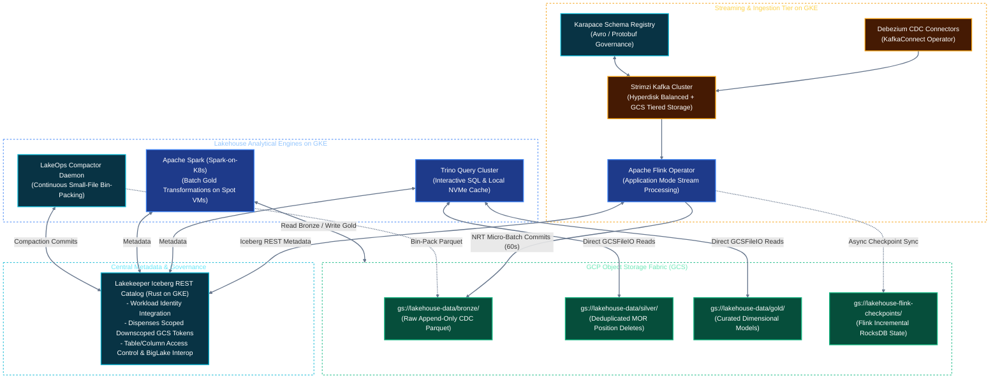

# Solution Architecture: Unified Kubernetes AI & Data Platform on Google Cloud (GCP)
## Document 02: Open Lakehouse, Distributed Compute & Pipeline Engineering on GCP

---

## 1. The Open Lakehouse Architecture on Google Cloud

The platform maintains an **Open Lakehouse architecture** using **Apache Iceberg** and **Google Cloud Storage (GCS)**, governed centrally by **Lakekeeper (Rust-based Iceberg REST Catalog)**. This eliminates proprietary warehouse lock-in while providing native interoperability between streaming engines (**Flink**), interactive SQL (**Trino**), and scalable batch processing (**Spark**).



---

## 2. Real-Time Ingestion & CDC Subsystem

### A. Debezium Change Data Capture (CDC) on GKE
Transactional changes from relational databases (Cloud SQL, Spanner, On-Prem PostgreSQL/MySQL) are captured in real-time using **Debezium** running on Strimzi's `KafkaConnect` framework:
* **Transactional Outbox Pattern:** Application services write domain events atomically to an `outbox_events` table within their local transactions. Debezium streams these outbox records into Kafka, preventing distributed dual-write anomalies.
* **Kubernetes Custom Resource (`KafkaConnector`):**
```yaml
apiVersion: kafka.strimzi.io/v1beta2
kind: KafkaConnector
metadata:
  name: pg-cdc-outbox-connector
  namespace: kafka
spec:
  class: io.debezium.connector.postgresql.PostgresConnector
  tasksMax: 4
  config:
    database.hostname: "cloudsql-proxy.database.svc"
    database.port: "5432"
    database.user: "cdc_reader"
    database.dbname: "production_db"
    plugin.name: "pgoutput"
    publication.autocreate.mode: "filtered"
    tombstones.on.delete: "false"
    decimal.handling.mode: "double"
    transforms: "outbox"
    transforms.outbox.type: "io.debezium.transforms.outbox.EventRouter"
    transforms.outbox.route.topic.replacement: "events.cdc.outbox.${routedByValue}"
```

### B. Schema Governance with Karapace Schema Registry
To prevent upstream breaking changes from corrupting stream processing or Iceberg schemas:
* Producers and Debezium serialize messages with **Apache Avro** or **Protobuf** using Karapace.
* Enforces `BACKWARD_TRANSITIVE` schema compatibility: new fields must be optional or provide defaults.
* Rejected incompatible schemas trigger automated alerts before messages ever enter Kafka topics.

### C. Strimzi Apache Kafka on GKE
* **Storage Performance:** Kafka brokers mount Google Cloud **Hyperdisk Balanced** (`hyperdisk-balanced` StorageClass) providing sustained P99 write latencies under **$5\text{ms}$**.
* **Tiered Storage (Kafka to GCS):** Segments older than 24 hours are offloaded to `gs://kafka-tiered-storage/`. This allows infinite, cost-effective event replayability without bloating expensive block storage.

---

## 3. Stateful Stream Processing: Apache Flink on GKE

Real-time transformations, complex event processing (CEP), and streaming writes are executed by **Apache Flink** managed by the official **Flink Kubernetes Operator**.

### A. Flink Deployment Topology (`FlinkDeployment` CRD)
Each streaming pipeline runs in **Application Mode** for workload isolation and independent lifecycle management:

```yaml
apiVersion: flink.apache.org/v1beta1
kind: FlinkDeployment
metadata:
  name: cdc-to-iceberg-streaming
  namespace: lakehouse-compute
spec:
  image: internal-registry.corp/flink-iceberg-stream:1.19.0
  flinkVersion: v1_19
  flinkConfiguration:
    taskmanager.numberOfTaskSlots: "4"
    state.backend: embeddedrocksdb
    state.backend.incremental: "true"
    state.backend.rocksdb.localdir: "/mnt/disks/local-nvme/rocksdb"
    state.checkpoints.dir: "gs://lakehouse-flink-checkpoints/checkpoints"
    state.savepoints.dir: "gs://lakehouse-flink-checkpoints/savepoints"
    execution.checkpointing.interval: "60000" # 60-second micro-batch
    execution.checkpointing.mode: "EXACTLY_ONCE"
    execution.checkpointing.timeout: "180000"
    execution.checkpointing.min-pause: "30000"
    execution.checkpointing.unaligned.enabled: "true" # Prevents backpressure blocking
  serviceAccount: flink-gcs-sa
  jobManager:
    resource:
      memory: "4096m"
      cpu: 2.0
  taskManager:
    resource:
      memory: "16384m"
      cpu: 4.0
    podTemplate:
      spec:
        nodeSelector:
          workload: lakehouse
        tolerations:
        - key: "workload"
          operator: "Equal"
          value: "lakehouse"
          effect: "NoSchedule"
        volumes:
        - name: local-nvme
          hostPath:
            path: /mnt/disks/local-nvme
  job:
    jarURI: local:///opt/flink/usrlib/cdc_iceberg_pipeline.jar
    parallelism: 16
    upgradeMode: savepoint
    state: running
```

### B. High-Throughput State & Unaligned Checkpoints
1. **Incremental RocksDB on Local NVMe SSDs:** TaskManagers store active state on attached high-speed local NVMe SSDs, writing only incremental SST files to `gs://lakehouse-flink-checkpoints/` during checkpointing.
2. **Unaligned Checkpoints:** During heavy traffic spikes or backpressure, unaligned checkpoints allow checkpoint barriers to overtake in-flight data buffers, ensuring checkpoints complete within SLA ($< 15\text{ seconds}$) without timeouts.

---

## 4. Solving the "Streaming to Iceberg" Problem (The $60\text{s}$ Frontier)

Writing continuous real-time streams directly to Apache Iceberg introduces two critical engineering hurdles:
1. **Catalog Commit Contention:** Frequent commits ($< 10\text{s}$) overwhelm the REST catalog and generate massive snapshot metadata trees.
2. **Small File Sprawl & Equality Delete Overhead:** Writing high-frequency updates generates millions of tiny Parquet files and equality delete files, degrading downstream Trino and Spark query performance by up to $10\times$.

### The 3-Part Modern Lakehouse Solution:

#### 1. Checkpoint-Aligned Micro-Batch Commits ($60\text{s} - 120\text{s}$)
The Flink Iceberg sink coordinates writes with Flink checkpoints:
* Data files are written continuously to GCS in the background.
* Iceberg commits transactions to **Lakekeeper** *only* when a Flink checkpoint succeeds ($60\text{s} - 120\text{s}$ interval).
* This bounds table latency to $60\text{s}$ (Near-Real-Time) while producing healthy file sizes ($64\text{MB} - 128\text{MB}$).

#### 2. Append-Only Bronze vs. Merge-On-Read (MOR) Silver
* **Bronze Tables (Raw CDC Event Log):** Configured as **Append-Only** (`write.upsert.enabled: false`). All `INSERT`, `UPDATE`, and `DELETE` operations are appended as immutable events with metadata (`_op_type`, `_cdc_timestamp`). This guarantees maximum streaming ingestion speed with **zero delete amplification**.
* **Silver Tables (Deduplicated State):** Uses Iceberg v2 **Merge-On-Read (MOR)** with Position Deletes generated during compaction, avoiding expensive equality-delete lookups during Trino analytical scans.

#### 3. Continuous Streaming Compaction Daemon (LakeOps Janitor)
Instead of waiting for nightly Airflow batches, an active Kubernetes CronJob / Flink Compactor runs continuously against active partitions:

```sql
-- Continuous Bin-Packing of Streaming Bronze Tables
CALL lakehouse.system.rewrite_data_files(
  table => 'bronze.operational_transactions',
  strategy => 'binpack',
  options => map(
    'target-file-size-bytes', '268435456', -- 256 MB target Parquet file
    'min-file-size-bytes', '33554432',     -- 32 MB minimum threshold
    'max-file-group-size-bytes', '2147483648' -- 2 GB compaction batch
  )
);

-- Prune Snapshots Older than 3 Days on Streaming Tables
CALL lakehouse.system.expire_snapshots(
  table => 'bronze.operational_transactions',
  older_than => CURRENT_TIMESTAMP - INTERVAL '3' DAY,
  retain_last => 100
);
```

---

## 5. Metadata & Table Governance: Lakekeeper REST Catalog on GKE

Lakekeeper operates as a high-concurrency, lightweight Rust service deployed on GKE:
1. **Catalog Interface:** Implements the official Apache Iceberg REST Catalog specification.
2. **Downscoped Credential Dispensing:** When an engine requests access to a table, Lakekeeper dispenses a **GCP Downscoped OAuth2 Token** restricted *only* to that table’s GCS bucket prefix (`gs://lakehouse-data/gold/customer_transactions/*`), guaranteeing zero broad bucket access.
3. **BigLake Interoperability:** Because Lakekeeper adheres to the open REST specification, Google Cloud BigQuery can federate and query Iceberg tables directly via BigLake external tables without data duplication.

---

## 6. Analytical Compute Engines on GKE

### A. Interactive SQL: Trino on GKE with Local NVMe Cache
* **Node Pool:** Deployed on GKE `c3-standard-44` instances with attached Local NVMe SSDs.
* **NVMe Caching:** Trino worker pods mount local NVMe SSDs to cache Parquet file blocks read from GCS. Repeated queries hit local NVMe with zero GCS network latency.
* **KEDA Autoscaling:** Scales Trino worker pods between 4 and 24 replicas based on query queue depth.

### B. Scalable Batch ETL: Apache Spark on GKE with Spot VMs
Spark batch transformations run container-natively using the **Spark-on-K8s Operator**:
* **GKE Spot VMs:** Executor pods run on `c3-standard-44` Spot node pools, cutting compute costs by up to **80%**.
* **Shuffle Handling:** Local NVMe SSDs provide ultra-fast shuffle storage.
* **Spark Submit Configuration on GKE:**
```bash
spark-submit \
  --master k8s://https://kubernetes.default.svc \
  --deploy-mode cluster \
  --name spark-iceberg-gold-etl \
  --conf spark.kubernetes.container.image=internal-registry.corp/spark-iceberg:3.5.1 \
  --conf spark.kubernetes.authenticate.driver.serviceAccountName=spark-sa \
  --conf spark.sql.extensions=org.apache.iceberg.spark.extensions.IcebergSparkSessionExtensions \
  --conf spark.sql.catalog.lakehouse=org.apache.iceberg.spark.SparkCatalog \
  --conf spark.sql.catalog.lakehouse.type=rest \
  --conf spark.sql.catalog.lakehouse.uri=http://lakekeeper.lakehouse-system.svc:8080/v1 \
  --conf spark.sql.catalog.lakehouse.io-impl=org.apache.iceberg.gcp.gcs.GCSFileIO \
  --conf spark.kubernetes.node.selector.cloud.google.com/gke-spot=true \
  --conf spark.dynamicAllocation.enabled=true \
  --conf spark.dynamicAllocation.maxExecutors=60 \
  gs://lakehouse-jobs/jobs/credit_risk_feature_pipeline.py
```

### C. Workflow Orchestration: Apache Airflow
* **KubernetesExecutor:** Every Airflow task runs in its own dedicated, isolated GKE pod.
* **Workload Identity:** Authenticates securely with GCS, BigQuery, and Lakekeeper without managing service account keys.
* **Git-Sync:** Continually syncs DAGs from enterprise Git repositories.
