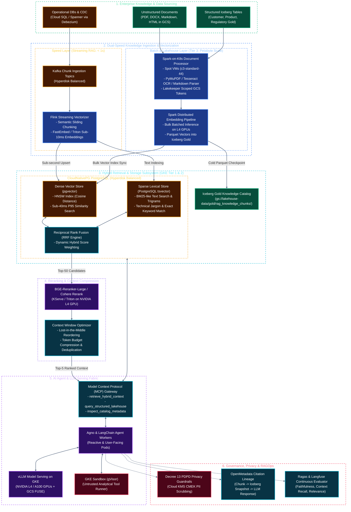
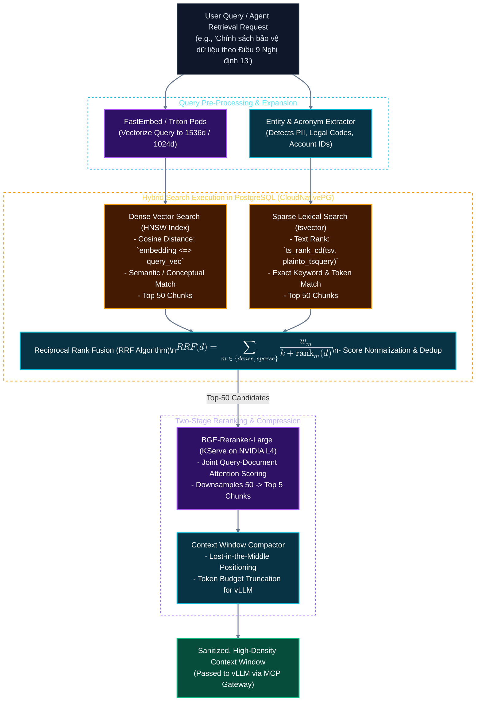
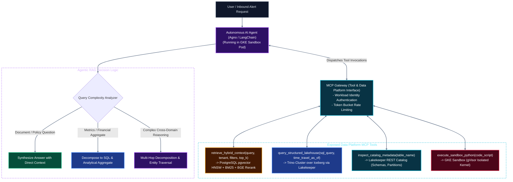

# Solution Architecture: Unified Kubernetes AI & Data Platform on Google Cloud (GCP)
## Document 03: Enterprise Hybrid RAG, Knowledge Pipelines & Semantic Retrieval on GCP

---

## 1. Executive Summary & End-to-End RAG Architecture

Retrieval-Augmented Generation (RAG) within modern enterprises must bridge the divide between **unstructured corporate knowledge** (documents, policies, technical manuals, transcripts) and **structured real-time operational state** (transaction records, customer telemetry, inventory logs). 

Rather than treating RAG as an isolated, off-cluster vector database wrapper, this architecture embeds RAG as an integral, native subsystem of the **Unified Kubernetes AI & Data Platform on Google Cloud (GCP)**. It integrates directly with:
* The **3-Tier Storage Continuum** defined in [Document 01](file:///c:/Users/ToanBX/dev/personal/data_platform_gcp/docs/architectures/01_infrastructure_and_storage.md) (Tier 0 Kafka event logs, Tier 1 `pgvector`/Redis operational state, Tier 2 GCS Iceberg tables, and GCS FUSE model weights).
* The **Dual-Speed Compute Fabric** defined in [Document 02](file:///c:/Users/ToanBX/dev/personal/data_platform_gcp/docs/architectures/02_lakehouse_and_compute.md) (sub-second streaming chunking/vectorization via Apache Flink and petabyte-scale batch document backfilling via Spark-on-K8s on Spot VMs).
* The **Autonomous AI Agent & LLM Serving Runtimes** defined in [Document 04](file:///c:/Users/ToanBX/dev/personal/data_platform_gcp/docs/architectures/04_ai_agent_and_llm_runtime.md) (vLLM on NVIDIA L4/A100 GPUs, GKE Sandbox gVisor execution, and the Model Context Protocol Gateway).
* **Enterprise Governance & Privacy** defined in [Document 05](file:///c:/Users/ToanBX/dev/personal/data_platform_gcp/docs/architectures/05_governance_security_and_observability.md) (Vietnam Personal Data Protection Decree 13 inline masking, Right-to-be-Forgotten cascading purges, and OpenMetadata dual-speed citation lineage).



---

## 2. Dual-Speed Knowledge Ingestion & Vectorization Pipelines

In enterprise environments, knowledge ingestion cannot rely solely on nightly batch cron jobs. Changes to operational policies, compliance rules, credit risk thresholds, and real-time customer communications must be searchable by AI agents in **$< 1\text{ second}$**, while massive document backfills must process petabytes of historical files at minimum compute cost.

### A. Speed Layer: Sub-Second Streaming RAG Ingestion (< 1s Latency)
When transactional records change or new dynamic documents arrive via Kafka:
1. **CDC Capture & Routing:** Debezium captures updates from operational databases (Cloud SQL / Spanner) and routes markdown/text event payloads to Kafka topic `rag.knowledge.incoming`.
2. **Flink Streaming Chunking & Embedding:**
   * A dedicated **Apache Flink** job (running in Application Mode on GKE Lakehouse compute pool) consumes messages from Kafka.
   * Performs semantic sliding-window chunking (512 tokens with 64-token overlap).
   * Calls a high-concurrency, lightweight embedding service (**FastEmbed / Triton Inference Server** running `bge-small-en-v1.5` or `text-embedding-3-small` equivalent) over internal gRPC with sub-10ms batch latency.
3. **Streaming Upsert into PostgreSQL `pgvector`:**
   * Flink writes chunk embeddings and lexical search documents directly into PostgreSQL `pgvector` in micro-transactions ($< 500\text{ms}$ write latency).

```yaml
apiVersion: flink.apache.org/v1beta1
kind: FlinkDeployment
metadata:
  name: streaming-rag-vectorizer
  namespace: lakehouse-compute
spec:
  image: internal-registry.corp/rag-streaming-vectorizer:1.4.0
  flinkVersion: v1_19
  flinkConfiguration:
    taskmanager.numberOfTaskSlots: "4"
    state.backend: embeddedrocksdb
    state.backend.incremental: "true"
    state.backend.rocksdb.localdir: "/mnt/disks/local-nvme/rocksdb"
    state.checkpoints.dir: "gs://lakehouse-flink-checkpoints/rag-vectorizer"
    execution.checkpointing.interval: "30000" # 30s checkpoint alignment
    execution.checkpointing.mode: "EXACTLY_ONCE"
  serviceAccount: flink-gcs-sa
  taskManager:
    resource:
      memory: "8192m"
      cpu: 2.0
    podTemplate:
      spec:
        nodeSelector:
          workload: lakehouse
        tolerations:
        - key: "workload"
          operator: "Equal"
          value: "lakehouse"
          effect: "NoSchedule"
  job:
    jarURI: local:///opt/flink/usrlib/streaming_vectorizer.jar
    parallelism: 8
    upgradeMode: savepoint
    state: running
```

### B. Lakehouse Layer: Scalable Batch Knowledge Processing (Tier 3)
For historical archives, regulatory manuals, PDF contracts, and analytical lakehouse tables:
1. **Unstructured Document Ingestion:** Raw files land in `gs://lakehouse-data/raw/documents/` (GCS Standard).
2. **Distributed Spark-on-K8s Parsing on Spot VMs:**
   * Document parsing (PDF OCR via Tesseract, tabular extraction, markdown AST synthesis) runs as distributed PySpark jobs on GKE Spot VMs (`c3-standard-44`), slashing compute costs by **80%**.
   * Workload Identity securely accesses GCS without static keys.
3. **Hierarchical Semantic Chunking:**
   * **Parent-Child Chunking Strategy:** Documents are broken into parent blocks (2,000 tokens for context synthesis) and nested child chunks (400 tokens for high-precision embedding search). During retrieval, the child chunk triggers the search hit, but the parent block is delivered to the LLM context window to prevent semantic truncation.
   * **Table-Aware Markdown Chunking:** HTML/PDF tables are converted into structured GitHub-flavored Markdown tables with column-header preservation per row chunk.
4. **Vector Persistence in Iceberg Gold:**
   * Embeddings, document metadata, chunk text, and parent references are committed to Apache Iceberg Gold table `gold.rag_knowledge_chunks` on GCS via the **Lakekeeper REST Catalog**.
   * A Spark synchronization job indexes these vectors into the operational PostgreSQL `pgvector` HNSW index.

---

## 3. High-Performance Hybrid Search & Vector Subsystem

Dense vector similarity search alone is prone to critical enterprise failure modes: it struggles with exact product IDs, account numbers, Vietnamese legal article citations (e.g., *"Điều 9 Nghị định 13/2023/NĐ-CP"*), and specialized financial acronyms. The platform standardizes on a **Two-Tier Hybrid Search Engine** combining Dense Vectors and Sparse Lexical Text Search.



### A. Storage Architecture: CloudNativePG with `pgvector` on Hyperdisk Balanced
The vector database is deployed using the **CloudNativePG (CNPG) Operator** on GKE `pool-stateful-storage` nodes:
* Mounted to **Google Cloud Hyperdisk Balanced** provisioned for 15,000 IOPS and 400 MB/s throughput.
* Native HNSW (Hierarchical Navigable Small World) index tuning:
  * `m = 16`: Number of bidirectional links per vector node.
  * `ef_construction = 128`: Search depth during index build (balances indexing speed vs. recall).
  * `ef_search = 64`: Dynamic search candidate list size for querying, achieving **$> 98\%$ recall** with **$< 35\text{ms}$** P95 query latency.

### B. Unified Hybrid Search Schema & Reciprocal Rank Fusion (RRF)
```sql
-- Hybrid Knowledge Table in PostgreSQL
CREATE EXTENSION IF NOT EXISTS vector;
CREATE EXTENSION IF NOT EXISTS pg_trgm;

CREATE TABLE rag_knowledge_chunks (
    chunk_id UUID PRIMARY KEY DEFAULT gen_random_uuid(),
    document_id VARCHAR(128) NOT NULL,
    parent_chunk_id UUID NULL,
    tenant_id VARCHAR(64) NOT NULL,
    access_role VARCHAR(64) NOT NULL DEFAULT 'public',
    source_uri VARCHAR(512) NOT NULL,
    chunk_content TEXT NOT NULL,
    parent_content TEXT NULL,
    metadata JSONB NOT NULL DEFAULT '{}',
    tsv_content TSVECTOR GENERATED ALWAYS AS (to_tsvector('english', chunk_content)) STORED,
    embedding VECTOR(1536) NOT NULL,
    created_at TIMESTAMPTZ NOT NULL DEFAULT CURRENT_TIMESTAMP,
    updated_at TIMESTAMPTZ NOT NULL DEFAULT CURRENT_TIMESTAMP
);

-- HNSW Vector Index
CREATE INDEX idx_rag_chunks_hnsw 
ON rag_knowledge_chunks 
USING hnsw (embedding vector_cosine_ops) 
WITH (m = 16, ef_construction = 128);

-- GIN Lexical Full-Text Index
CREATE INDEX idx_rag_chunks_tsv ON rag_knowledge_chunks USING gin (tsv_content);

-- Tenant & Access Control B-Tree Index
CREATE INDEX idx_rag_chunks_tenant_access ON rag_knowledge_chunks (tenant_id, access_role);
```

#### Stored Function: Reciprocal Rank Fusion (RRF)
```sql
CREATE OR REPLACE FUNCTION match_hybrid_knowledge(
    query_text TEXT,
    query_embedding VECTOR(1536),
    match_limit INT DEFAULT 50,
    target_tenant VARCHAR DEFAULT 'enterprise',
    rrf_k INT DEFAULT 60,
    dense_weight FLOAT DEFAULT 0.6,
    sparse_weight FLOAT DEFAULT 0.4
)
RETURNS TABLE (
    chunk_id UUID,
    document_id VARCHAR,
    chunk_content TEXT,
    parent_content TEXT,
    source_uri VARCHAR,
    combined_score FLOAT
)
LANGUAGE sql STABLE AS $$
WITH dense_search AS (
    SELECT 
        c.chunk_id,
        ROW_NUMBER() OVER (ORDER BY c.embedding <=> query_embedding) AS dense_rank
    FROM rag_knowledge_chunks c
    WHERE c.tenant_id = target_tenant
    ORDER BY c.embedding <=> query_embedding
    LIMIT match_limit
),
sparse_search AS (
    SELECT 
        c.chunk_id,
        ROW_NUMBER() OVER (ORDER BY ts_rank_cd(c.tsv_content, plainto_tsquery('english', query_text)) DESC) AS sparse_rank
    FROM rag_knowledge_chunks c
    WHERE c.tenant_id = target_tenant
      AND c.tsv_content @@ plainto_tsquery('english', query_text)
    ORDER BY ts_rank_cd(c.tsv_content, plainto_tsquery('english', query_text)) DESC
    LIMIT match_limit
)
SELECT 
    c.chunk_id,
    c.document_id,
    c.chunk_content,
    c.parent_content,
    c.source_uri,
    (
        COALESCE(dense_weight / (rrf_k + d.dense_rank), 0.0) +
        COALESCE(sparse_weight / (rrf_k + s.sparse_rank), 0.0)
    ) AS combined_score
FROM rag_knowledge_chunks c
LEFT JOIN dense_search d ON c.chunk_id = d.chunk_id
LEFT JOIN sparse_search s ON c.chunk_id = s.chunk_id
WHERE d.chunk_id IS NOT NULL OR s.chunk_id IS NOT NULL
ORDER BY combined_score DESC
LIMIT match_limit;
$$;
```

---

## 4. Two-Stage Retrieval, Cross-Encoder Reranking & Context Compression

Delivering raw top-K vector search results directly to an LLM degrades reasoning quality due to noisy semantic matches and the **"Lost-in-the-Middle"** phenomenon (where LLMs attend disproportionately to the start and end of context prompts while ignoring the middle).

### A. Stage 1: Coarse Hybrid Retrieval
* Retrieves the top **$50$ candidate chunks** using the `match_hybrid_knowledge` RRF function in under **$40\text{ms}$**.
* Broad enough to capture edge cases, acronyms, and tangential concepts across dense and lexical channels.

### B. Stage 2: Cross-Encoder Reranking (`BGE-Reranker-Large`)
* Unlike bi-encoders (which encode query and document independently into fixed vectors), a **Cross-Encoder** computes full cross-attention across all token pairs of $(query, document)$.
* Deployed as a microservice on GKE `pool-ai-gpu` running on **NVIDIA L4 GPUs (24GB VRAM)** managed by KServe.
* Evaluates 50 candidate pairs in parallel in **$< 80\text{ms}$**, selecting the top **$5$ chunks** with true semantic relevance.

### C. Context Optimization & Prompt Packing
Before injecting retrieved passages into vLLM:
1. **Deduplication & Semantic Overlap Pruning:** Chunks sharing $> 85\%$ lexical similarity are merged or discarded.
2. **Lost-in-the-Middle Reordering:** The highest-scoring chunk ($Rank 1$) is positioned at the **beginning** of the context block; the second-highest ($Rank 2$) is positioned at the **very end**; lower-ranked chunks are nested in between.
3. **Parent Context Injection:** If consecutive retrieved child chunks belong to the same parent section, the system replaces them with the unified `parent_content` block, providing coherent narrative context without token fragmentation.

---

## 5. Agentic RAG & Model Context Protocol (MCP) Integration

RAG on this platform is not static semantic lookup; it is **Agentic RAG**, orchestrated through the **Model Context Protocol (MCP) Gateway** defined in [Document 04](file:///c:/Users/ToanBX/dev/personal/data_platform_gcp/docs/architectures/04_ai_agent_and_llm_runtime.md).



### Agentic Retrieval Patterns:
1. **Router Pattern (Semantic vs. Structured):** When an agent receives a query like *"What was customer #91823's total loan volume last month and what are the applicable default policies?"*, the agent:
   * Uses `query_structured_lakehouse` to run an analytical SQL query via **Trino** on Iceberg Gold tables for the numerical metric.
   * Uses `retrieve_hybrid_context` to fetch policy documents from `pgvector`.
   * Synthesizes both sources into a unified, factual response.
2. **Self-Correction & Query Reformulation:** If the reranker assigns all candidate chunks a relevance score below threshold ($\tau < 0.65$), the agent autonomously initiates query reformulation or prompts the user for clarification rather than hallucinating answers.
3. **GraphRAG Entity Traversal:** Entity metadata extracted from documents (e.g., `Customer`, `Contract`, `LegalEntity`, `Clause`) is linked via relational foreign keys in PostgreSQL. Agents can traverse entity relationships to perform multi-hop reasoning across interconnected documents.

---

## 6. Data Privacy, Governance & RAGOps Observability

### A. Vietnam Decree 13 PDPD Compliance in RAG
To comply with the **Vietnam Personal Data Protection Decree (Decree 13/2023/ND-CP)**:
1. **Pre-Vectorization PII Scrubbing:** Unstructured documents pass through an inline Named Entity Recognition (NER) filter before chunking. Customer identifiers (Vietnamese Citizen Identity / CCCD, bank account numbers, biometric data, phone numbers) are masked or tokenized using cryptographic keys held in **Google Cloud KMS (CMEK)**.
2. **Right-to-be-Forgotten (RTBF) Cascading Purge:** When a customer requests deletion under Article 9:
   * A position delete is written to the analytical Apache Iceberg table on GCS.
   * A synchronous Kafka tombstone event triggers `DELETE FROM rag_knowledge_chunks WHERE metadata->>'customer_id' = :id` in `pgvector`.
   * Vector index vacuuming immediately purges the corresponding embeddings.

### B. OpenMetadata End-to-End Citation Lineage
Every RAG response generated by an AI agent carries an immutable citation header:
* **Traceability:** Links LLM answers to exact `chunk_id`, parent `document_id`, and the underlying **Apache Iceberg snapshot ID** in GCS.
* **Lineage Ingestion:** The OpenMetadata collector records this lineage graph, enabling compliance auditors to trace any AI-generated claim back to the exact version of the corporate policy or database row that existed when the answer was produced.

### C. Continuous Evaluation (RAGOps) Matrix
The platform continuously evaluates RAG quality in staging and production using **Ragas** and **Langfuse**:

| RAG Metric | Target SLA | Measuring Technique | Action on Degradation |
| :--- | :--- | :--- | :--- |
| **Context Precision** | $> 0.90$ | Ratio of relevant chunks in retrieved top-5 context | Tune hybrid search weights ($\alpha$) and BGE reranker threshold |
| **Context Recall** | $> 0.88$ | Ground-truth required facts present in retrieved chunks | Increase coarse retrieval limit (50 $\rightarrow$ 100) or chunk overlap |
| **Faithfulness** | $> 0.96$ | Claims in LLM answer directly inferable from context | Lower LLM temperature ($0.1$), tighten system prompt guardrails |
| **Answer Relevance** | $> 0.92$ | Alignment between user question and final generated response | Review query expansion logic and prompt templates |
| **Retrieval P95 Latency** | $< 120\text{ms}$ | Combined latency: HNSW + BM25 + BGE Reranker | Scale KServe GPU replicas or reindex HNSW (`ef_search`) |

---

## 7. High Availability, Disaster Recovery & FinOps for RAG

### A. High Availability (HA) Across Multi-Zone GKE
* **CloudNativePG Replication:** PostgreSQL with `pgvector` runs across three GKE zones (`asia-southeast1-a`, `asia-southeast1-b`, `asia-southeast1-c`) with one primary and two standby replicas.
* **Synchronous Replication:** Configured with `synchronous_commit: "on"` and `min_sync_replicas: 1` to guarantee zero data loss during single-zone failures.
* **KServe Reranker HA:** BGE Reranker model pods run with `topologySpreadConstraints` across zones with a minimum replica count of 2.

### B. Disaster Recovery (DR) & Backup Strategy
* **Continuous WAL Archiving:** CloudNativePG streams Write-Ahead Logs (WAL) continuously to a GCS Dual-Region bucket (`gs://lakehouse-pg-wal-backups/`).
* **RPO / RTO SLAs:**
  * **RPO:** $< 1\text{ minute}$ for operational vector state.
  * **RTO:** $< 15\text{ minutes}$ for full cluster recovery via automated CloudNativePG restore manifests.
* **Snapshot Versioning:** Historical vector tables in Apache Iceberg Gold benefit from GCS Object Versioning with a Recovery Point Objective of $0$ (active-active dual-region replication).

### C. FinOps & Resource Optimization on GCP
1. **Two-Stage Filtering Savings:** Pre-filtering 10,000,000 vectors down to 50 candidates using HNSW in PostgreSQL takes $< 30\text{ms}$ on CPU/Hyperdisk. Running expensive Cross-Encoder transformer attention on only 50 candidates reduces GPU compute demand by **$> 99\%$** compared to brute-force reranking.
2. **Hardware Sizing on NVIDIA L4:** Serving embedding and reranker models on **NVIDIA L4 (24GB VRAM)** instances (`g2-standard-16`) delivers FP8/FP16 performance matching an A100 at **40% of the cost**.
3. **Semantic Query Caching in Redis L1:**
   * Frequent user queries are vectorized and hashed. Similar past queries (cosine similarity $> 0.96$) return pre-computed retrieval contexts directly from Redis L1 in **$< 3\text{ms}$**, bypassing PostgreSQL and GPU reranking entirely and cutting query costs.
4. **Vector Vacuuming & Memory Tuning:**
   * Automated weekly maintenance scripts execute `pg_cron` jobs to reindex bloated HNSW graphs and pack dead tuples, keeping memory footprint within allocated RAM limits without node resizing.

---

## 8. Architectural Documentation Cross-References & Index

* [Document 00: Architecture Overview & Workload Requirements on GCP](file:///c:/Users/ToanBX/dev/personal/data_platform_gcp/docs/architectures/00_overview_and_requirements.md)
* [Document 01: Infrastructure, GKE & Cloud Storage Fabric](file:///c:/Users/ToanBX/dev/personal/data_platform_gcp/docs/architectures/01_infrastructure_and_storage.md)
* [Document 02: Open Lakehouse, Distributed Compute & Pipeline Engineering on GCP](file:///c:/Users/ToanBX/dev/personal/data_platform_gcp/docs/architectures/02_lakehouse_and_compute.md)
* [Document 03: Enterprise Hybrid RAG, Knowledge Pipelines & Semantic Retrieval on GCP](file:///c:/Users/ToanBX/dev/personal/data_platform_gcp/docs/architectures/03_rag_system_architecture.md)
* [Document 04: AI Agent Runtimes, LLM Serving & Memory Architecture on GKE](file:///c:/Users/ToanBX/dev/personal/data_platform_gcp/docs/architectures/04_ai_agent_and_llm_runtime.md)
* [Document 05: Governance, Security, Privacy & Full-Stack Observability on GCP](file:///c:/Users/ToanBX/dev/personal/data_platform_gcp/docs/architectures/05_governance_security_and_observability.md)
* [Document 06: High Availability, Disaster Recovery & FinOps on GCP](file:///c:/Users/ToanBX/dev/personal/data_platform_gcp/docs/architectures/06_ha_dr_and_finops.md)
* [Master Architecture Blueprint & Index](file:///c:/Users/ToanBX/dev/personal/data_platform_gcp/docs/architectures/README.md)
