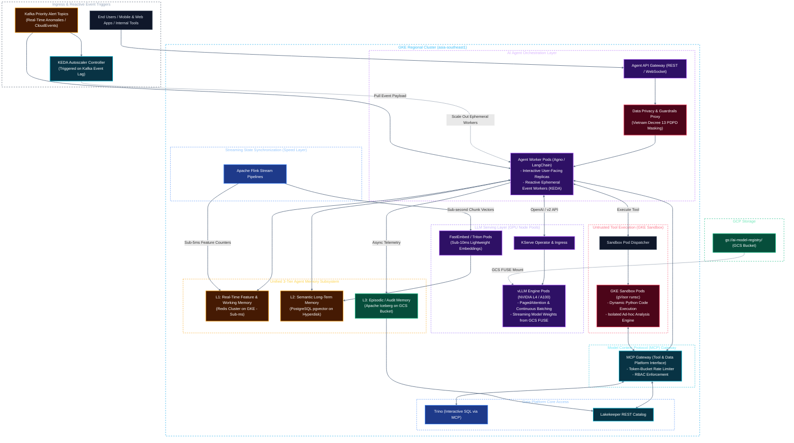
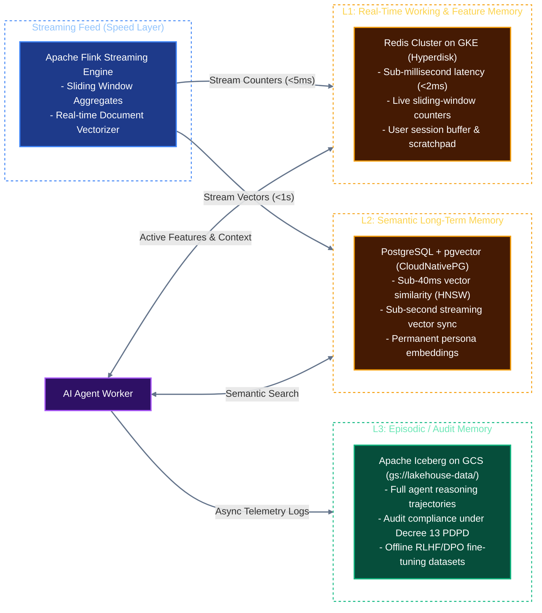

# Solution Architecture: Unified Kubernetes AI & Data Platform on Google Cloud (GCP)
## Document 04: AI Agent Runtimes, LLM Serving & Memory Architecture on GKE

---

## 1. AI Agent Workload Architecture on GKE

AI Agent workloads on GKE are engineered for both **interactive conversational reasoning** (User $\rightarrow$ Agent $\rightarrow$ LLM $\rightarrow$ Tool) and **autonomous, event-driven reactive execution** (Kafka Event $\rightarrow$ KEDA $\rightarrow$ Agent $\rightarrow$ Action). 

GKE provides purpose-built cloud-native capabilities—specifically **GKE Sandbox (managed gVisor)**, **GCS FUSE CSI driver**, **KEDA event-driven autoscaling**, and direct connectivity to the streaming fabric—that make it an optimal runtime environment for autonomous agents.



---

## 2. High-Throughput LLM Serving: vLLM with GCS FUSE on GKE

Model serving on GKE utilizes **vLLM** hosted on GPU node pools managed by **KServe**:

### A. Accelerated Model Loading with GCS FUSE CSI Driver
On GKE, the native **Cloud Storage FUSE CSI Driver** streams model weights directly into GPU memory with local NVMe caching, reducing pod startup to under **45 seconds**:

```yaml
apiVersion: "serving.kserve.io/v1beta1"
kind: "InferenceService"
metadata:
  name: "llama-3-70b-instruct"
  namespace: "ai-serving"
  annotations:
    gke-gcsfuse/volumes: "true"
    gke-gcsfuse/memory-limit: "8Gi"
    gke-gcsfuse/cpu-limit: "4"
spec:
  predictor:
    minReplicas: 1
    maxReplicas: 6
    scaleTarget: 15 # Concurrent requests per replica
    scaleMetric: concurrency
    model:
      modelFormat:
        name: vLLM
      resources:
        limits:
          nvidia.com/gpu: "4" # 4x A100 80GB (Tensor Parallelism = 4)
          memory: "128Gi"
          cpu: "16"
        requests:
          nvidia.com/gpu: "4"
          memory: "64Gi"
          cpu: "8"
      args:
        - "--model=/mnt/models/hub/Meta-Llama-3-70B-Instruct"
        - "--tensor-parallel-size=4"
        - "--max-model-len=16384"
        - "--gpu-memory-utilization=0.92"
        - "--enable-prefix-caching"
      volumeMounts:
        - name: gcs-model-store
          mountPath: /mnt/models
          readOnly: true
    volumes:
      - name: gcs-model-store
        csi:
          driver: gcsfuse.csi.storage.gke.io
          readOnly: true
          volumeAttributes:
            bucketName: data-platform-models-prod
            mountOptions: "implicit-dirs,file-cache:max-size-mb:200000"
```

---

## 3. Native GKE Sandbox for Untrusted Agent Tool Execution

AI agents routinely generate dynamic Python scripts (data transformation, calculations, visualization). Executing untrusted code inside standard containers risks container breakouts and internal network probing.

On GKE, sandboxing is managed natively via **GKE Sandbox**:
1. **gVisor User-Space Kernel:** Intercepts application system calls, isolating the host Linux kernel from untrusted agent code.
2. **Metadata Server Protection:** GKE Workload Identity automatically blocks access to the Google Cloud Metadata server (`169.254.169.254`), preventing agents from stealing cluster credentials.
3. **Strict Network & Resource Limits:** Ephemeral pods are configured with 512 MB RAM, 1 CPU, 15-second timeouts, and zero egress except to the local MCP Gateway.

```yaml
apiVersion: v1
kind: Pod
metadata:
  name: ephemeral-agent-sandbox-0412
  namespace: agent-sandboxes
  annotations:
    sandbox.gke.io/type: gvisor # Activates GKE Sandbox kernel isolation
spec:
  restartPolicy: Never
  nodeSelector:
    sandbox.gke.io/type: gvisor
  containers:
  - name: python-tool-runner
    image: internal-registry.corp/data-platform/agent-python-sandbox:3.11-slim
    command: ["python", "-c", "import sys; ..."]
    resources:
      limits:
        memory: "512Mi"
        cpu: "1000m"
    securityContext:
      readOnlyRootFilesystem: true
      allowPrivilegeEscalation: false
      runAsNonRoot: true
      runAsUser: 10001
      capabilities:
        drop: ["ALL"]
```

---

## 4. 3-Tier Agent Memory Subsystem & Real-Time Synchronization

The agent memory architecture synchronizes real-time streaming state with historical analytical knowledge:



### A. Real-Time Feature Store (Redis L1):
* Flink streaming jobs calculate real-time behavioral features (e.g., `tx_count_last_10m`, `login_ip_distinct_count_1h`) and flush them directly to Redis via high-throughput pipelining.
* When an AI agent reasons about a customer request or fraud signal, it fetches pre-computed features in **$< 2\text{ms}$** without querying the analytical Lakehouse.

### B. Near-Real-Time Streaming Vector Ingestion (`pgvector` L2):
* Traditional platforms vectorize documents in batch mode, leaving vector databases 15–60 minutes behind operational reality.
* On this platform, a dedicated Flink pipeline extracts incoming text chunks, invokes lightweight embeddings via Triton/FastEmbed, and executes streaming upserts into `pgvector` with HNSW indices in **$< 1\text{ second}$**.
* HNSW tuning parameters on Hyperdisk: `m = 16`, `ef_construction = 128` to maintain low write latency without sacrificing search recall.

---

## 5. Event-Driven Reactive AI Agents on GKE

In addition to user-prompted agents, the platform natively supports **Event-Driven Autonomous Agents** reacting to real-time stream anomalies:

1. **Anomaly Detection & Signal Emission:**
   * Apache Flink evaluates complex event patterns (CEP) over transaction streams.
   * Upon detecting anomalous thresholds (e.g., account takeover velocity or operational failure), Flink writes a standardized **CloudEvent** to Kafka topic `ai.agent.triggers.priority`.
2. **KEDA Event-Driven Worker Scaling:**
   * A **KEDA `ScaledJob`** monitors Kafka topic consumer lag. When messages arrive, KEDA immediately spins up ephemeral Agent Worker pods:
   ```yaml
   apiVersion: keda.sh/v1alpha1
   kind: ScaledJob
   metadata:
     name: reactive-fraud-agent-job
     namespace: ai-agents
   spec:
     jobTargetRef:
       template:
         spec:
           containers:
           - name: agent-worker
             image: internal-registry.corp/agents/fraud-mitigation-agent:1.2.0
             env:
             - name: KAFKA_TOPIC
               value: "ai.agent.triggers.priority"
     triggers:
     - type: kafka
       metadata:
         bootstrapServers: "kafka-cluster-kafka-bootstrap.kafka.svc:9092"
         consumerGroup: "reactive-fraud-agents"
         topic: "ai.agent.triggers.priority"
         lagThreshold: "1"
   ```
3. **Autonomous Remediation Loop:**
   * The ephemeral agent worker pulls the alert, loads real-time feature context from Redis L1, executes isolated diagnostic queries via the MCP Gateway, queries vLLM for root-cause analysis, and dispatches mitigation webhooks.

---

## 6. Model Context Protocol (MCP) Gateway on GKE

The **Model Context Protocol (MCP)** standardizes tool integration between AI agents and the data platform:
* **Exposed Data Platform Tools:**
  1. `execute_iceberg_sql`: Routes parameterized queries to Trino with automated partition pruning checks.
  2. `search_vector_knowledge`: Performs cosine similarity queries on PostgreSQL `pgvector`.
  3. `inspect_catalog_metadata`: Reads table documentation and schema definitions from Lakekeeper.
* **Security & Rate Limiting:** Enforces token-bucket rate limiting, checks GKE Workload Identity credentials, and logs all tool executions to the L3 Iceberg audit log.
* **Deep Architectural Integration:** For complete architectural details on Hybrid RAG retrieval, two-stage BGE cross-encoder reranking, and semantic chunking pipelines, see **[Document 03: Enterprise Hybrid RAG, Knowledge Pipelines & Semantic Retrieval on GCP](file:///c:/Users/ToanBX/dev/personal/data_platform_gcp/docs/architectures/03_rag_system_architecture.md)**.
