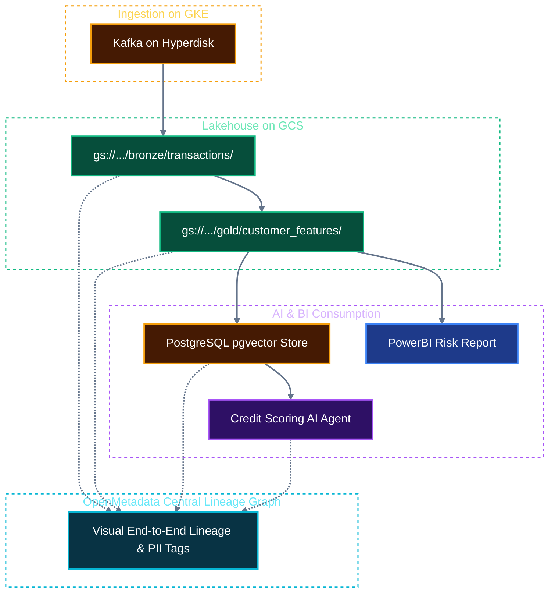
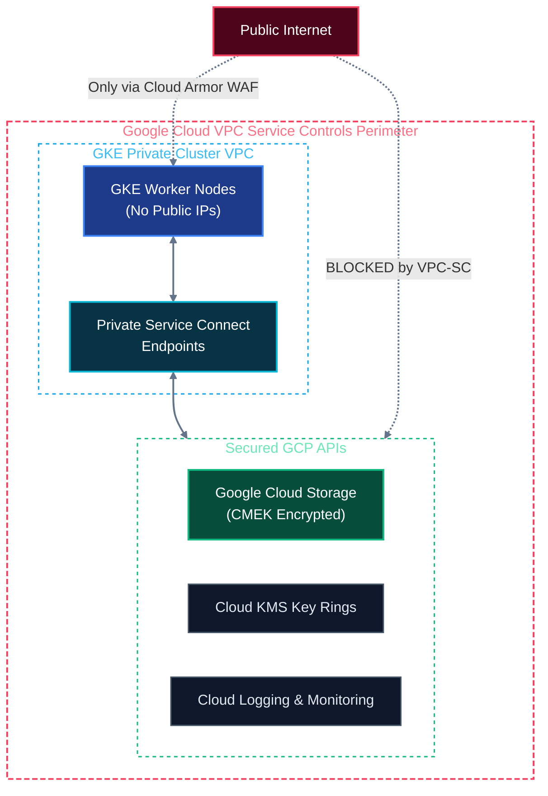
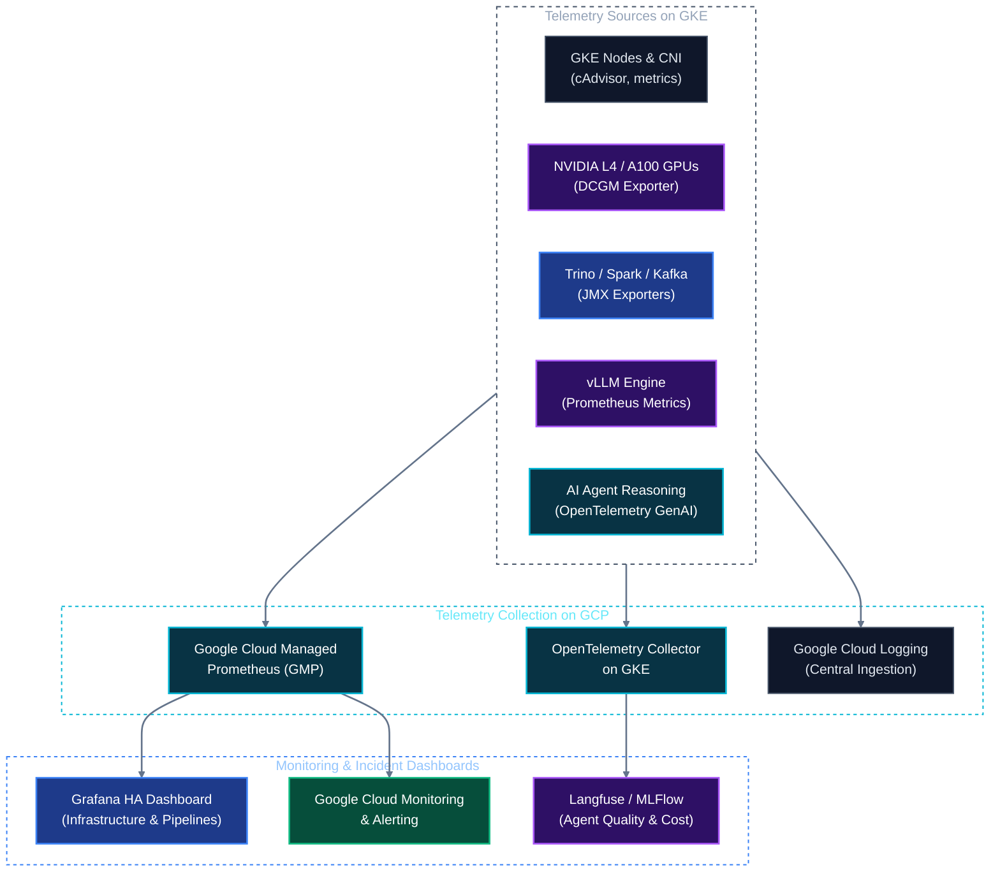

# Solution Architecture: Unified Kubernetes AI & Data Platform on Google Cloud (GCP)
## Document 04: Governance, Security, Privacy & Full-Stack Observability on GCP

---

## 1. Compliance Architecture: Vietnam Personal Data Protection Decree 13 on GCP

Deploying financial and personal data workloads on Google Cloud requires adherence to the **Vietnam Personal Data Protection Decree (Decree 13/2023/ND-CP)**:
* **Data Sovereignty & Perimeter:** Guarded by **VPC Service Controls (VPC-SC)**, establishing a cryptographic security perimeter around GCS buckets, GKE clusters, and Artifact Registries, preventing data egress outside approved GCP projects.
* **Customer-Managed Encryption Keys (Cloud KMS CMEK):** All GCS buckets containing Iceberg data and all GKE Persistent Disks are encrypted with CMEK keys rotated periodically.
* **Inline PII Masking Proxy on GKE:** An inline proxy sanitizes prompts before they reach vLLM or vector stores, anonymizing national identification numbers (CCCD), account numbers, and phone numbers.

```mermaid
flowchart LR
    RawInput["Raw Agent Input / Query\n(May contain CCCD / Salary / Phone)"]:::gray
    
    subgraph PrivacyProxy["Data Privacy & Guardrails Proxy (GKE Service)"]
        Scanner["PII Scanner\n(Regex + NER Engine)"]:::danger
        Tokenizer["Reversible Masking\nTokenizer"]:::danger
        PolicyCheck["OPA Consent\nValidator"]:::danger
    end
    
    MaskedPayload["Anonymized Prompt\n[CUSTOMER_REF_9812]"]:::cyan
    vLLM["GKE vLLM Inference\n(Self-Hosted L4/A100)"]:::purple
    DeMasker["De-Tokenization\n(Role-Based Access)"]:::danger
    FinalOutput["Final Secure Response"]:::gray

    RawInput --> Scanner --> PolicyCheck --> Tokenizer --> MaskedPayload
    MaskedPayload --> vLLM --> DeMasker --> FinalOutput

    %% Subgraph Styling (Transparent & Dual-Mode Friendly)
    style PrivacyProxy fill:none,stroke:#f43f5e,stroke-width:1.5px,stroke-dasharray: 4 4,color:#fb7185

    %% Link Styling
    linkStyle default stroke:#64748b,stroke-width:2px;

    %% Universal Dual-Mode High-Contrast Palette
    classDef danger  fill:#4c0519,stroke:#f43f5e,stroke-width:2px,color:#ffffff;
    classDef purple  fill:#2e1065,stroke:#a855f7,stroke-width:2px,color:#ffffff;
    classDef cyan    fill:#083344,stroke:#06b6d4,stroke-width:2px,color:#ffffff;
    classDef gray    fill:#0f172a,stroke:#475569,stroke-width:1.5px,color:#e2e8f0;
```

---

## 2. Automated Metadata, Lineage & Cataloging: OpenMetadata on GKE

**OpenMetadata** runs natively on GKE with a PostgreSQL backend (CloudNativePG) and OpenSearch:
* **GCS & Iceberg Lineage:** Automatically parses table schemas, partition metrics, and Iceberg snapshots from Lakekeeper.
* **Trino & Spark Lineage:** Ingests query execution logs from Trino and Spark to visualize column-level lineage from source transactions to downstream BI reports and vector embeddings.
* **Agent Lineage Tracking:** Captures agent reasoning traces, associating the exact Iceberg partition or vector chunk retrieved with the generated agent response.

---

## 3. GCP Security Perimeter: VPC Service Controls & IAM

* **Private GKE Cluster:** Worker nodes have private RFC 1918 IP addresses with zero public IP exposure. All internet egress is mediated via Cloud NAT.
* **Cloud Armor & WAF:** Protects the external Agent API gateway against DDoS attacks, SQL injection, and malicious payloads.

---

## 4. Full-Stack Observability Subsystem on GCP

Observability unifies infrastructure telemetry, data pipeline execution, and AI agent reasoning:

### Key Service Level Indicators (SLIs) & Alert Matrix

| Component | Metric Name | Target SLA | Alert Condition |
| :--- | :--- | :--- | :--- |
| **vLLM Serving** | Time-To-First-Token (TTFT) | P95 < 250 ms | `vllm:avg_prompt_throughput_tok_per_s < 100` for 5m |
| **vLLM Serving** | GPU VRAM KV-Cache Pressure | Utilization < 90% | `vllm:gpu_cache_usage_factor > 0.90` for 3m |
| **GKE GPU Nodes** | GPU Core Temperature & ECC | Healthy | `dcgm_gpu_temp > 82` or `dcgm_ecc_dbe_aggregate_total > 0` |
| **Trino Engine** | Queued Analytical Queries | P95 < 2.0s | `trino_queued_queries > 20` for 5m (Triggers KEDA scale-out) |
| **GCS Storage** | 4xx / 5xx API Error Rate | Error Rate < 0.01% | `gcs_api_error_rate > 0.01` for 5m |
| **AI Agents** | Tool Execution Failure Rate | Failure Rate < 2% | `agent_tool_error_count / total > 0.05` for 5m |
