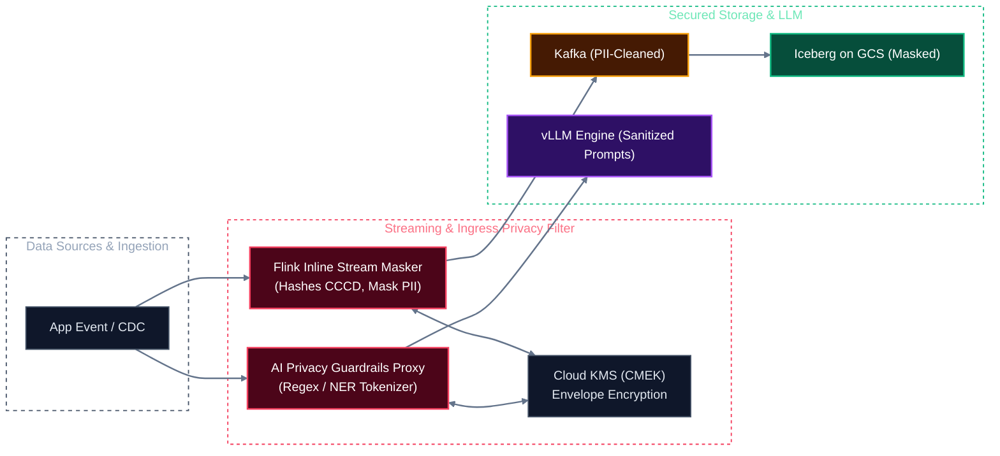
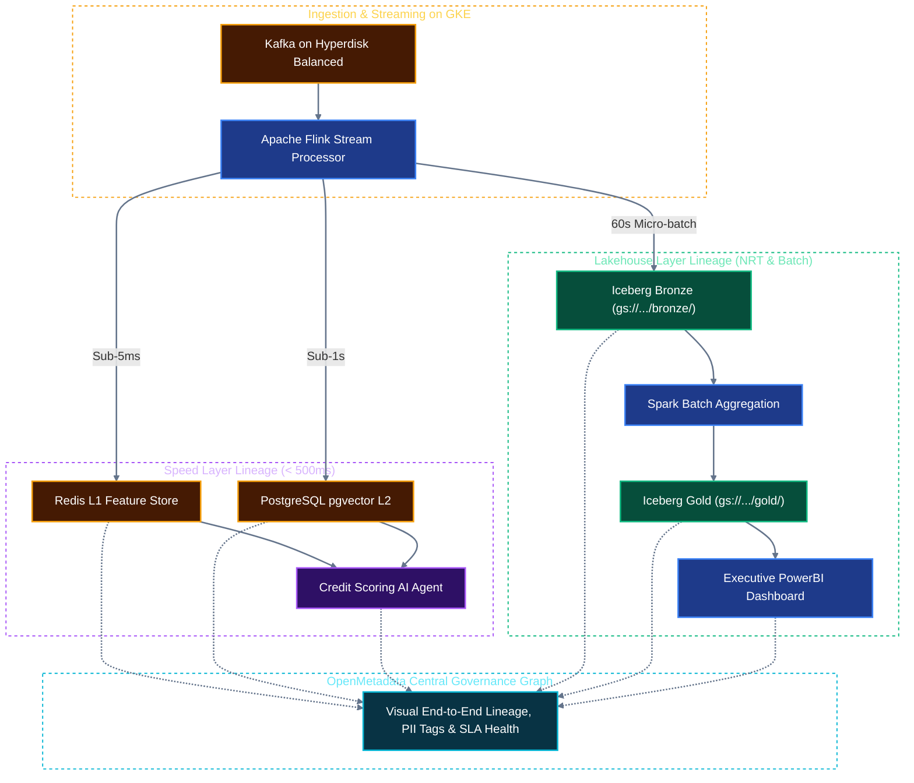
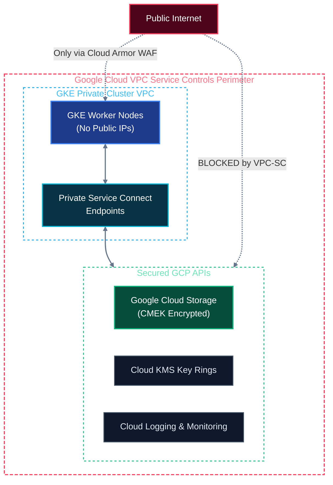
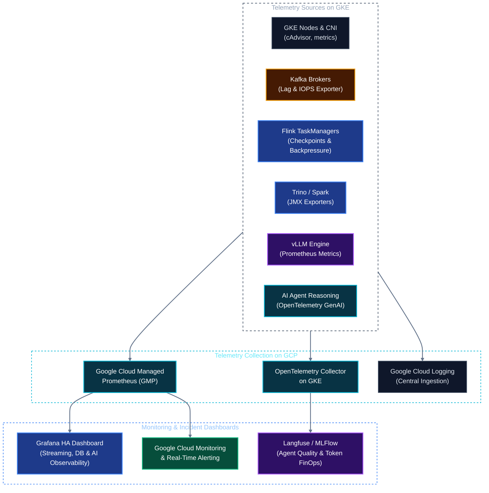

# Solution Architecture: Unified Kubernetes AI & Data Platform on Google Cloud (GCP)
## Document 05: Governance, Security, Privacy & Full-Stack Observability on GCP

---

## 1. Regulatory Compliance & Inline Privacy Guardrails: Vietnam Decree 13 PDPD

The platform strictly complies with the **Vietnam Personal Data Protection Decree (Decree 13/2023/ND-CP)** across batch, streaming, and AI workloads:

1. **Inline Streaming Anonymization (Flink & Debezium):**
   * Before raw transactional data is broadcast across Kafka or committed to Iceberg, Flink streaming operators execute inline cryptographic hashing and tokenization on PII fields (e.g., Vietnamese National ID / CCCD, phone numbers, banking account numbers).
   * Decryption keys are stored in **Google Cloud KMS (CMEK)** and restricted via IAM condition policies.
2. **AI Agent Privacy & Guardrails Proxy:**
   * An inline lightweight proxy intercepts all agent prompt payloads.
   * Named Entity Recognition (NER) detects and redacts customer PII before payloads leave the internal VPC perimeter for external LLM inference.
3. **Data Subject Rights (Article 9 Right to Erasure / RTBF):**
   * Iceberg tables support metadata-driven equality/position deletes, enabling targeted deletion of customer records across petabyte-scale historical datasets without rewriting entire partition directories.

---

## 2. Automated Metadata, Lineage & Cataloging: OpenMetadata on GKE

**OpenMetadata** runs natively on GKE with a PostgreSQL backend (CloudNativePG) and OpenSearch:
* **Dual-Speed Lineage Tracking:** Captures both the **Sub-second Speed Layer** (`Kafka -> Flink -> Redis/pgvector -> Agent`) and the **Analytical Lakehouse Layer** (`Kafka -> Flink -> Iceberg Bronze -> Spark -> Iceberg Gold -> Trino/BI`).
* **Lakekeeper & Iceberg Integration:** Automatically ingests table schemas, column data types, partition specs, and snapshot commit histories.
* **Agent Reasoning Lineage:** Tracks which Iceberg snapshot and vector chunk was retrieved by an agent for any given LLM decision.

---

## 3. GCP Security Perimeter: VPC Service Controls & IAM

* **Private GKE Cluster:** Worker nodes have private RFC 1918 IP addresses with zero public IP exposure. All internet egress is mediated via Cloud NAT.
* **Cloud Armor & WAF:** Protects the external Agent API gateway against DDoS attacks, SQL injection, and malicious payloads.

---

## 4. Full-Stack Observability Subsystem on GCP

Observability unifies infrastructure telemetry, stream processing health, and AI agent reasoning:

### Key Service Level Indicators (SLIs) & Alert Matrix

| Component | Metric Name | Target SLA | Alert Condition |
| :--- | :--- | :--- | :--- |
| **Kafka Cluster** | Consumer Group Lag | Lag $< 5,000$ messages | `kafka_consumergroup_lag > 10000` for 3m |
| **Kafka Brokers** | P99 Produce Latency | Latency $< 5\text{ ms}$ | `kafka_server_requestmetrics_requestspersec{request="Produce"} > 20ms` |
| **Flink Streaming** | Checkpoint Duration | Duration $< 20\text{ seconds}$ | `flink_jobmanager_job_lastCheckpointDuration > 30000` for 2 checkpoints |
| **Flink Streaming** | Stream Backpressure Ratio | Ratio $< 0.15$ | `flink_taskmanager_job_task_isBackPressured > 0.30` for 5m |
| **vLLM Serving** | Time-To-First-Token (TTFT) | P95 $< 250\text{ ms}$ | `vllm:avg_prompt_throughput_tok_per_s < 100` for 5m |
| **vLLM Serving** | GPU VRAM KV-Cache Pressure | Utilization $< 90\%$ | `vllm:gpu_cache_usage_factor > 0.90` for 3m |
| **Trino Engine** | Queued Analytical Queries | P95 $< 2.0\text{s}$ | `trino_queued_queries > 20` for 5m (Triggers KEDA scale-out) |
| **GCS Storage** | 4xx / 5xx API Error Rate | Error Rate $< 0.01\%$ | `gcs_api_error_rate > 0.01` for 5m |
| **AI Agents** | Tool Execution Failure Rate | Failure Rate $< 2\%$ | `agent_tool_error_count / total > 0.05` for 5m |
