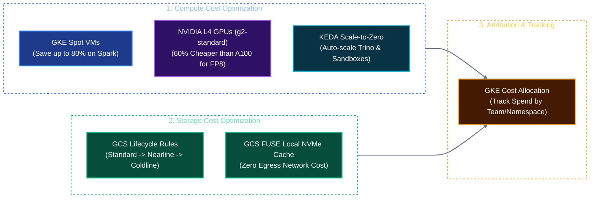

# Solution Architecture: Unified Kubernetes AI & Data Platform on Google Cloud (GCP)
## Document 05: High Availability, Disaster Recovery & FinOps on GCP

---

## 1. High Availability (HA) Multi-Zone Architecture on GCP

The platform is architected as a **GKE Regional Cluster** deployed across three zones (`asia-southeast1-a`, `asia-southeast1-b`, `asia-southeast1-c`), ensuring high availability and business continuity even during the complete failure of an entire Google Cloud data center.

```mermaid
flowchart TB
    subgraph GCPRegion["GCP Region: asia-southeast1 (Multi-Zone)"]
        subgraph ZoneA["Zone asia-southeast1-a"]
            NodeA["GKE Worker Node A"]:::primary
            PGPrimary["PostgreSQL Primary (CNPG)"]:::warning
            KafkaA["Kafka Broker 01"]:::warning
            vLLMA["vLLM Pod Replica 01"]:::purple
        end

        subgraph ZoneB["Zone asia-southeast1-b"]
            NodeB["GKE Worker Node B"]:::primary
            PGStandby1["PostgreSQL Standby 01"]:::warning
            KafkaB["Kafka Broker 02"]:::warning
            vLLMB["vLLM Pod Replica 02"]:::purple
        end

        subgraph ZoneC["Zone asia-southeast1-c"]
            NodeC["GKE Worker Node C"]:::primary
            PGStandby2["PostgreSQL Standby 02"]:::warning
            KafkaC["Kafka Broker 03"]:::warning
            TrinoCoord["Trino Standby / Workers"]:::primary
        end

        subgraph GeoReplicatedStorage["Geo-Redundant Storage Fabric"]
            GCSDualRegion["GCS Dual-Region / Multi-Region Bucket\n(Automatic Cross-Region Redundancy)"]:::success
        end
    end

    ZoneA <--> ZoneB
    ZoneB <--> ZoneC
    ZoneA <--> ZoneC
    ZoneA --> GCSDualRegion
    ZoneB --> GCSDualRegion
    ZoneC --> GCSDualRegion

    %% Subgraph Styling (Transparent & Dual-Mode Friendly)
    style GCPRegion fill:none,stroke:#475569,stroke-width:1.5px,stroke-dasharray: 5 5,color:#94a3b8
    style ZoneA fill:none,stroke:#0ea5e9,stroke-width:1.5px,stroke-dasharray: 4 4,color:#38bdf8
    style ZoneB fill:none,stroke:#0ea5e9,stroke-width:1.5px,stroke-dasharray: 4 4,color:#38bdf8
    style ZoneC fill:none,stroke:#0ea5e9,stroke-width:1.5px,stroke-dasharray: 4 4,color:#38bdf8
    style GeoReplicatedStorage fill:none,stroke:#10b981,stroke-width:1.5px,stroke-dasharray: 4 4,color:#6ee7b7

    %% Link Styling
    linkStyle default stroke:#64748b,stroke-width:2px;

    %% Universal Dual-Mode High-Contrast Palette
    classDef primary fill:#1e3a8a,stroke:#3b82f6,stroke-width:2px,color:#ffffff;
    classDef success fill:#064e3b,stroke:#10b981,stroke-width:2px,color:#ffffff;
    classDef warning fill:#451a03,stroke:#f59e0b,stroke-width:2px,color:#ffffff;
    classDef purple  fill:#2e1065,stroke:#a855f7,stroke-width:2px,color:#ffffff;
```



### High Availability Mechanics on GKE:
1. **Google Managed Control Plane:** GKE regional control plane replicates `etcd` across three zones with an automatic 99.95% uptime SLA.
2. **Kubernetes Topology Spread Constraints:** Enforces even scheduling of Lakekeeper, Trino, and Kafka replicas across zones:
```yaml
spec:
  topologySpreadConstraints:
  - maxSkew: 1
    topologyKey: "topology.kubernetes.io/zone"
    whenUnsatisfiable: DoNotSchedule
    labelSelector:
      matchLabels:
        app: lakekeeper
```

---

## 2. Disaster Recovery (DR) & Backup Matrix on GCP

| Service Tier | Components | RPO Target | RTO Target | GCP DR & Backup Mechanism |
| :--- | :--- | :--- | :--- | :--- |
| **Tier 1 (Critical State)** | PostgreSQL (pgvector & Lakekeeper DB) | $< 1\text{ minute}$ | $< 15\text{ minutes}$ | Continuous WAL streaming to GCS backup bucket via CloudNativePG; automated cross-region snapshot replication. |
| **Tier 1 (Critical State)** | Kafka Partition Logs | $< 5\text{ minutes}$ | $< 20\text{ minutes}$ | MirrorMaker 2 replication to secondary GCP region (`asia-east1` Taiwan). |
| **Tier 2 (Analytical Lakehouse)** | GCS Iceberg Bucket | $0$ (Active-Active) | $< 1\text{ hour}$ | **GCS Dual-Region Bucket** with Object Versioning and Turbo Replication enabled. |
| **Tier 3 (AI Model Weights)** | vLLM Model Weights | $0$ (Stateless) | $< 15\text{ minutes}$ | GCS FUSE mount to multi-region model repository bucket. |
| **Tier 3 (GKE Cluster Configs)** | K8s Manifests & Stateful Volumes | $< 1\text{ hour}$ | $< 30\text{ minutes}$ | **Backup for GKE** (managed cloud service) scheduling automated daily plan backups. |

---

## 3. FinOps & Cost Optimization on Google Cloud

Deploying high-performance GPU and big data clusters on the cloud requires aggressive cost governance:



### 1. GKE Spot VMs for Batch & Sandbox Workloads
* **Spark Batch Executors:** Run entirely on Spot node pools. Because Spark-on-K8s handles executor termination gracefully, this reduces batch ETL costs by up to **80%**.
* **Ephemeral Agent Sandboxes:** Code execution pods run on Spot VMs; short tasks (< 15 seconds) finish before any node preemption can take effect.

### 2. GPU Hardware Right-Sizing: NVIDIA L4 vs. A100
* For models up to 14B parameters and FP8 quantized 70B models, deploy **NVIDIA L4 (24GB VRAM)** via `g2-standard` instances instead of A100s, slashing GPU hosting costs by **60%** while maintaining $< 250\text{ ms}$ TTFT.
* Reserve A100 / H100 GPU instances strictly for FP16 70B models or intensive distributed fine-tuning.

### 3. GCS Object Lifecycle Management
Automatically transition historical Iceberg Parquet files:
```json
{
  "rule": [
    {
      "action": {"type": "SetStorageClass", "storageClass": "NEARLINE"},
      "condition": {"age": 90, "matchesPrefix": ["lakehouse-data/gold/"]}
    },
    {
      "action": {"type": "SetStorageClass", "storageClass": "COLDLINE"},
      "condition": {"age": 365, "matchesPrefix": ["lakehouse-data/audit/"]}
    }
  ]
}
```

### 4. GKE Cost Allocation by Namespace
Enable native GKE cost allocation to track compute, RAM, and GPU spending by team namespace (e.g., `namespace: credit-agent`, `namespace: bi-analytics`) with direct visualization in Google Cloud Billing and Looker Studio.
