# Enterprise Kubernetes AI & Data Platform on Google Cloud (GCP)
## Architecture Blueprint Suite

This repository contains the complete architectural specification for the **Unified Kubernetes AI & Data Platform running on Google Cloud Platform (GCP)**. The platform is designed on **Google Kubernetes Engine (GKE)** to support both **traditional Lakehouse workloads** (Batch, Streaming, Interactive SQL, BI) and **first-class AI Agent workloads** (LLM serving, sandboxed tool execution, agent memory hierarchy, Model Context Protocol, and real-time semantic retrieval).

---

## Architectural Documentation Roadmap

```mermaid
flowchart TD
    Index["docs/architectures/README.md\n(Master Architecture Index)"]:::gray
    Doc0["00: Overview & Requirements on GCP\n- Business Context & NFRs\n- Lakehouse vs. AI Agent Demands on GKE"]:::primary
    Doc1["01: Infrastructure & Storage Fabric\n- GKE Regional Cluster (Multi-Zone Node Pools)\n- GCS (GCSFileIO), Hyperdisk, Local SSD, GCS FUSE CSI\n- GKE Dataplane V2 (Cilium) & Workload Identity"]:::cyan
    Doc2["02: Open Lakehouse & Compute on GKE\n- Apache Iceberg on GCS & Lakekeeper REST Catalog\n- Spark-on-K8s on Spot VMs, Trino NVMe Cache, Flink CDC\n- Strimzi Kafka on Hyperdisk & Airflow Orchestration"]:::success
    Doc3["03: AI Agent & LLM Runtime on GKE\n- vLLM & KServe on NVIDIA L4 / A100 GPU Pools\n- Native GKE Sandbox (gVisor) for Dynamic Tool Sandboxing\n- 3-Tier Memory Hierarchy (Redis, pgvector, GCS Iceberg)\n- Model Context Protocol (MCP) Gateway"]:::purple
    Doc4["04: Governance, Security & Observability on GCP\n- Vietnam PDPD Decree 13 Compliance & VPC Service Controls\n- OpenMetadata End-to-End Lineage\n- Google Cloud Managed Prometheus (GMP) & Agent Tracing"]:::danger
    Doc5["05: HA, Disaster Recovery & FinOps on GCP\n- GKE Regional Multi-Zone HA & GCS Dual-Region Buckets\n- Backup for GKE & CloudNativePG WAL Archival\n- GKE Spot VMs, NVIDIA L4 Sizing, GCS Lifecycle Tiering"]:::warning

    Index --> Doc0
    Doc0 --> Doc1
    Doc1 --> Doc2
    Doc2 --> Doc3
    Doc3 --> Doc4
    Doc4 --> Doc5

    %% Link Styling
    linkStyle default stroke:#64748b,stroke-width:2px;

    %% Universal Dual-Mode High-Contrast Palette
    classDef primary fill:#1e3a8a,stroke:#3b82f6,stroke-width:2px,color:#ffffff;
    classDef success fill:#064e3b,stroke:#10b981,stroke-width:2px,color:#ffffff;
    classDef warning fill:#451a03,stroke:#f59e0b,stroke-width:2px,color:#ffffff;
    classDef danger  fill:#4c0519,stroke:#f43f5e,stroke-width:2px,color:#ffffff;
    classDef purple  fill:#2e1065,stroke:#a855f7,stroke-width:2px,color:#ffffff;
    classDef cyan    fill:#083344,stroke:#06b6d4,stroke-width:2px,color:#ffffff;
    classDef gray    fill:#0f172a,stroke:#475569,stroke-width:1.5px,color:#e2e8f0;
```

---

## Document Index

1. **[Document 00: Architecture Overview & Workload Requirements on GCP](file:///c:/Users/ToanBX/dev/personal/data_platform/docs/architectures/00_overview_and_requirements.md)**
   * Executive summary, architectural principles, comparative analysis of Lakehouse vs. AI Agent workloads on GKE, and GCP-specific SLIs/SLOs.
2. **[Document 01: Infrastructure, GKE & Cloud Storage Fabric](file:///c:/Users/ToanBX/dev/personal/data_platform/docs/architectures/01_infrastructure_and_storage.md)**
   * GKE Regional Cluster node pool topology (Lakehouse, Stateful, GPU, and Sandbox Pools), storage primitives (GCS, Hyperdisk Balanced, GCS FUSE CSI, Local NVMe SSDs), GKE Dataplane V2 (Cilium eBPF), and GKE Workload Identity Federation.
3. **[Document 02: Open Lakehouse, Distributed Compute & Pipeline Engineering on GCP](file:///c:/Users/ToanBX/dev/personal/data_platform/docs/architectures/02_lakehouse_and_compute.md)**
   * Decoupled Lakehouse on Google Cloud Storage (`GCSFileIO`), Lakekeeper Rust-native REST Catalog dispensing downscoped GCP OAuth2 tokens, Spark-on-K8s on GKE Spot VMs, Trino with Local NVMe SSD caching, Flink CDC, Strimzi Kafka, Airflow, and automated LakeOps maintenance routines.
4. **[Document 03: AI Agent Runtimes, LLM Serving & Memory Architecture on GKE](file:///c:/Users/ToanBX/dev/personal/data_platform/docs/architectures/03_ai_agent_and_llm_runtime.md)**
   * vLLM with GCS FUSE direct model streaming on NVIDIA L4/A100 GPUs, KServe autoscaling, native **GKE Sandbox (managed gVisor)** for untrusted Python tool execution, the Model Context Protocol (MCP) Gateway, and the 3-Tier Memory Hierarchy (Redis L1, PostgreSQL `pgvector` L2, GCS Iceberg L3).
5. **[Document 04: Governance, Security, Privacy & Full-Stack Observability on GCP](file:///c:/Users/ToanBX/dev/personal/data_platform/docs/architectures/04_governance_security_and_observability.md)**
   * Vietnam Personal Data Protection Decree 13 (Decree 13/2023/ND-CP) compliance via inline PII masking proxy, Cloud KMS CMEK, VPC Service Controls, OpenMetadata automated lineage, and Google Cloud Managed Service for Prometheus (GMP) with OpenTelemetry agent tracing.
6. **[Document 05: High Availability, Disaster Recovery & FinOps on GCP](file:///c:/Users/ToanBX/dev/personal/data_platform/docs/architectures/05_ha_dr_and_finops.md)**
   * Multi-zone GKE topology, GCS Dual-Region geo-replication, Backup for GKE, GKE Spot VM economics (80% batch savings), NVIDIA L4 right-sizing, and GCS Object Lifecycle Management.
