# Enterprise Kubernetes AI & Data Platform on Google Cloud (GCP)
## Architecture Blueprint Suite

This repository contains the complete architectural specification for the **Unified Kubernetes AI & Data Platform running on Google Cloud Platform (GCP)**. 

The platform is engineered on **Google Kubernetes Engine (GKE)** as a single, cohesive fabric supporting:
1. **Real-Time & Near-Real-Time Stream Processing:** Sub-second transactional CDC (Debezium, Strimzi Kafka, Karapace) and stateful stream processing (Apache Flink) with dual-speed routing.
2. **Open Modern Lakehouse:** Decoupled columnar storage on Google Cloud Storage (GCS), Apache Iceberg v2 tables with Lakekeeper Rust-native REST Catalog, Trino interactive SQL with NVMe caching, and Spark-on-K8s batch ETL on Spot VMs.
3. **Autonomous AI Agents & LLM Serving:** High-throughput vLLM model serving with GCS FUSE direct streaming, native GKE Sandbox (managed gVisor) for untrusted tool execution, 3-tier memory (Redis L1, `pgvector` L2, GCS Iceberg L3), and event-driven reactive agent triggers via KEDA.
4. **Enterprise Governance & FinOps:** Vietnam Decree 13 PDPD inline masking, OpenMetadata end-to-end lineage, VPC Service Controls, Cloud KMS CMEK, Kafka tiered storage, and GKE Spot VM economics.

---

## Architectural Documentation Roadmap

```mermaid
flowchart TD
    Index["docs/architectures/README.md\n(Master Architecture Blueprint Index)"]:::gray
    Doc0["00: Architecture Overview & Workload Requirements\n- Real-Time, Lakehouse & AI Agent Cohesion\n- 4-Tier Latency Taxonomy & SLA Targets\n- Workload Comparison & Core GCP Tenets"]:::primary
    Doc1["01: Infrastructure, GKE & Cloud Storage Fabric\n- GKE Regional Cluster (Multi-Zone Node Pools)\n- 3-Tier Storage Continuum (Kafka, pgvector/Redis, GCS Iceberg)\n- GKE Dataplane V2 (Cilium) & Workload Identity"]:::cyan
    Doc2["02: Open Lakehouse, Distributed Compute & Pipelines\n- Debezium CDC, Karapace Schema Registry, Strimzi Kafka\n- Stateful Flink Operator & RocksDB NVMe State\n- Streaming-to-Iceberg Protocol (60s Commits & Compactor)\n- Spark-on-K8s on Spot VMs & Trino NVMe Cache"]:::success
    Doc3["03: AI Agent Runtimes, LLM Serving & Memory\n- vLLM & KServe on NVIDIA L4 / A100 GPU Pools\n- GKE Sandbox (gVisor) for Dynamic Python Tools\n- 3-Tier Memory: Live Redis L1, Streaming pgvector L2, GCS L3\n- Event-Driven Reactive Agents (Kafka + KEDA)"]:::purple
    Doc4["04: Governance, Security, Privacy & Observability\n- Vietnam PDPD Decree 13 Compliance & Inline Stream Masking\n- OpenMetadata Dual-Speed Lineage (Speed vs Lakehouse)\n- Google Cloud Managed Prometheus & Streaming SLIs"]:::danger
    Doc5["05: HA, Disaster Recovery & FinOps on GCP\n- Multi-Zone Regional HA (Kafka, Flink, Trino, Lakekeeper)\n- GCS Dual-Region Replication & Backup for GKE\n- Kafka Tiered Storage to GCS & Spark Spot VM Savings"]:::warning
    Doc6["06: Enterprise Hybrid RAG, Pipelines & Retrieval\n- Dual-Speed Ingestion: Flink Streaming & Spark-on-K8s Batch\n- Hybrid Search (pgvector HNSW + BM25 tsvector) & RRF\n- Two-Stage BGE Cross-Encoder Reranker on L4 GPUs\n- Agentic RAG with MCP Tools & Decree 13 Citation Lineage"]:::purple

    Index --> Doc0
    Doc0 --> Doc1
    Doc1 --> Doc2
    Doc2 --> Doc3
    Doc3 --> Doc4
    Doc4 --> Doc5
    Doc5 --> Doc6

    %% Link Styling
    linkStyle default stroke:#64748b,stroke-width:2px;

    %% Universal Dual-Mode High-Contrast Palette
    classDef primary fill:#1e3a8a,stroke:#3b82f6,stroke-width:2px,color:#ffffff;
    classDef success fill:#064e3b,stroke:#10b981,stroke-width:2px,color:#ffffff;
    classDef warning fill:#451a03,stroke:#f59e0b,stroke-width:2px,color:#ffffff;
    classDef danger  fill:#4c0519,stroke:#f43f5e,stroke-width:2px,color:#ffffff;
    classDef purple  fill:#2e1065,stroke:#a855f7,stroke-width:2px,color:#ffffff;
    classDef cyan    fill:#083344,stroke:#06b6d4,stroke-width:2px,color:#ffffff;
    classDef gray    fill:#0f172a,stroke:#475569,stroke-width:1.5px,color:#e2e8f0;
```

---

## Document Index

1. **[Document 00: Architecture Overview & Workload Requirements on GCP](file:///c:/Users/ToanBX/dev/personal/data_platform_gcp/docs/architectures/00_overview_and_requirements.md)**
   * Executive summary, unified dual-speed architecture, 3-way workload comparison (Lakehouse vs. Streaming vs. AI Agents), and the 4-Tier Latency Taxonomy & SLA benchmarks.
2. **[Document 01: Infrastructure, GKE & Cloud Storage Fabric](file:///c:/Users/ToanBX/dev/personal/data_platform_gcp/docs/architectures/01_infrastructure_and_storage.md)**
   * GKE Regional Cluster node pool topology (Compute, Stateful, GPU, and Sandbox Pools), the 3-Tier Storage Continuum (Kafka as Tier 0 Streaming Log Storage, pgvector/Redis as Tier 1, Iceberg on GCS as Tier 2), GKE Dataplane V2 (Cilium eBPF), and GKE Workload Identity Federation.
3. **[Document 02: Open Lakehouse, Distributed Compute & Pipeline Engineering on GCP](file:///c:/Users/ToanBX/dev/personal/data_platform_gcp/docs/architectures/02_lakehouse_and_compute.md)**
   * Transactional CDC (Debezium + Outbox Pattern + Karapace Schema Registry), Strimzi Kafka on Hyperdisk, Flink Kubernetes Operator in Application Mode, solving the "Streaming to Iceberg" small files problem ($60\text{s}$ commit boundary, append-only bronze vs MOR with position deletes, streaming compaction daemon), Lakekeeper REST Catalog, Trino NVMe caching, and Spark on Spot VMs.
4. **[Document 03: AI Agent Runtimes, LLM Serving & Memory Architecture on GKE](file:///c:/Users/ToanBX/dev/personal/data_platform_gcp/docs/architectures/03_ai_agent_and_llm_runtime.md)**
   * vLLM with GCS FUSE direct model streaming on NVIDIA L4/A100 GPUs, KServe autoscaling, native **GKE Sandbox (managed gVisor)** for untrusted Python tool execution, 3-Tier Memory Synchronization (sub-5ms feature streaming to Redis L1, sub-second vector streaming to `pgvector` L2, and L3 episodic Iceberg audit log), and event-driven reactive AI agents triggered via Kafka and KEDA.
5. **[Document 04: Governance, Security, Privacy & Full-Stack Observability on GCP](file:///c:/Users/ToanBX/dev/personal/data_platform_gcp/docs/architectures/04_governance_security_and_observability.md)**
   * Vietnam Personal Data Protection Decree 13 (Decree 13/2023/ND-CP) compliance with inline stream PII masking, OpenMetadata Dual-Speed Lineage tracking, VPC Service Controls, Cloud KMS CMEK, and Google Cloud Managed Service for Prometheus (GMP) with streaming SLI alerts.
6. **[Document 05: High Availability, Disaster Recovery & FinOps on GCP](file:///c:/Users/ToanBX/dev/personal/data_platform_gcp/docs/architectures/05_ha_dr_and_finops.md)**
   * Regional multi-zone HA topology (Kafka, Flink, Trino, Lakekeeper), streaming DR with Kafka MirrorMaker 2 and Flink checkpoint restoration from GCS Dual-Region buckets, and streaming FinOps (Kafka Tiered Storage saving 70% disk cost, Spark Spot VMs saving 80%, NVIDIA L4 GPU right-sizing).
7. **[Document 06: Enterprise Hybrid RAG, Knowledge Pipelines & Semantic Retrieval on GCP](file:///c:/Users/ToanBX/dev/personal/data_platform_gcp/docs/architectures/06_rag_system_architecture.md)**
   * Dual-speed knowledge ingestion (sub-second streaming chunking & vectorization via Flink and batch processing via Spark-on-K8s), PostgreSQL `pgvector` HNSW index combined with BM25 full-text search (`tsvector`) via Reciprocal Rank Fusion (RRF), two-stage retrieval with BGE cross-encoder reranking on NVIDIA L4 GPUs, Agentic RAG integration via the Model Context Protocol (MCP) Gateway, Vietnam Decree 13 PDPD PII scrubbing, RTBF cascading purges, and OpenMetadata end-to-end citation lineage.
