# Operational Standard Operating Procedure (SOP)
## Instruction 01: Platform-as-a-Product & GitOps-First (Zero Console Tweaks)

---

## 1. Principle & Operational Mandate

This standard establishes the operational methodology for managing all infrastructure, platform services, and streaming/analytical workloads across the **GCP Unified AI & Data Platform**.

### A. Platform-as-a-Product
The Data Platform team operates not as a reactive ticketing queue, but as a **product engineering team** delivering a reliable, secure, and self-service substrate. Our customers are internal Data Engineers, ML/AI Engineers, and Analytics Teams.
* **Golden Paths:** Provide standardized, version-controlled templates for deploying Flink pipelines, Spark jobs, and AI Agent execution sandboxes.
* **Defined SLAs/SLOs:** Measure platform performance by platform uptime (99.95%), Time-To-First-Token (TTFT $< 250\text{ms}$), and streaming freshness ($< 60\text{s}$).

### B. GitOps-First & Zero Console Tweaks
* **Git as the Single Source of Truth:** Every cloud resource, Kubernetes operator, Helm configuration, and Iceberg catalog policy must exist in version-controlled Git repositories.
* **Strict Console Lockdown:** Direct modifications in the Google Cloud Console (e.g., creating GCS buckets, tweaking firewall rules, resizing node pools) or via ad-hoc commands (`kubectl edit`, `kubectl apply`, `gcloud compute`) in production environments are **strictly prohibited**.
* **Automated Reconciliation:** The live cluster and cloud state must continuously match the declared Git state through automated drift detection and reconciliation engines.

```mermaid
flowchart LR
    subgraph DeveloperWorkstation["1. Developer & Platform Engineers"]
        Engineer["Data Platform Engineer"]:::gray
        GitBranch["Feature Branch\n(PR: Terraform / Helm / CRDs)"]:::cyan
        Review["Automated Validation\n& Peer Approval"]:::primary
        
        Engineer -->|"Git Push"| GitBranch --> Review
    end

    subgraph VersionControl["2. Git Repository (Single Source of Truth)"]
        MainBranch["main Branch (Protected)\n(Signed Commits Only)"]:::cyan
        Review -->|"Merge PR"| MainBranch
    end

    subgraph ContinuousDeployment["3. Automated GitOps Engine"]
        TFRoutes["Cloud Build / GitHub Actions\n(Terraform Plan & Apply)"]:::primary
        ArgoCD["ArgoCD GitOps Operator\n(Live K8s State Reconciliation)"]:::primary
        
        MainBranch -->|"Trigger Webhook"| TFRoutes
        MainBranch -->|"Sync Polling (3m)"| ArgoCD
    end

    subgraph ProductionState["4. Live Production State (Zero Manual Access)"]
        GCPInfra["GCP Managed Resources\n(VPC-SC, GCS, GKE, KMS CMEK)"]:::success
        GKEWorkloads["GKE Operators & Stateful Pods\n(Flink, Kafka, Lakekeeper, vLLM)"]:::success
        
        TFRoutes -->|"Workload Identity Auth"| GCPInfra
        ArgoCD -->|"Declarative Drift Rollback"| GKEWorkloads
    end

    %% Subgraph Styling
    style DeveloperWorkstation fill:none,stroke:#475569,stroke-width:1.5px,stroke-dasharray: 4 4,color:#94a3b8
    style VersionControl fill:none,stroke:#06b6d4,stroke-width:1.5px,stroke-dasharray: 4 4,color:#67e8f9
    style ContinuousDeployment fill:none,stroke:#3b82f6,stroke-width:1.5px,stroke-dasharray: 4 4,color:#93c5fd
    style ProductionState fill:none,stroke:#10b981,stroke-width:1.5px,stroke-dasharray: 4 4,color:#6ee7b7

    %% Link Styling
    linkStyle default stroke:#64748b,stroke-width:2px;

    %% Universal Dual-Mode High-Contrast Palette
    classDef primary fill:#1e3a8a,stroke:#3b82f6,stroke-width:2px,color:#ffffff;
    classDef success fill:#064e3b,stroke:#10b981,stroke-width:2px,color:#ffffff;
    classDef warning fill:#451a03,stroke:#f59e0b,stroke-width:2px,color:#ffffff;
    classDef cyan    fill:#083344,stroke:#06b6d4,stroke-width:2px,color:#ffffff;
    classDef gray    fill:#0f172a,stroke:#475569,stroke-width:1.5px,color:#e2e8f0;
```



---

## 2. Repository Topology & Separation of Concerns

To guarantee clarity, auditability, and safety, platform code is structured into three decoupled layers:

```
data_platform_gcp/
├── infra/                          # Layer 1: Cloud Infrastructure as Code (Terraform)
│   ├── modules/                    # Reusable modules (gke-cluster, gcs-bucket, vpc-sc)
│   └── environments/
│       ├── dev/                    # Development environment state
│       ├── staging/                # Pre-production environment state
│       └── prod/                   # Production environment state (Strict IAM)
│           ├── main.tf             # GKE Regional Cluster, CMEK, VPC
│           ├── storage.tf          # GCS Buckets, Hyperdisk StorageClasses
│           ├── iam.tf              # Workload Identity bindings
│           └── backend.tf          # Remote state in gs://tf-state-lakehouse-prod/
│
├── gitops/                         # Layer 2: Kubernetes Platform Engine (ArgoCD / Helm)
│   ├── bootstrap/                  # ArgoCD Root "App-of-Apps"
│   └── applications/
│       ├── 00-crds/                # Strimzi, Flink, KServe, CNPG CRDs
│       ├── 01-networking/          # Ingress Gateway, Cilium NetworkPolicies
│       ├── 02-storage/             # PersistentVolumeClaims, GCS FUSE CSI
│       ├── 03-lakehouse/           # Lakekeeper, Trino, Spark Operator, Airflow
│       ├── 04-streaming/           # Strimzi Kafka, Debezium Connect, Karapace
│       ├── 05-ai-serving/          # vLLM, KServe, GKE Sandbox runtime
│       └── 06-observability/       # Managed Prometheus, Grafana, OpenMetadata
│
└── pipelines/                      # Layer 3: Streaming & Analytical Code
    ├── flink-jobs/                 # Flink Application JARs & FlinkDeployment CRDs
    ├── spark-jobs/                 # Spark PySpark batch scripts & manifests
    └── agent-tools/                # Pre-approved tools for GKE Sandbox execution
```

---

## 3. Two-Tier GitOps Architecture & Lifecycles

### Tier A: Cloud Infrastructure as Code (Terraform)
* **Scope:** Underlying cloud fabric (VPC, Subnets, GKE Regional Cluster, Node Pools, Cloud KMS keys, GCS Buckets, Cloud Armor policies).
* **Execution Engine:** Cloud Build or GitHub Actions runner authenticated via **GCP Workload Identity Federation** (zero static service account keys).
* **PR Plan Verification:** Every pull request runs `terraform plan` and posts the speculative execution diff back into the PR comments.
* **Production Apply:** Merging into `main` automatically triggers `terraform apply -auto-approve` against the production environment.

#### Terraform Remote State Configuration (`infra/environments/prod/backend.tf`):
```hcl
terraform {
  required_version = ">= 1.8.0"
  backend "gcs" {
    bucket                      = "data-platform-tfstate-prod"
    prefix                      = "terraform/state/production"
    impersonate_service_account = "terraform-ci-sa@data-platform-prod.iam.gserviceaccount.com"
  }
}
```

---

### Tier B: Kubernetes Platform & Workload GitOps (ArgoCD)
* **Scope:** Deploying operators, custom resources, database clusters, and service configurations on GKE.
* **Execution Engine:** **ArgoCD** deployed within the GKE cluster in namespace `argocd`.
* **Automated Sync & Self-Healing:** ArgoCD checks Git every 3 minutes. If an unauthorized human manually edits a deployment or deletes a service via `kubectl`, ArgoCD automatically detects the drift and reverts the cluster back to the Git declaration:

```yaml
apiVersion: argoproj.io/v1alpha1
kind: Application
metadata:
  name: lakehouse-catalog-lakekeeper
  namespace: argocd
  finalizers:
    - resources-finalizer.argocd.argoproj.io
spec:
  project: default
  source:
    repoURL: 'https://github.com/corp/data-platform-gcp.git'
    targetRevision: main
    path: gitops/applications/03-lakehouse/lakekeeper
  destination:
    server: 'https://kubernetes.default.svc'
    namespace: lakehouse-system
  syncPolicy:
    automated:
      prune: true     # Automatically deletes resources removed from Git
      selfHeal: true  # Automatically overwrites manual out-of-band cluster edits
    syncOptions:
      - CreateNamespace=true
      - ApplyOutOfSyncOnly=true
```

---

## 4. Operational Step-by-Step Workflows

### Workflow 1: Provisioning a New Infrastructure Resource (e.g., GCS Bucket or GPU Pool)
1. **Branch Out:** Create a new branch: `git checkout -b feature/add-l4-gpu-pool`.
2. **Declare Resource:** Add the configuration in `infra/environments/prod/compute.tf`.
3. **Local Lint & Validate:**
   ```bash
   terraform fmt -check
   terraform validate
   tflint
   ```
4. **Open Pull Request:** Push branch and open a PR against `main`.
5. **Review CI Output:** Verify the automated `terraform plan` comment on the PR.
6. **Peer Review:** Obtain sign-off from a Senior Data Platform Engineer.
7. **Merge:** Merge to `main`. CI runner executes `terraform apply`. Verify the new node pool appears in GKE:
   ```bash
   gcloud container node-pools list --cluster gke-data-platform-prod --region asia-southeast1
   ```

---

### Workflow 2: Updating a Platform Workload (e.g., Scaling Flink or Upgrading Lakekeeper)
1. **Locate Declarative Manifest:** Open `gitops/applications/04-streaming/flink/flink-deployment.yaml`.
2. **Modify Spec:** Increment task parallelism or update image version tag:
   ```yaml
   spec:
     job:
       parallelism: 32 # Scaled up from 16
   ```
3. **Commit & PR:** Push changes and create a PR. ArgoCD PR preview validates Kubernetes schema.
4. **Merge to Main:** Once merged, ArgoCD detects the commit, initiates an in-place rolling update or savepoint upgrade, and reports `Synced` and `Healthy`.

---

### Workflow 3: Investigating & Reconciling Drift
If an automated alert fires for cluster drift or an out-of-sync application:
1. **Identify the Drift via CLI:**
   ```bash
   argocd app diff lakehouse-catalog-lakekeeper
   ```
2. **Analyze Root Cause:** Check Kubernetes Audit Logs to see who executed the manual `kubectl` command.
3. **Force Reconciliation:**
   ```bash
   argocd app sync lakehouse-catalog-lakekeeper --force
   ```
4. **Enforce Policy:** Remind the team member of the zero-console mandate and open an incident ticket if production state was altered.

---

### Workflow 4: Emergency "Break-Glass" Procedure
During severe production P1 outages (e.g., Kafka partition offline, GCS credentials expired):
1. **Activate Break-Glass Role:** A lead engineer assumes a temporary, time-bounded Privileged Access Management (PAM) role with `roles/container.admin` (maximum duration: 2 hours).
2. **Execute Triage Commands:** Remediate the immediate failure (e.g., scale a stuck pod, restart broker).
3. **Record All Commands:** All terminal sessions are logged and sent to Cloud Audit Logs.
4. **Backport Fix to Git (Mandatory SLA: $< 4\text{ hours}$):**
   * As soon as the incident stabilizes, the engineer **must** commit the exact changes made into Git.
   * If the fix is not committed to Git, ArgoCD's `selfHeal` will overwrite the manual fix at the next sync interval, re-introducing the outage.
5. **Post-Mortem Review:** Conduct a blameless post-mortem examining why the platform could not be remediated via normal GitOps workflows.

---

## 5. Guardrails & Policy-as-Code (Technical Enforcement)

Policy without automated technical enforcement fails over time. We enforce the Zero-Console rule via three technical barriers:

### 1. GCP IAM Deny Policies
* Human engineers belong to Google Workspace Groups (`data-platform-engineers@corp.com`) that have **Read-Only / Viewer** access to the GCP Console (`roles/viewer`, `roles/container.viewer`).
* Human identities are explicitly barred from running `compute.instances.create`, `container.clusters.update`, or `storage.buckets.delete` in production.
* Only the dedicated CI/CD Service Account (`terraform-runner@...iam.gserviceaccount.com`) holds deployer roles, which can only be impersonated through trusted GitHub Actions / Cloud Build workflows.

### 2. Kubernetes Admission Control (Kyverno / Gatekeeper)
* **Block Ephemeral Manual Deployments:** Policies prevent raw `kubectl run` or untagged container images in production namespaces.
* **Enforce Resource Quotas:** Every pod must specify explicit CPU and Memory requests and limits.

### 3. Branch Protection on Git
* The `main` branch requires:
  1. At least 1 approved peer review from the `@platform-leads` code owner group.
  2. Passing CI checks (`tflint`, `tfsec`, `kubeval`, schema compatibility).
  3. Strict linear history (rebase or squash merge only).
  4. Cryptographically signed commits (`git commit -S`).

---

## 6. Verification & Self-Audit Checklist

Every Data Platform Engineer must verify their changes against this checklist before requesting PR review:

- [ ] **Declarative:** Is the change 100% codified in Git? No manual steps required.
- [ ] **Idempotent:** Will running this Terraform script or Helm chart twice cause downtime or duplicate resources?
- [ ] **Secret-Free:** Are there zero plaintext credentials, service account JSON keys, or passwords committed to Git? (Use Secret Manager + External Secrets Operator or Workload Identity).
- [ ] **Resource Limits:** Do all new Kubernetes pods define CPU and Memory requests and limits?
- [ ] **FinOps Checked:** Does this change provision expensive resources (GPUs, NVMe, Hyperdisk)? Are Spot VMs or autoscaling policies enabled?
- [ ] **Rollback Plan:** If this deployment fails, can it be cleanly rolled back with `git revert`?
