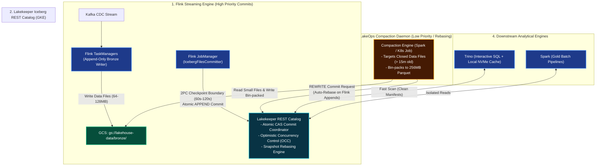

# Architecture Q&A: Flink-to-Iceberg Checkpointing Calibration & OCC Conflict Resolution

---

## 1. Problem Understanding

In our enterprise lakehouse architecture, Apache Flink consumes high-throughput transactional CDC streams from Kafka and sinks records directly into Apache Iceberg tables stored on Google Cloud Storage (GCS) and registered in Lakekeeper (Rust-based Iceberg REST Catalog). Meanwhile, Trino executes sub-second interactive SQL queries and Apache Spark executes heavy batch Gold transformations.

This architecture introduces two primary distributed systems tensions:

### A. The Ingestion Frontier: Data Freshness vs. GCS Metadata & Small-File Bloat
* **Checkpoint-Driven Commits:** The Flink Iceberg connector coordinates table snapshot commits strictly via Flink’s Two-Phase Commit (2PC) checkpointing mechanism (`IcebergFilesCommitter`). Data written to GCS becomes visible to Trino and Spark *only* when a checkpoint completes.
* **The High-Frequency Failure Mode ($< 15\text{s}$):** Sinking sub-minute CDC records with aggressive commit intervals (e.g., $5\text{s}$–$10\text{s}$) produces tens of thousands of tiny Parquet files ($< 5\text{MB}$) and generates over $8,640$ snapshots per day. This triggers:
  1. **Metadata Bloat:** Exponential growth of manifest files and manifest lists, exhausting memory during query planning in Trino/Spark.
  2. **GCS API Exhaustion:** High-frequency object creation and listing operations risk hitting GCS rate limits and inflate operational costs.
  3. **Scan Degradation:** Trino worker threads spend more time opening object storage file connections than performing vectorized columnar reads.
* **The Low-Frequency Failure Mode ($> 15\text{m}$):** Extending checkpoint intervals to tens of minutes yields large Parquet files, but violates Near-Real-Time (NRT) freshness SLAs and enlarges Flink RocksDB state size, increasing recovery time (MTTR) upon TaskManager failure.

### B. Optimistic Concurrency Control (OCC) Conflicts Under Concurrent Writes
* **Atomic CAS Metadata Swaps:** Lakekeeper implements Iceberg's REST catalog specification, enforcing serializable commits through Compare-And-Swap (CAS) operations on the table metadata pointer (`metadata.json`).
* **The Compaction Collision:** To prevent small-file sprawl, an asynchronous compaction daemon (e.g., LakeOps Janitor or Spark job) continuously bin-packs small Parquet files into optimal $256\text{MB}$ files via `rewrite_data_files`.
* **The Conflict:** If Flink commits an `APPEND` snapshot while the compaction daemon is rewriting historical files, the compactor’s base snapshot version becomes stale. Without proper isolation and rebasing semantics, the compactor fails with `CommitFailedException` (wasting substantial compute) or Flink’s commit retries exhaust, inducing streaming backpressure and stalling real-time ingestion.

---

## 2. Solution & Why the Solution Works

Our solution resolves both tensions through a combination of **checkpoint calibration**, **workload tiering**, **isolated commit semantics**, and **catalog-level snapshot rebasing**.



---

### Part A: Checkpoint & Commit Calibration Strategy

#### 1. The $60\text{s}$–$120\text{s}$ Checkpointing Frontier
We calibrate Flink’s checkpointing parameters in `FlinkDeployment` to align table commits with a Near-Real-Time (NRT) SLA:
* `execution.checkpointing.interval: "60000"` ($60\text{ seconds}$)
* `execution.checkpointing.min-pause: "30000"` ($30\text{ seconds}$)
* `execution.checkpointing.timeout: "180000"` ($3\text{ minutes}$)
* `execution.checkpointing.mode: "EXACTLY_ONCE"`
* `execution.checkpointing.unaligned.enabled: "true"`

**Why This Works:**
* **File Sizing:** Under steady CDC throughput, a $60\text{s}$ to $120\text{s}$ micro-batch allows Flink writers to accumulate $64\text{MB}$ to $128\text{MB}$ of columnar Parquet data in memory before flushing. This hits the lower bound of acceptable Parquet file sizes for Trino vectorization.
* **Bounded Metadata Frequency:** Restricting commits to once per minute caps snapshot generation to $1,440$ snapshots/day (or $720$/day at $120\text{s}$), which is easily managed by Lakekeeper and metadata expiration jobs.
* **`min-pause` Guardrail:** Enforcing a $30\text{s}$ pause between checkpoints ensures that if writing to GCS slows down during network spikes, Flink does not enter a continuous checkpoint saturation loop. Unaligned checkpoints guarantee checkpoint barriers bypass backpressured data channels.

#### 2. Tiered Ingestion: Append-Only Bronze vs. Deduplicated Silver
* **Bronze Layer (Append-Only):** Configured with `write.upsert.enabled: false`. Every insert, update, and delete from Debezium CDC is appended as an immutable event with operational metadata (`_op_type`, `_cdc_timestamp`).
* **Silver Layer (Deduplication via MOR):** Uses Merge-On-Read (MOR) with position deletes or scheduled Spark incremental merge jobs.

**Why This Works:**
* Flink writes purely new data files into Bronze without checking primary keys or generating equality delete files. 
* Writing equality deletes from a streaming sink causes severe read amplification for Trino. By keeping Bronze strictly append-only, Flink write latency stays minimal and deterministic.

---

### Part B: Resolving OCC Conflicts (Flink vs. Compactor)

Iceberg uses Optimistic Concurrency Control. When two engines attempt to commit to the catalog simultaneously, the engine committing second must validate whether its changes conflict with the newly committed snapshot.

#### 1. Non-Conflicting Operation Isolation (`APPEND` vs. `REWRITE`)
* Flink commits strictly `APPEND` operations (adding newly generated data files).
* The compaction daemon performs `REWRITE` operations via `rewrite_data_files` (bin-packing existing small files into larger ones).
* **Isolation Rule:** The compaction daemon is configured to target only **stable, closed files** older than a specific safety threshold:
  ```sql
  CALL lakehouse.system.rewrite_data_files(
    table => 'bronze.operational_transactions',
    strategy => 'binpack',
    where => '_cdc_timestamp < CURRENT_TIMESTAMP - INTERVAL ''15'' MINUTE',
    options => map(
      'target-file-size-bytes', '268435456', -- 256 MB
      'min-file-size-bytes', '33554432',     -- 32 MB
      'max-file-group-size-bytes', '2147483648' -- 2 GB
    )
  );
  ```

**Why This Works:**
* Because the compactor restricts its work to files committed prior to `T - 15m`, the set of files being replaced by the compactor and the set of new files being appended by Flink are **completely disjoint**.
* In Apache Iceberg, an `APPEND` and a `REWRITE` that touch disjoint file sets are mathematically non-conflicting.

#### 2. Snapshot Rebasing & Automatic Conflict Resolution
When the compaction job finishes writing bin-packed Parquet files and calls Lakekeeper's commit endpoint:
1. If Flink has committed one or more `APPEND` snapshots during the compaction job's execution, Lakekeeper detects a CAS mismatch on the table metadata version.
2. Instead of failing the compaction job, Iceberg's commit logic performs **Snapshot Rebasing**:
   * It loads the latest table snapshot (created by Flink).
   * It verifies that none of the small files the compactor deleted were modified or removed by the intermediate Flink commits (guaranteed by our 15-minute file age filter and append-only Bronze pattern).
   * It creates a new snapshot that incorporates both Flink's new data files and the compactor's replaced files, then executes the CAS commit against Lakekeeper.

**Why This Works:**
* Eliminates wasted compute resources by preventing long-running compactions from aborting due to lightweight streaming appends.

#### 3. Asymmetric Priority: Ingestion Guarantees
* **Flink Ingestion (High Priority):** Configured with retry parameters:
  ```properties
  commit.retry.num = 10
  commit.retry.backoff-ms = 1000
  ```
  If Flink ever encounters a momentary catalog CAS contention, it immediately retries with exponential backoff.
* **Compaction Daemon (Low Priority):** Yields to real-time ingestion. If a conflict cannot be rebased, the compactor aborts and retries on the next scheduled cycle. Streaming ingestion never stalls.

#### 4. Automated Metadata Maintenance
We deploy a continuous `LakeOps Janitor` CronJob that executes snapshot expiration and manifest compaction:
```sql
-- Expire snapshots older than 3 days, retaining the last 100
CALL lakehouse.system.expire_snapshots(
  table => 'bronze.operational_transactions',
  older_than => CURRENT_TIMESTAMP - INTERVAL '3' DAY,
  retain_last => 100
);

-- Optimize manifest tree for fast query planning
CALL lakehouse.system.rewrite_manifests(
  table => 'bronze.operational_transactions'
);
```

**Why This Works:**
* Purges unreferenced small files from GCS after compaction.
* Keeps the Iceberg manifest list compact so Trino's query planning time remains under $100\text{ms}$.

---

## 3. Summary: Actual Issues Solved by Architectural Design Choices

The table below maps each **concrete failure mode / root issue** to the specific **architectural design choice** and its **measurable outcome**:

| Category | Actual Root Issue / Failure Mode | Architectural Design Choice | Solved Outcome & Guarantees |
| :--- | :--- | :--- | :--- |
| **Ingestion Sizing & Freshness** | **Metadata & Small-File Bloat:** Sub-15s commits create $> 8,640$ snapshots/day and thousands of tiny ($< 5\text{MB}$) Parquet files, exhausting GCS API limits and causing Trino coordinator OOM during manifest planning. | **60s–120s Checkpoint Frontier:** Calibrated Flink interval with 30s `min-pause` and unaligned checkpoints. | Bounds snapshots to $\approx 1,440$/day; produces healthy initial Parquet files ($64\text{MB}$–$128\text{MB}$); meets Near-Real-Time SLA ($\le 1\text{m}$). |
| **Delete & Read Amplification** | **The "Side-Notes" Read Trap:** Sinking CDC updates via Copy-On-Write rewrites entire files (write amplification); sinking via Equality Deletes generates thousands of delete "side-note" files, slowing Trino queries by $10\times$–$30\times$ (read amplification). | **Tiered Write Semantics:** Force Bronze to strictly **Append-Only** (`write.upsert.enabled = false`); delegate deduplication and position deletes to the **Silver layer**. | Zero full-file rewrites and **zero delete files** in Bronze. Flink streams at full network speed; Trino reads clean, deduplicated Silver files with zero delete-joining overhead. |
| **Catalog Concurrency (OCC)** | **Compactor Aborts & Streaming Stalls:** Background compaction rewrites files concurrently with live Flink commits, triggering Lakekeeper CAS collisions and `CommitFailedException`, which wastes compute or causes streaming backpressure. | **Disjoint Compaction Windows + Auto-Rebasing:** Compactor targets only closed files older than 15 mins (`_cdc_timestamp < NOW() - 15m`); Flink has high retry priority (`commit.retry.num: 10`). | Flink appends and compactor rewrites touch **completely disjoint file sets**. Lakekeeper automatically rebases compaction commits onto latest Flink snapshots without failing jobs. |
| **Storage Optimization Across Tiers** | **Layer-Specific File Degradation:** Bronze accumulates 60s micro-batch files; Silver accumulates position deletes from updates; Gold suffers from Spark executor partition skew. | **Multi-Tier Compaction Strategy:** Bronze = pure continuous bin-packing ($256\text{MB}$); Silver = MOR delete purging + row deduplication; Gold = Z-Order sorting for BI scans. | Prevents file degradation at every layer: Bronze retains full raw event history, Silver guarantees clean current state, and Gold maximizes vectorized Trino dashboard queries. |
| **Metadata Hygiene & Query Planning** | **Manifest Tree Bloat:** Accumulated historical snapshots and unreferenced orphan files on GCS cause Trino query planning time to balloon ($> 5\text{s}$ just reading metadata). | **Continuous LakeOps Janitor:** Automated `expire_snapshots` (older than 3 days, retain last 100) and `rewrite_manifests`. | Garbage collects unreferenced Parquet files on GCS; keeps manifest trees compact; ensures Trino metadata planning latency remains under **$100\text{ms}$**. |
