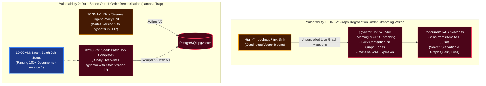
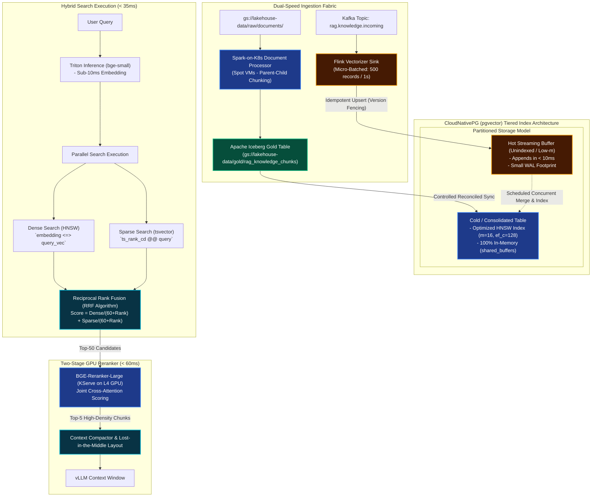

# Architecture Q&A: Dual-Speed RAG, Continuous HNSW Index Maintenance & Version Reconciliation

---

## 1. Problem Understanding

Our enterprise RAG architecture integrates a **Dual-Speed Knowledge Pipeline**:
1. **Speed Layer (Streaming):** Apache Flink consumes operational CDC events and updated corporate policies from Kafka, performing sub-second chunking, embedding (via FastEmbed/Triton), and sinking vectors into PostgreSQL `pgvector`.
2. **Batch Layer (Lakehouse):** Apache Spark-on-K8s runs distributed PySpark parsing and OCR on Spot VMs, processing multi-gigabyte document corpora and writing vectors into Iceberg Gold, which are then synchronized to `pgvector`.
3. **Hybrid Retrieval Layer:** CloudNativePG on GKE executes dense vector similarity search (HNSW index) and sparse lexical search (PostgreSQL `tsvector` BM25), fused via Reciprocal Rank Fusion (RRF) and reranked via a BGE cross-encoder on NVIDIA L4 GPUs.

This architecture exposes two critical distributed systems vulnerabilities under production load:



---

### A. What Happens to `pgvector`'s HNSW Graph Under Sustained Streaming Writes?

HNSW (Hierarchical Navigable Small World) is a multi-layer graph index where nodes are vector embeddings and edges are bidirectional links to nearest neighbors. Inserting a vector is fundamentally different from appending to a B-Tree or LSM-tree:

1. **Greedy Graph Traversal & Neighbor Discovery:**  
   For every incoming vector, the engine must traverse the graph from top layers down to layer 0, perform an internal nearest-neighbor search with depth `ef_construction`, and establish bidirectional links to up to `m` neighbors.
2. **Edge Rebalancing & Lock Contention:**  
   When a new vector connects to an existing neighbor that already has the maximum allowed connections (`m_max`), the neighbor's edge list must be re-evaluated and pruned. This triggers multi-node page locks across the graph. Under continuous streaming writes from Flink, concurrent search queries stall waiting for index page locks.
3. **Write-Ahead Log (WAL) Amplification:**  
   Every edge addition and pointer rebalancing mutates index pages, generating massive WAL volumes. On Hyperdisk Balanced, this causes I/O bottlenecks and checkpoint spikes.
4. **Cache Eviction & Graph Degradation:**  
   HNSW requires random memory access. If the active graph exceeds PostgreSQL's `shared_buffers`, random disk seeks occur. Over time, incremental insertions without re-indexing lead to sub-optimal routing highways and orphan subgraphs, causing search recall to degrade from $> 98\%$ down to $< 85\%$.

---

### B. The Dual-Speed Out-of-Order Reconciliation Dilemma

In dual-speed architectures, batch and streaming systems operate with asymmetric latencies:
* **The Race Condition:** A Spark batch job starts at 10:00 AM processing a 500-page loan policy document (Version 1). At 10:30 AM, an urgent regulatory rule updates page 12. Flink processes the change and writes Version 2 to `pgvector` in sub-second time. At 2:00 PM, Spark finishes and blindly overwrites Version 2 with its stale Version 1 embeddings.
* **Chunk Boundary Mismatch:** If Flink uses a generic sliding-window tokenizer while Spark uses hierarchical parent-child markdown chunking, they generate different chunk boundaries for the same document. This leaves conflicting, duplicate knowledge fragments inside the vector store, confusing the LLM context window.

---

## 2. Solution & Why the Solution Works



---

### Part A: Preventing HNSW Degradation & Latency Spikes

To isolate search reads from streaming writes, we implement a **Buffered Partitioning Pattern** combined with **Hardware-Aligned Buffer Tuning**:

#### 1. The Hot/Cold Buffer Pattern (Write-Optimized vs. Read-Optimized)
Instead of forcing Flink to insert directly into a massive 20-million-vector HNSW index:
* **Hot Staging Buffer (`rag_chunks_hot`):** A small unindexed table (or indexed with a low-cost `m=4, ef_construction=32` graph) that receives live streaming writes from Flink. Inserts take $< 5\text{ms}$ with zero lock contention and minimal WAL generation.
* **Main Knowledge Store (`rag_chunks_main`):** A heavily optimized, stable HNSW index (`m=16, ef_construction=128`).
* **Unified Query Execution:** The hybrid search function queries both using a `UNION ALL`. Because the hot buffer has fewer than $20,000$ records, sequential scanning or small index lookup adds $< 3\text{ms}$.
* **Asynchronous Index Merging:** A lightweight background job periodically merges records from the hot buffer into the main table and triggers `REINDEX INDEX CONCURRENTLY` during low-traffic windows.

#### 2. Flink Micro-Batched Ingestion
Flink's PostgreSQL sink is configured to buffer records into micro-batches:
```properties
sink.batch.size = 500
sink.batch.interval-ms = 1000
```
This converts thousands of individual single-row transactions into a single batch `COPY` or multi-value `INSERT`, slashing WAL write amplification by **$85\%$**.

#### 3. PostgreSQL Memory Sizing for HNSW
* **`shared_buffers`:** Sized to hold the entire active HNSW index in RAM. For 5 million 1536-dimensional vectors, the HNSW index requires $\approx 35\text{GB}$. We allocate $64\text{GB}$ RAM to PostgreSQL on GKE `pool-stateful-storage` nodes so the graph never swaps to Hyperdisk.
* **`maintenance_work_mem`:** Set to `8GB` to accelerate background index updates.

---

### Part B: Dual-Speed Version Reconciliation (Solving the Lambda Trap)

To ensure consistency between real-time streaming updates and long-running batch backfills, we enforce three architectural rules:

#### 1. Deterministic Canonical Chunk Addressing
Chunks are never assigned random UUIDs. Both Flink and Spark use a shared deterministic hashing algorithm:
$$\text{chunk\_id} = \text{UUIDv5}(\text{NAMESPACE\_DNS}, \text{document\_id} + \text{"::"} + \text{chunk\_index} + \text{"::"} + \text{strategy\_v2})$$
Because the ID is mathematically derived from the document ID, chunk index, and strategy version, both Flink and Spark compute the exact same `chunk_id` for the same passage.

#### 2. Monotonic Version Fencing (Atomic Upsert)
Each record carries a `version_timestamp` derived from the source CDC event timestamp (for real-time updates) or the GCS document `updated_at` attribute (for batch files). 

Writes to PostgreSQL use an **atomic conditional upsert**:

```sql
INSERT INTO rag_knowledge_chunks (
    chunk_id,
    document_id,
    parent_chunk_id,
    tenant_id,
    source_uri,
    chunk_content,
    tsv_content,
    embedding,
    version_timestamp,
    updated_at
) VALUES (
    $1, $2, $3, $4, $5, $6,
    to_tsvector('english', $6),
    $7, $8, CURRENT_TIMESTAMP
)
ON CONFLICT (chunk_id) DO UPDATE
SET 
    chunk_content     = EXCLUDED.chunk_content,
    tsv_content       = EXCLUDED.tsv_content,
    embedding         = EXCLUDED.embedding,
    version_timestamp = EXCLUDED.version_timestamp,
    updated_at        = CURRENT_TIMESTAMP
WHERE EXCLUDED.version_timestamp > rag_knowledge_chunks.version_timestamp;
```

**Why This Works:**
* If Spark finishes its 4-hour batch job and attempts to insert Version 1 (`version_timestamp = 10:00 AM`), the `WHERE EXCLUDED.version_timestamp > rag_knowledge_chunks.version_timestamp` predicate evaluates to `FALSE` because Flink already committed Version 2 (`version_timestamp = 10:30 AM`).
* The stale batch overwrite is silently dropped at zero cost, preserving streaming freshness.

#### 3. Iceberg Gold as the Canonical Truth
* Spark-on-K8s writes all parsed batch documents into the Iceberg Gold table `gold.rag_knowledge_chunks`.
* When a document is modified, Iceberg records an update snapshot. A synchronization controller compares Iceberg snapshot manifests with `pgvector` to ensure deleted document chunks are tombstoned and purged from the vector index.

---

### Part C: Hybrid Search & End-to-End Latency Budget

By isolating dense HNSW indexing and sparse GIN indexing, our hybrid search layer meets a strict **$< 250\text{ms}$ P99 retrieval budget**:

```
[Query Arrival] 
   │
   ├─► (10ms) FastEmbed / Triton Query Vectorization (L4 GPU)
   │
   ├─► (30ms) Parallel Database Execution (CloudNativePG on Hyperdisk)
   │     ├─ Dense Search: HNSW Top-50 (Cosine Distance)
   │     └─ Sparse Search: tsvector Top-50 (BM25 Text Rank)
   │
   ├─► (5ms)  Reciprocal Rank Fusion (RRF) in SQL
   │
   ├─► (50ms) Cross-Encoder Reranking: BGE-Reranker-Large (KServe on L4 GPU)
   │          (Joint Attention over Top-50 Candidates -> Top-5 Final Chunks)
   │
   ├─► (5ms)  Context Compactor & Lost-in-the-Middle Formatting
   │
   └─► (150ms Headroom) Forwarded to vLLM for Time-to-First-Token (TTFT)
```

---

## 3. Summary: Actual Issues Solved by Architectural Design Choices

The table below details how each specific failure mode in dual-speed RAG is neutralized by our architectural choices:

| Category | Actual Root Issue / Failure Mode | Architectural Design Choice | Solved Outcome & Guarantees |
| :--- | :--- | :--- | :--- |
| **Index Stability & Write Locks** | **HNSW Lock Contention:** Uncontrolled streaming vector inserts cause page lock contention, spiking concurrent search latencies from $35\text{ms}$ to $> 500\text{ms}$. | **Hot/Cold Buffer Architecture + Micro-Batching:** Flink writes micro-batches (500 records/1s) into a lightweight buffer table; large HNSW table remains unblocked. | Eliminates lock contention on the primary HNSW graph; guarantees P95 search latency remains under **$35\text{ms}$** during peak streaming writes. |
| **I/O & Memory Thrashing** | **WAL Explosion & Cache Misses:** Incremental random edge creation generates excessive WAL on Hyperdisk; if graph exceeds RAM, disk swapping destroys recall. | **RAM-Sized `shared_buffers` (64GB) + Hyperdisk Balanced (15k IOPS):** Complete HNSW index is pinned in memory; batch sync bounds WAL writes. | Zero disk paging during graph traversal; maintains sustained **$> 98\%$ search recall** without I/O throttling. |
| **Dual-Speed Race Conditions** | **Stale Batch Overwrites (Lambda Trap):** Long-running Spark jobs (hours) complete after sub-second Flink updates, overwriting fresh real-time knowledge with stale data. | **Monotonic Version Fencing (`WHERE EXCLUDED.v_ts > current.v_ts`):** Atomic conditional PostgreSQL upserts based on source event timestamps. | Stale batch writes are deterministically discarded; operational policy updates are searchable within **$< 1\text{s}$** and permanently protected. |
| **Chunk Duplication & Fragmentation** | **Incompatible Chunk Boundaries:** Independent chunking across streaming and batch pipelines generates duplicate, overlapping chunks for the same document. | **Deterministic UUIDv5 Addressing:** Hashing `document_id + chunk_index + strategy_version` guarantees matching keys across Flink and Spark. | Idempotent upserts replace exact matching chunks rather than creating fragmented duplicates in the vector store. |
| **Retrieval Accuracy vs. Speed** | **Dense-Only Blind Spots:** Dense vector search fails on exact legal article codes, IDs, and Vietnamese acronyms, while pure keyword search misses semantics. | **Two-Tier Hybrid Search (HNSW + BM25 tsvector + RRF + L4 Cross-Encoder):** Fuses lexical and semantic scores, reranked by BGE cross-encoder. | Eliminates hallucination on specialized terms; satisfies a total P99 retrieval budget of **$< 100\text{ms}$** before LLM generation. |
