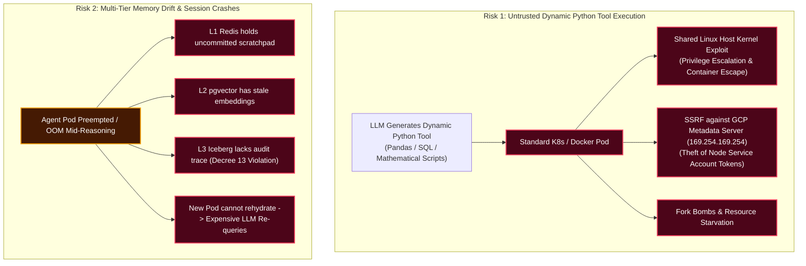
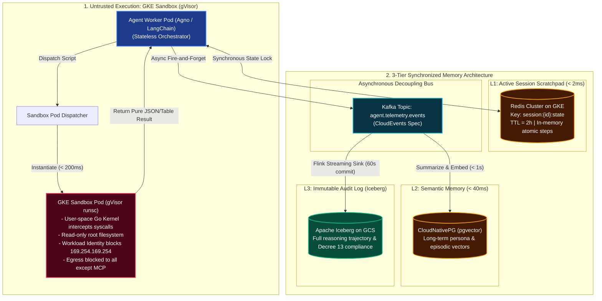

# Architecture Q&A: Untrusted AI Agent Code Execution & 3-Tier Memory Synchronization

---

## 1. Problem Understanding

Autonomous AI agents in enterprise data platforms do not just generate text; they act as computational engines. In our architecture, agent workers (built on Agno/LangChain) dynamically generate and run Python analysis scripts against our Iceberg lakehouse (via Trino) and maintain state across three tiers of memory:
1. **L1 Working Memory:** Redis Cluster on GKE ($< 2\text{ms}$).
2. **L2 Semantic Long-Term Memory:** CloudNativePG with `pgvector` ($< 40\text{ms}$).
3. **L3 Episodic / Compliance Audit Memory:** Apache Iceberg on GCS ($60\text{s}$ commits).

This architecture introduces two severe production risks:



---

### A. Why Standard Container Isolation (Docker / Kubernetes Defaults) is Insufficient

A container is **not** a virtualization boundary. It is merely a Linux process constrained by namespaces and cgroups, **sharing the host Linux kernel**:
1. **Host Kernel Vulnerabilities (Container Escape):**  
   If an LLM hallucinates malicious code or is tricked via prompt injection into executing kernel exploits (e.g., Dirty COW, Dirty Pipe, or unpatched eBPF/cgroup syscall flaws), the attacker escapes the container and gains **root access to the underlying Kubernetes worker node**.
2. **Server-Side Request Forgery (SSRF) & Metadata Theft:**  
   In Google Cloud, any pod with raw network access can query `http://169.254.169.254/computeMetadata/v1/`. An untrusted Python script can extract the host node's temporary OAuth2 access tokens and compromise the entire GCP project.
3. **Resource Starvation & Denial of Service:**  
   Untrusted Python scripts can trigger infinite recursion, fork bombs, or memory leaks that crash the entire node, disrupting co-located analytical pods.

---

### B. The Memory Synchronization & Failover Dilemma

An AI agent’s reasoning loop is stateful and multi-turn (Thought $\rightarrow$ Action $\rightarrow$ Tool Result $\rightarrow$ Thought).
* **Latency vs. Consistency Tension:** Writing every single reasoning token synchronously to L1 (Redis), L2 (`pgvector`), and L3 (Iceberg) adds hundreds of milliseconds of overhead, ruining user interactivity.
* **Mid-Loop Worker Preemption:** If an agent pod running on a GKE node is evicted, preempted, or crashes during step 3 of a 5-step analysis, a naive system loses the active scratchpad. The user must restart the session, wasting expensive GPU inference tokens and corrupting the regulatory audit trace required by **Vietnam Decree 13 PDPD**.

---

## 2. Solution & Why the Solution Works



---

### Part A: Untrusted Code Execution with GKE Sandbox (gVisor)

We isolate all dynamic Python tool execution inside **GKE Sandbox** managed via `gVisor`:

```yaml
apiVersion: v1
kind: Pod
metadata:
  name: dynamic-python-sandbox-run
  namespace: agent-sandboxes
  annotations:
    sandbox.gke.io/type: gvisor # Activates user-space kernel isolation
spec:
  restartPolicy: Never
  nodeSelector:
    sandbox.gke.io/type: gvisor
  containers:
  - name: python-runner
    image: internal-registry.corp/agent-python-sandbox:3.11-slim
    resources:
      limits:
        memory: "512Mi"
        cpu: "1000m"
    securityContext:
      readOnlyRootFilesystem: true
      allowPrivilegeEscalation: false
      runAsNonRoot: true
      runAsUser: 10001
      capabilities:
        drop: ["ALL"]
```

#### Why Choose GKE Sandbox (gVisor) over Ephemeral VMs?

| Dimension | Standard Container | Ephemeral VMs (Firecracker / GCE) | GKE Sandbox (gVisor) | Why gVisor Wins in Our Architecture |
| :--- | :--- | :--- | :--- | :--- |
| **Startup Latency** | $\sim 500\text{ms}$ | **$2\text{s}$–$15\text{s}$** | **$< 200\text{ms}$** | Interactive tool calls require instant execution. A 10-second VM boot destroys LLM reasoning flow. |
| **Security Boundary** | Shared Linux host kernel (Weak). | Full hardware virtualization (Strong). | **User-space kernel (`runsc`) interception (Strong).** | Intercepts all system calls in a Go user-space sandbox. Untrusted code *never* directly executes syscalls on the host kernel. |
| **GCP Metadata Protection** | Vulnerable to SSRF token theft. | Requires custom iptables. | **Native Workload Identity metadata protection.** | GKE Sandbox natively intercepts and blocks calls to `169.254.169.254`, preventing token theft. |
| **Pod Density & Cost** | High density, low cost. | Poor density; heavy memory overhead per VM. | **High density; standard K8s pod footprint.** | Pack dozens of sandboxes per node without hypervisor licensing or dedicated VM memory reservations. |

---

### Part B: 3-Tier Memory Synchronization & Failover Mechanics

We solve the trade-off between latency and durability using an **Asymmetric Write-Through/Write-Behind Architecture**:

#### 1. The Tier Contract:
* **L1 (Redis Cluster - Working Memory):** Holds active conversational state, thought scratchpads, and real-time streaming feature counters (fed by Flink in $< 5\text{ms}$). TTL = $2\text{ hours}$.
* **L2 (PostgreSQL `pgvector` - Semantic Memory):** Holds permanent persona profiles, summarized episodic milestones, and historical user preferences accessible via HNSW similarity search in $< 40\text{ms}$.
* **L3 (Apache Iceberg on GCS - Audit & Compliance):** An append-only historical log of the complete reasoning trajectory (prompts, tool inputs, raw outputs, latency, tokens), satisfying legal compliance under **Vietnam Decree 13 PDPD**.

#### 2. Write Synchronization Flow:
1. **Synchronous In-Loop Write (L1 Only):**  
   During the reasoning loop, the agent worker writes *only* to **L1 Redis** ($< 2\text{ms}$). The agent never blocks waiting for disk or database I/O.
2. **Asynchronous Event-Driven Emission (L2 & L3):**  
   When a step completes, the worker emits an asynchronous telemetry event to Kafka topic `agent.telemetry.events`:
   * A streaming worker consumes the event, passes significant conversational insights through an embedding model, and writes to **L2 `pgvector`** within $< 1\text{ second}$.
   * Flink consumes the stream and commits immutable trajectory records into **L3 Iceberg** on GCS via the 60-second micro-batch checkpoint boundary.

#### 3. Stateless Worker Failover & Session Rehydration:
Because agent worker pods hold **zero local in-memory state**, failure recovery is completely seamless:

```
[Agent Pod Crashes at Step 3] 
   │
   ├─► 1. Kubernetes spins up replacement pod (< 2s)
   │
   ├─► 2. New pod connects to L1 Redis with `session_id`
   │      - Reads: `step_id: 3`, `state: 'waiting_for_tool'`, `scratchpad: [...]`
   │
   ├─► 3. Pod checks MCP Tool Dispatcher for execution status
   │      - Tool finished? Pulls result from sandbox output buffer.
   │      - Tool failed? Re-dispatches idempotent tool run.
   │
   └─► 4. Resumes reasoning loop at Step 4 without re-prompting the user!
```

**Why This Works:**
* Eliminates wasted GPU inference cost: the LLM does not need to re-generate steps 1 and 2.
* Guarantees that even under spot node preemption, user sessions continue uninterrupted with zero state corruption.

---

## 3. Summary: Actual Issues Solved by Architectural Design Choices

The table below maps each **concrete failure mode / root issue** to the specific **architectural design choice** and its **measurable outcome**:

| Category | Actual Root Issue / Failure Mode | Architectural Design Choice | Solved Outcome & Guarantees |
| :--- | :--- | :--- | :--- |
| **Tool Execution Security** | **Host Kernel Escapes:** LLM-generated Python scripts running in standard containers exploit host kernel bugs (e.g., Dirty Pipe) to seize node root privileges. | **GKE Sandbox (gVisor `runsc`):** Intercepts all system calls in a Go user-space application kernel; drops all capabilities; read-only root filesystem. | Complete kernel isolation; code execution exploits are trapped within the user-space sandbox, leaving the host node 100% safe. |
| **Cloud Credential Theft** | **SSRF on Metadata Server:** Untrusted scripts query `169.254.169.254` to steal GKE node Service Account OAuth2 credentials. | **GKE Workload Identity + Metadata Concealment:** Native gVisor interception blocks all egress to the link-local metadata IP. | Zero credential leakage; untrusted code has zero access to cloud identity tokens. |
| **Tool Invocation Latency** | **Slow Ephemeral VM Spin-Up:** Virtual machines (Firecracker/GCE) take $2\text{s}$–$15\text{s}$ to boot, stalling interactive conversational agent loops. | **Containerized gVisor Sandboxes:** Sandboxed pods launch natively on existing GKE nodes in **$< 200\text{ms}$**. | Instant tool execution preserving conversational flow without paying hypervisor boot tax. |
| **Memory Latency vs. Durability** | **Synchronous Multi-Tier Stalls:** Writing reasoning traces synchronously to vector DBs and cloud storage introduces $200\text{ms}+$ latency per reasoning step. | **Asymmetric Write Architecture:** Synchronous in-memory write to L1 Redis ($< 2\text{ms}$); asynchronous Kafka emission to L2 and L3. | High-speed interactive user experience with guaranteed background persistence and zero I/O blocking. |
| **Node Preemption & Session Loss** | **Mid-Loop Worker Crashes:** Pod evictions or spot node reclaims destroy the in-flight reasoning scratchpad, forcing users to restart the prompt. | **Stateless Workers + Atomic L1 State Checkpointing:** Session state and step counters are externalized in Redis. | Replacement pods rehydrate the exact reasoning step in **$< 50\text{ms}$** without re-running expensive LLM inference. |
| **Regulatory Audit Compliance** | **Audit Trail Gaps:** Ephemeral session data evaporates after conversation termination, violating **Vietnam Decree 13 PDPD** data lineage laws. | **Immutable L3 Iceberg Trajectory Sinking:** Event-driven Flink pipeline sinks complete prompt/tool audit records to GCS. | Permanent, cryptographically auditable, tamper-proof compliance logs stored cost-effectively on GCS Parquet. |
