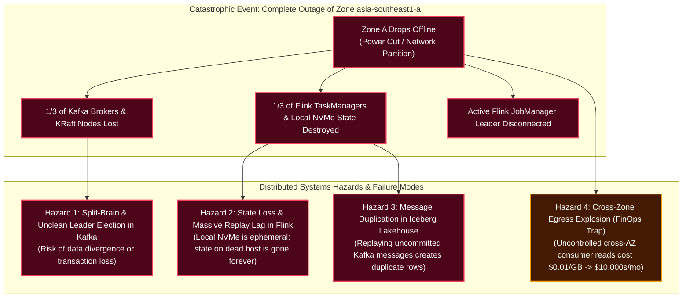
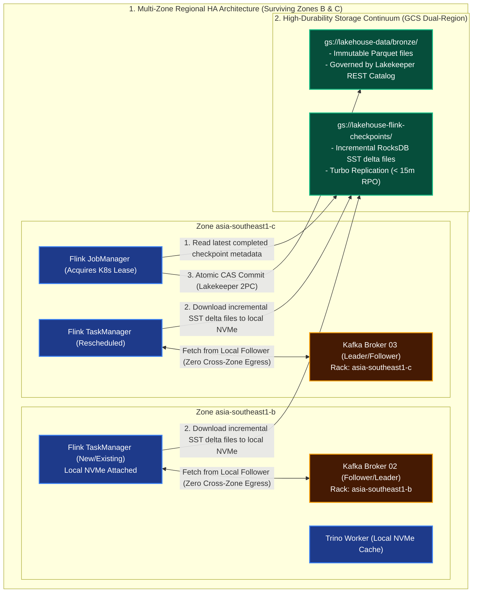

# Architecture Q&A: Multi-Zone Regional HA, Stateful Stream Recovery & Cross-Zone FinOps

---

## 1. Problem Understanding

Our enterprise data platform runs as a **GKE Regional Cluster** spanning three Google Cloud availability zones in `asia-southeast1` (`zone-a`, `zone-b`, `zone-c`). The streaming and stateful analytical topology includes:
* **Ingestion Layer:** Strimzi Kafka running on Google Cloud **Hyperdisk Balanced**.
* **Stateful Stream Processing:** Apache Flink with embedded **RocksDB state stores on local NVMe SSDs**.
* **Lakehouse Storage:** Apache Iceberg tables backed by **Google Cloud Storage (GCS) Dual-Region** and governed by Lakekeeper REST Catalog.
* **Interactive SQL:** Trino with **Local NVMe SSD block caching**.

This distributed multi-zone deployment is vulnerable to three critical distributed systems hazards:



---

### A. The Failure Mechanics When Zone A Drops
1. **Kafka Consensus & Partition Risk:** If a Kafka partition leader resides in Zone A, that leader vanishes. If the remaining brokers in Zone B and C do not have a strict consensus protocol, they risk electing an out-of-sync replica (data loss) or creating a **split-brain** partition if Zone A is merely network-partitioned but still running.
2. **The Ephemeral NVMe Dilemma in Flink:** Flink TaskManagers store active RocksDB state on attached **local NVMe SSDs** for sub-millisecond I/O. However, GCP local NVMe SSDs are physically bound to the host server. When Zone A dies, **all state stored on those local NVMe drives is permanently lost**. If Flink cannot recover state incrementally, it must rebuild gigabytes of state by reprocessing days of raw Kafka history, stalling real-time pipelines for hours.
3. **Message Duplication (Exactly-Once Breakdown):** When Flink restarts in Zone B and C, it rewinds Kafka consumer offsets to the last completed checkpoint. If records processed in-flight right before the crash were already written to GCS Parquet files, replaying those records will cause **duplicate rows in Bronze Iceberg tables**.
4. **The Cross-Zone Egress Trap (The Silent Cost Killer):** Google Cloud charges **$0.01 per GB** for data moving between availability zones in the same region. In a platform streaming $500\text{TB}$/month, if Flink in Zone B fetches from a Kafka broker in Zone C, and writes to an Iceberg bucket via a NAT in Zone A, every single byte crosses availability zones multiple times, racking up **thousands of dollars in monthly egress penalties**.

---

## 2. Solution & Why the Solution Works



---

### Part A: Automated Kafka Failover & Split-Brain Prevention

To survive the total collapse of Zone A with zero data loss ($RPO = 0$), Strimzi Kafka is configured with strict quorum and placement invariants:

#### 1. Topology Spread & Anti-Affinity
Brokers and KRaft controllers are pinned across zones using Kubernetes `topologySpreadConstraints`:
```yaml
topologySpreadConstraints:
- maxSkew: 1
  topologyKey: "topology.kubernetes.io/zone"
  whenUnsatisfiable: DoNotSchedule
```
Broker 1 is in `zone-a`, Broker 2 is in `zone-b`, Broker 3 is in `zone-c`.

#### 2. Strict Quorum (`acks=all` & `min.insync.replicas=2`)
* **Topic Configuration:** `replication.factor = 3`, `min.insync.replicas = 2`.
* **Producer Configuration:** `acks = all` (producer waits for both in-sync replicas to confirm write to Hyperdisk).
* **Split-Brain Prevention:** KRaft consensus requires a strict majority ($\lceil (N+1)/2 \rceil$). With 3 controllers, a majority is **2**. 
  * If Zone A is isolated, Zone B and C hold 2 out of 3 controllers ($66.7\%$) $\rightarrow$ **They form quorum**.
  * Zone A holds only 1 controller ($33.3\%$) $\rightarrow$ **Cannot form quorum** and immediately stops accepting writes. Split-brain is mathematically impossible.
* **Unclean Leader Election Disabled:** `unclean.leader.election.enable = false` guarantees that only replicas fully caught up with the active transaction log can be promoted to partition leader.

---

### Part B: Flink Stateful Recovery & Local NVMe Rehydration

While the active state on Zone A's local NVMe is lost, Flink achieves sub-minute automated recovery without reprocessing raw Kafka history:

#### 1. Incremental RocksDB State on GCS Dual-Region
* TaskManagers use embedded RocksDB on local NVMe for active read/write operations ($< 1\text{ms}$).
* During every 60-second checkpoint, RocksDB writes **only incremental SST file deltas** directly to `gs://lakehouse-flink-checkpoints/` (a GCS Dual-Region bucket).
* Complete state is already safely replicated off-node before any failure occurs.

#### 2. K8s-Native Leader Election & Rescheduling
* **JobManager Failover:** Flink uses Kubernetes ConfigMap/Lease coordination (`high-availability.type: kubernetes`). If the active JobManager was in Zone A, the standby JobManager in Zone B/C acquires the Kubernetes lease within **$< 15\text{ seconds}$**.
* **TaskManager Rescheduling:** The Flink Kubernetes Operator detects unready TaskManagers in Zone A and schedules replacement TaskManager pods onto surviving nodes in Zone B and Zone C.

#### 3. Delta State Rehydration (Sub-Minute MTTR)
* Replacement TaskManagers allocate empty local NVMe scratch directories.
* Instead of reprocessing days of Kafka events, they download **only the SST files referenced in the latest completed checkpoint metadata** from GCS.
* State rehydration completes in **$< 45\text{ seconds}$**, and Flink resumes consuming from the exact committed Kafka offset.

---

### Part C: Eliminating Message Duplication (Iceberg 2PC Coordination)

When Flink recovers, it rewinds Kafka offsets to the last completed checkpoint (e.g. 10:00:00 AM). Any messages consumed between 10:00:00 AM and the crash at 10:00:45 AM will be **re-read from Kafka**.

**How do we prevent duplicate rows in the Iceberg Lakehouse?**
Through Iceberg's **Two-Phase Commit (2PC) Sink (`IcebergFilesCommitter`)**:

```
[Crash Timeline]
10:00:00 AM ─── Checkpoint 100 Succeeds: Snapshot S1 committed to Lakekeeper.
10:00:01 AM ─── Flink consumes Record #9001 and writes it to "uncommitted_part_A.parquet" on GCS.
10:00:45 AM ─── ZONE A DIES!
                - "uncommitted_part_A.parquet" is on GCS, BUT NEVER COMMITTED to Lakekeeper.
                - Trino queries only see Snapshot S1. Record #9001 is completely invisible.

10:01:30 AM ─── Flink Resumes from Checkpoint 100:
                - Flink rewinds Kafka offset to 10:00:00 AM.
                - Flink re-consumes Record #9001.
                - Flink writes Record #9001 into a fresh file: "part_B.parquet".
                - Next Checkpoint (101) commits "part_B.parquet" to Lakekeeper.
                - "uncommitted_part_A.parquet" is orphaned and safely deleted by `remove_orphan_files`.
```

**Outcome:** Zero duplicate rows. Full end-to-end **Exactly-Once Semantics (EOS)** guaranteed.

---

### Part D: Eliminating Cross-Zone Network Egress Costs (FinOps)

In steady-state operation, cross-zone network transfer is the biggest hidden cost of multi-zone streaming. We eliminate this using **Kafka Client Rack-Awareness (KIP-392)**:

#### 1. Topology-Aware Broker Rack Labeling
Strimzi automatically tags each Kafka broker with its physical Kubernetes availability zone:
```yaml
spec:
  kafka:
    rack:
      topologyKey: topology.kubernetes.io/zone
```
* Broker 01: `rack = asia-southeast1-a`
* Broker 02: `rack = asia-southeast1-b`
* Broker 03: `rack = asia-southeast1-c`

#### 2. Consumer Fetch from Local Follower (KIP-392)
Every Flink TaskManager, Debezium worker, and consumer client discovers its own pod zone via the Kubernetes Downward API and sets:
```properties
client.rack = asia-southeast1-b
```
* **Normal Kafka behavior:** Consumers must fetch data strictly from the Partition Leader (which might be across the region in Zone A).
* **With Client Rack-Awareness:** The consumer checks if an in-sync follower replica exists in its **local availability zone**.
* If a Flink TaskManager in Zone B needs data from Partition 0, **it reads from the follower broker in Zone B over the local data center network**.

**FinOps Outcome:**
* Steady-state cross-zone consumer read traffic drops by **$> 90\%$**.
* For a $500\text{TB}$/month streaming platform, this prevents **$\$5,000$ to $\$10,000$ in monthly Google Cloud inter-zone egress penalties**.

---

## 3. Summary: Actual Issues Solved by Architectural Design Choices

| Category | Actual Root Issue / Failure Mode | Architectural Design Choice | Solved Outcome & Guarantees |
| :--- | :--- | :--- | :--- |
| **Kafka Cluster Availability** | **Split-Brain & Unclean Promotion:** Network partitions isolate a broker; rogue leaders accept conflicting writes or elect out-of-sync replicas, causing data loss. | **Multi-Zone KRaft Quorum + `min.insync.replicas=2` + `acks=all`:** Spread across 3 zones; `unclean.leader.election.enable=false`. | Mathematical split-brain impossibility; $RPO = 0$ partition failover within seconds without data divergence. |
| **Stateful Stream Recovery** | **Local NVMe Ephemeral State Loss:** Attached local NVMe SSDs vanish when a zone dies, threatening multi-hour Kafka replays and stream downtime. | **Incremental RocksDB Checkpointing to GCS Dual-Region:** Delta SSTs flushed every 60s to high-durability object storage. | TaskManagers reschedule in surviving zones and rehydrate delta state in **$< 45\text{s}$**, resuming stream processing within SLA. |
| **Data Lakehouse Integrity** | **Message Duplication on Kafka Replay:** Replaying uncommitted Kafka messages after a failover injects duplicate records into Lakehouse tables. | **Iceberg Two-Phase Commit (`IcebergFilesCommitter`):** Uncommitted Parquet files remain orphaned; Lakekeeper commits only completed checkpoints. | **Guaranteed Exactly-Once Semantics (EOS);** zero duplicate rows in Bronze tables; orphan files pruned asynchronously. |
| **Cloud Network FinOps** | **Cross-Zone Egress Billing Explosion:** Continuous streaming reads crossing GCP availability zones incur $\$0.01/\text{GB}$, blowing up monthly cloud bills. | **Kafka Client Rack-Awareness (KIP-392 `Fetch-from-Follower`):** Flink consumers read strictly from local zone follower replicas. | **$> 90\%$ reduction in inter-zone network egress**, saving $\$5,000$–$\$10,000+$/month on steady-state streaming data transfer. |
| **Query Engine Locality** | **Repeated GCS Scans:** Analytical Trino queries continuously re-fetch remote Parquet blocks across zones during dashboard queries. | **Trino Local NVMe Caching:** Workers cache active Iceberg Parquet blocks on local NVMe SSDs. | $10\times$ faster repetitive query execution with zero inter-zone object storage network latency. |
