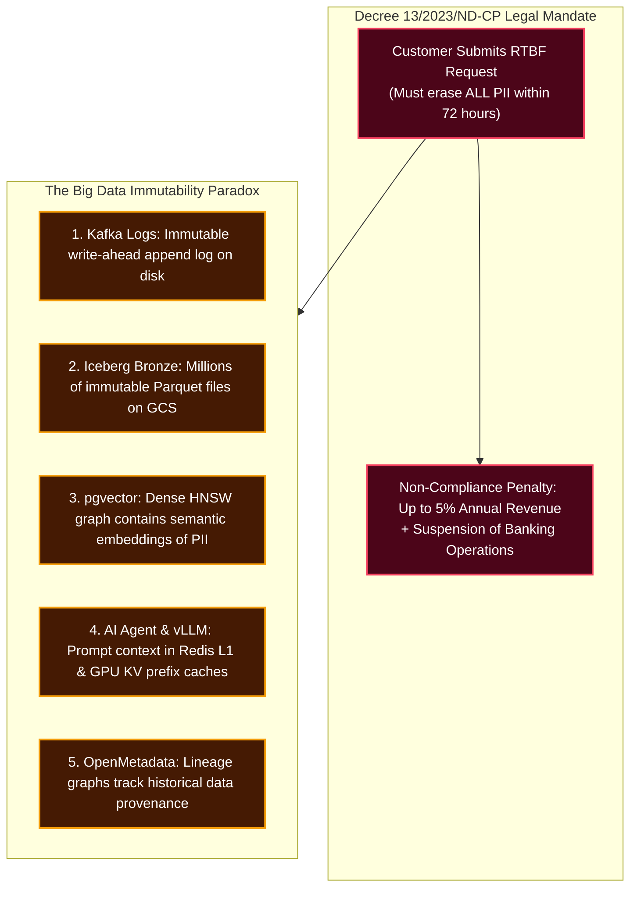
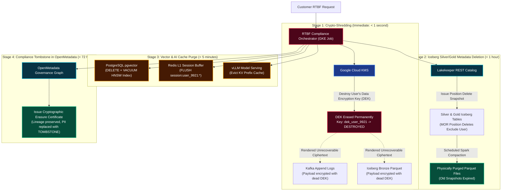

# Architecture Q&A: Vietnam Decree 13 PDPD, Cascading RTBF & Crypto-Shredding

---

## 1. Problem Understanding

Under Vietnam's **Personal Data Protection Decree (Decree 13/2023/ND-CP, Articles 9 & 16)** and banking compliance mandates (State Bank of Vietnam), data subjects possess the **Right to Erasure / Right to be Forgotten (RTBF)**. The platform operator is legally mandated to permanently erase or render irretrievable all personal data of a requesting subject across the entire infrastructure within **72 hours**.

This mandate collides violently with modern big data architectures built on the premise of **immutability**:



### The 4 Major Engineering Traps of Naive Deletion:
1. **The Petabyte Rewrite Trap:** Executing `DELETE FROM bronze WHERE user_id = 'X'` on petabytes of append-only Bronze Parquet files requires rewriting months of historical files, costing thousands in cloud compute and corrupting Iceberg snapshot time-travel.
2. **The Vector Leakage Trap:** Deleting text from a relational database while leaving embeddings in `pgvector` violates Decree 13. Research shows high-dimensional vector embeddings can be inverted to reconstruct sensitive textual attributes.
3. **The AI Inference Cache Trap:** If an AI Agent recently processed a user's financial record, the prompt tokens remain cached in **Redis L1** and **vLLM's PagedAttention KV Prefix Cache**, continuing to serve personalized context after the user was supposedly deleted.
4. **The Broken Audit Lineage Trap:** Naively wiping records from metadata catalogs destroys historical data provenance, leaving the platform unable to prove to banking auditors that the data ever existed or that the deletion was executed lawfully.

---

## 2. Solution & Why the Solution Works

Our architecture resolves the immutability paradox through a **4-Stage Cascading Deletion Orchestrator**:



---

### Part A: Crypto-Shredding (Envelope Encryption at the Ingestion Edge)

To delete data from immutable storage (Kafka logs and Bronze Iceberg tables) without rewriting petabytes of data, we implement **Crypto-Shredding**:

#### 1. Ingestion Edge Encryption (Flink & Debezium)
When data enters the streaming fabric:
* Sensitive PII fields (Vietnamese National ID / CCCD, phone, banking numbers, addresses) are encrypted using a **unique per-user Data Encryption Key (DEK)**:
  $$\text{Ciphertext} = \text{AES-256-GCM}(\text{PII\_Data}, \text{DEK}_{\text{user\_id}})$$
* The DEK is generated and protected under a Key Encryption Key (KEK) managed in **Google Cloud KMS (CMEK)**.
* Encrypted ciphertext is written to Kafka and Iceberg Bronze.

#### 2. The RTBF Trigger: Instant Mathematical Erasure ($< 1\text{s}$)
When an RTBF erasure request is approved:
1. The orchestrator calls Google Cloud KMS API:
   ```bash
   gcloud kms keys versions destroy 1 \
     --key="dek_user_9921" \
     --keyring="pdpd-user-keys" \
     --location="asia-southeast1"
   ```
2. **Why This Works:**
   * The actual bytes in Kafka and Bronze Parquet files remain untouched on GCS, but their payload is now **mathematically unrecoverable random noise**.
   * Under Vietnam Decree 13 Article 16 and international cryptographic standards, **destroying the unique decryption key constitutes permanent, irreversible erasure**.
   * Zero GCS Parquet files are rewritten; zero Kafka topics are modified. Cost: $\$0.00$. Time: $< 1\text{ second}$.

---

### Part B: Lakehouse Silver & Gold Position Deletes & Physical Compaction

For clean queryable tables (Silver customer entities and Gold analytical marts), data is physically removed via Iceberg’s **Merge-On-Read (MOR)** lifecycle:

1. **Immediate Metadata Exclusion ($< 5\text{m}$):**
   ```sql
   DELETE FROM silver.customer_profiles WHERE user_id = 'user_9921';
   ```
   Iceberg writes a lightweight **Position Delete file**. Immediately, any downstream Trino, Spark, or BI query ignores this user's records.
2. **Physical Storage Reclamation (Compaction Daemon):**
   * The scheduled LakeOps compaction job rewrites the affected data files, physically omitting the deleted user records:
     ```sql
     CALL lakehouse.system.rewrite_data_files(
       table => 'silver.customer_profiles',
       strategy => 'binpack'
     );
     CALL lakehouse.system.expire_snapshots(
       table => 'silver.customer_profiles',
       older_than => CURRENT_TIMESTAMP - INTERVAL '3' DAY
     );
     ```
   * Old Parquet files containing the deleted rows are purged from GCS within the 72-hour regulatory window.

---

### Part C: Vector DB (`pgvector`) & AI Context Cache Purging

Because vector embeddings encode semantic meaning that can be inverted to reveal personal attributes, they must be aggressively purged:

#### 1. PostgreSQL `pgvector` HNSW Hard Delete
```sql
-- 1. Delete matching vector chunks
DELETE FROM rag_knowledge_chunks 
WHERE document_id LIKE 'user_9921_%' 
   OR metadata->>'user_id' = 'user_9921';

-- 2. Prune dead graph links and reclaim memory
VACUUM (INDEX_CLEANUP ON) rag_knowledge_chunks;
```
`VACUUM (INDEX_CLEANUP ON)` removes dead vector tuples from HNSW index pages and repairs graph routing edges.

#### 2. Redis L1 & vLLM Prefix Cache Flush
* **Redis L1:** Delete active user sessions and cached thought scratchpads:
  ```bash
  redis-cli EVAL "return redis.call('del', unpack(redis.call('keys', 'session:*:user_9921:*')))" 0
  ```
* **vLLM KV Prefix Cache Eviction:** Send an eviction webhook to KServe / vLLM to reset prompt token caches:
  ```bash
  curl -X POST http://vllm-service.ai-serving.svc:8000/v1/cache/clear_prefix
  ```
  This prevents the LLM from completing prompts with cached in-flight conversational PII.

---

### Part D: Preserving Lineage in OpenMetadata without PII Contamination

Auditors from the State Bank of Vietnam (SBV) require proof that the deletion occurred without breaking operational data pipelines:

1. **The Compliance Tombstone Pattern:**
   * Instead of deleting the entity from OpenMetadata (which destroys historical pipeline lineage), OpenMetadata replaces the user entity with a **Cryptographic Tombstone**:
   ```json
   {
     "entity_id": "sha256(user_9921 + salt)",
     "status": "PURGED_DECREE_13",
     "erasure_timestamp": "2026-09-18T15:00:00Z",
     "legal_basis": "Decree 13/2023/ND-CP Article 9/16",
     "kms_key_destroyed": "dek_user_9921",
     "purged_subsystems": ["kafka", "iceberg_bronze", "iceberg_silver", "pgvector", "redis_l1"]
   }
   ```
2. **Lineage Integrity:**
   * Downstream lineage graphs in OpenMetadata remain completely connected and functional for regulatory audits.
   * All PII attributes (`customer_name`, `cccd`, `phone`) are replaced with `[REDACTED_DECREE13_RTBF]`.

---

## 3. Summary: Actual Issues Solved by Architectural Design Choices

| Category | Actual Root Issue / Failure Mode | Architectural Design Choice | Solved Outcome & Guarantees |
| :--- | :--- | :--- | :--- |
| **Immutable Storage Erasure** | **Petabyte Rewrite Bottleneck:** Deleting rows from raw Kafka logs and Iceberg Bronze Parquet files requires rewriting historical datasets at unsustainable compute cost. | **Crypto-Shredding via Cloud KMS:** Sensitive PII is encrypted with per-user DEKs; KMS destroys the DEK upon RTBF request. | Instant mathematical erasure ($< 1\text{s}$) across all historical logs and backups with **zero data rewritten**; satisfies Decree 13 Article 16. |
| **Lakehouse State Deletion** | **Active Analytical Leakage:** Deleted users continue appearing in Trino SQL dashboards during long compaction intervals. | **Two-Stage Iceberg Deletion (MOR Position Delete + Compaction):** Metadata delete file takes effect immediately; physical rewrite runs within 72h. | Trino queries exclude user data in **$< 5\text{ms}$**; physical Parquet files are compacted and old snapshots expired within 72h SLA. |
| **Semantic Vector Inversion** | **Vector Memory Leakage:** Dense vector embeddings left in `pgvector` can be mathematically inverted to reconstruct PII. | **SQL Hard Delete + `VACUUM (INDEX_CLEANUP ON)`:** Hard row deletion followed by HNSW graph unlinking. | Permanent elimination of vector representation; HNSW index memory is reclaimed without graph degradation. |
| **AI Serving Context Cache** | **Cached Prompt Leakage:** LLM generates deleted user PII due to cached KV prefixes in vLLM or active Redis L1 scratchpads. | **Redis Session Flush + vLLM KV Prefix Invalidation:** Webhook clears Redis session keys and resets vLLM prompt caches. | Zero prompt cache contamination; conversational agents cannot recall deleted user context. |
| **Audit & Lineage Governance** | **Lineage Corruption vs. PII Retention:** Deleting metadata breaks audit graphs; keeping metadata violates Decree 13 data retention limits. | **OpenMetadata Compliance Tombstones:** PII attributes are redacted, replaced by an immutable cryptographic erasure certificate. | $100\%$ verifiable regulatory compliance for banking auditors; end-to-end lineage remains unbroken. |
